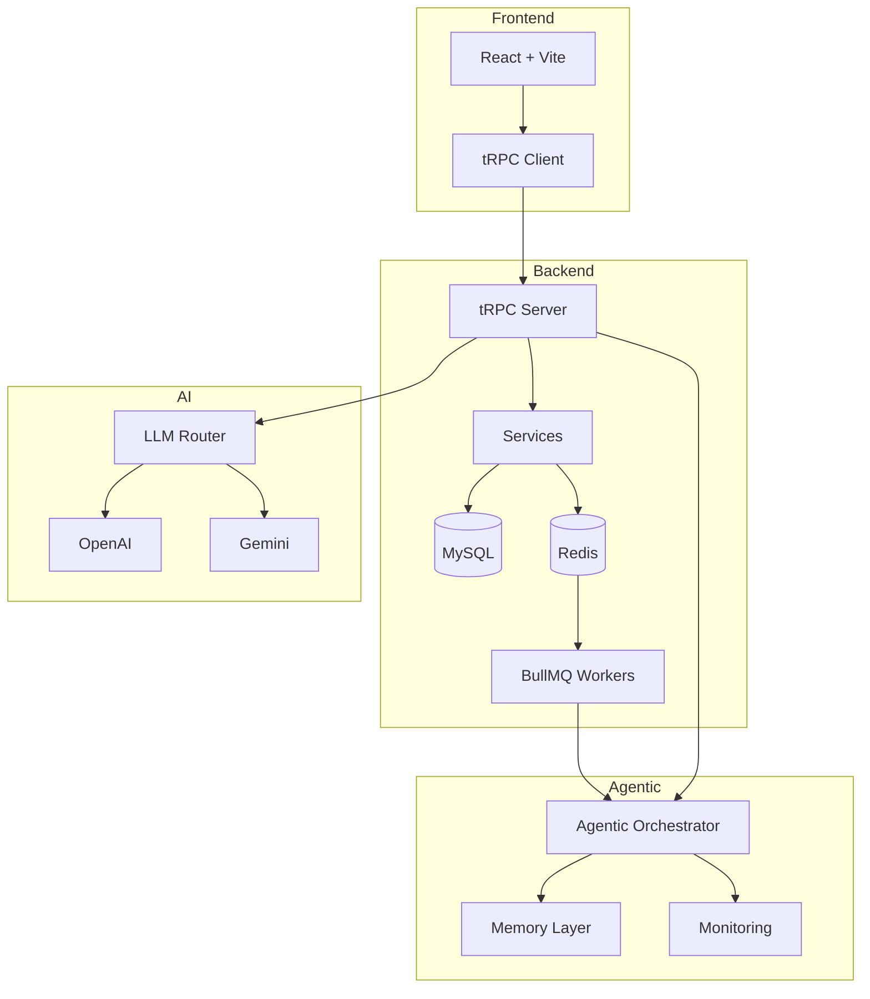

# Nexus System AfilIAte-AI

> Ecossistema de Marketing Multinível (MMN) orquestrado por agentes de IA autônomos, operando em uma arquitetura de alta integridade.

## Status do Projeto


**Aviso**: Este projeto está em desenvolvimento ativo. Algumas funcionalidades descritas neste documento estão em implementação ou planejadas para fases futuras.

## Stack Tecnológica

| Categoria | Tecnologia | Versão |
|-----------|------------|--------|
| **Frontend Web** | React 18 + Vite + wouter (router) + TailwindCSS + TanStack Query | ^18.3.1 / ^6.0.7 |
| **Backend** | Node.js + TypeScript + tRPC v11 | ^22.10.0 |
| **Banco de Dados** | MySQL (Drizzle ORM) + Redis + BullMQ | ^0.38.4 / ^5.28.2 |
| **Mobile** | React Native + Expo Router (diretório `mobile/`) | 0.78.0 / ~54 |
| **IA** | Google Genkit (Gemini) + OpenAI | ^1.0.0 / ^4.77.0 |
| **Auth** | JWT (Firebase/NextAuth no roadmap) | - |

## Avanços Recentes (v1.0.2+)

### ✅ Camada Agentic Implementada

| Componente | Status | Descrição |
|------------|--------|-----------|
| Persistência de Sessões | ✅ Implementado | Gradual para sessões e memória agentic |
| Monitoramento | ✅ Implementado | Camada de monitoramento e orquestração |
| Orquestração Multi-Agente | ✅ Implementado | Infraestrutura de coordenação |
| Logs de Auditoria | ✅ Implementado | Rastreamento completo de operações |

### ⚠️ Funcionalidades Em Desenvolvimento

| Componente | Status | Descrição |
|------------|--------|-----------|
| Dashboard do Afiliado | ⚠️ Parcial | Integração com dados reais em progresso |
| Plano de Carreira (XP) | ⚠️ Planejado | Schema preparado, lógica em desenvolvimento |
| BeYour Banker | ⚠️ Planejado | Sistema financeiro - fase de design |
| Posts Automatizados | ⚠️ Planejado | Workers BullMQ - fase de design |

## Como Iniciar

### 1. Preparação

```bash
git clone https://github.com/Nexus-HUB57/MMN_AI-to-AI.git
cd MMN_AI-to-AI
npm install
```

### 2. Infraestrutura (Docker)

```bash
npm run infrastructure:up      # docker compose up -d
npm run infrastructure:logs    # acompanhar logs
npm run infrastructure:down   # derrubar containers
```

### 3. Banco de Dados

```bash
npm run db:generate    # drizzle-kit generate
npm run db:migrate     # drizzle-kit migrate
npm run db:studio       # GUI opcional
```

### 4. Variáveis de Ambiente

Copie `.env.example` para `.env` e preencha:
- `DATABASE_URL` → string MySQL
- `REDIS_URL` → redis://localhost:6379
- `OPENAI_API_KEY`, `JWT_SECRET`, `MYSQL_ROOT_PASSWORD`, `PORT`

### 5. Execução em Desenvolvimento

```bash
# Frontend + Backend juntos
npm run dev

# Separadamente:
npm run dev:frontend    # Vite dev server (porta 5173)
npm run dev:backend     # tsx watch do backend/src/index.ts
npm run dev:mobile      # Expo dev server

# Workers BullMQ
npm --workspace backend run worker:content
npm --workspace backend run worker:commissions
npm --workspace backend run worker:marketplace
npm --workspace backend run worker:orders

# Genkit dev (Gemini)
npm run genkit:dev
```

### 6. Build de Produção

```bash
npm run build
npm run start
```

## Funcionalidades Implementadas

### ✅ Core Backend (85%)

| Funcionalidade | Status | Descrição |
|----------------|--------|-----------|
| Stack Tecnológica | ✅ Completo | React + Vite + tRPC + TailwindCSS + Drizzle + MySQL + Redis + BullMQ |
| Autenticação JWT | ✅ Funcional | Contexto tRPC com JWT implementado |
| Sistema MMN Básico | ✅ Funcional | Comissões em cascata até 15 níveis, compressão dinâmica |
| Marketplaces | ✅ Parcial | Mercado Livre, Shopee, Hotmart integrados |
| Roteador LLM | ✅ Funcional | Google Genkit (Gemini) + OpenAI |
| Content Generation | ✅ Parcial | Textos, variações, hashtags, sentimento |
| Dropshipping | ✅ Funcional | Pedidos, tracking, integrações marketplace |
| Upgrades/Skills | ✅ Funcional | Sistema de upgrades com tipos e preços |
| Frontend React | ✅ Funcional | ~55 páginas/components, Dashboard, layouts |
| Orquestração Agentic | ✅ Funcional | Camada de coordenação multi-agente |

### ✅ Camada Agentic (70%)

| Componente | Status | Descrição |
|------------|--------|-----------|
| Sistema de Memória | ✅ Implementado | Persistência gradual para sessões |
| Monitoramento | ✅ Implementado | Camada de observabilidade |
| Orquestração | ✅ Implementado | Coordenação de agentes |
| Logs de Auditoria | ✅ Implementado | Rastreamento completo |
| Persistência de Estado | ✅ Implementado | Gestão de estado agentic |

### ⚠️ Funcionalidades em Desenvolvimento

| Funcionalidade | Status | Descrição |
|----------------|--------|-----------|
| Dashboard do Afiliado | ⚠️ Parcial | Métricas reais em integração |
| Plano de Carreira (XP) | ⚠️ Planejado | Sistema de níveis I-III, XP, ranks |
| BeYour Banker | ⚠️ Planejado | Sistema financeiro (saldo, PIX) |
| Posts Automatizados | ⚠️ Planejado | WhatsApp, Instagram, Facebook |
| Marketplace Nexus | ⚠️ Planejado | Catálogo próprio de produtos |

### ❌ Funcionalidades Futuras (Roadmap)

| Funcionalidade | Status | Prioridade |
|----------------|--------|------------|
| Autenticação Firebase/NextAuth | 📋 RoadMap | Média |
| Sorteios (Grafo+IA) | 📋 Planejado | Média |
| Títulos de Capitalização | 📋 Planejado | Baixa |
| Holdings/Dividendos | 📋 Planejado | Média |
| Circuit Breakers | 📋 Planejado | Alta |
| Modelos de Permissão Detalhados | 📋 Planejado | Alta |

## Roadmap Agentic

### Documentação de Evolução

- [Roadmap Agentic de Execução](docs/agentic/ROADMAP_AGENTIC_EXECUCAO.md)
- [Arquitetura Agentic Alvo](docs/agentic/ARQUITETURA_AGENTIC_ALVO.md)
- [Operação Agentic, SRE e Compliance](docs/agentic/OPERACAO_AGENTIC_SRE_COMPLIANCE.md)
- [Épicos e Issues Detalhadas](docs/agentic/EPICOS_E_ISSUES_AGENTIC.md)
- [Plano de Execução por Sprint](docs/agentic/PLANO_SPRINTS_AGENTIC.md)

## Métricas de Conformidade

| Categoria | Implementado | Total | Percentual |
|-----------|-------------|-------|------------|
| Core Backend | 9 | 10 | 90% |
| Camada Agentic | 5 | 7 | 71% |
| Frontend/UI | 7 | 12 | 58% |
| Sistema MMN | 5 | 8 | 63% |
| Integração IA | 4 | 5 | 80% |
| Automação | 2 | 6 | 33% |
| Financeiro | 2 | 8 | 25% |
| Social/Marketing | 1 | 5 | 20% |
| Plano de Carreira | 1 | 10 | 10% |

**Conformidade Geral: ~45-50%**

## Estrutura do Projeto

```
MMN_AI-to-AI/
├── backend/
│   ├── src/
│   │   ├── _core/          # Core utilities
│   │   ├── agentic/        # Camada agentic
│   │   ├── config/         # Configurações
│   │   ├── database/       # Schema e migrations
│   │   ├── drizzle/       # Drizzle ORM
│   │   ├── genkit/        # Google Genkit
│   │   ├── integrations/  # Integrações externas
│   │   ├── routers/       # Routers tRPC
│   │   ├── services/      # Lógica de negócio
│   │   ├── trpc/          # tRPC context
│   │   ├── workers/       # BullMQ workers
│   │   └── index.ts       # Entry point
│   └── package.json
├── frontend/
│   ├── src/
│   │   ├── components/     # Componentes React
│   │   ├── contexts/      # Contextos (Auth, etc)
│   │   ├── hooks/         # Custom hooks
│   │   ├── lib/           # Utilitários
│   │   ├── pages/         # Páginas
│   │   ├── App.tsx        # App principal
│   │   └── main.tsx       # Entry point
│   └── package.json
├── mobile/                 # React Native + Expo
├── database/
│   └── schemas/          # Schemas Drizzle
├── docs/
│   └── agentic/          # Documentação agentic
├── infra/                # Docker + configurações
└── package.json          # Monorepo root
```

## Estrutura do Banco de Dados

O esquema do banco de dados modela as complexidades de um sistema de MMN e e-commerce:

- **users**: Informações básicas dos usuários e autenticação
- **affiliates**: Perfil de afiliado, código, percentual de comissão
- **network**: Árvore da rede multinível
- **products/orders**: Catálogo de produtos e pedidos (dropshipping)
- **commissions/payments**: Fluxo financeiro e comissões
- **agents/agent_upgrades**: Configuração de agentes e upgrades
- **agentic_sessions**: Sessões e memória agentic
- **agentic_logs**: Logs de auditoria

## Arquitetura



## Plano de Carreira (PD/SCC) - Visão Geral

O sistema contempla um plano de carreira estruturado com 27 níveis organizados em 5 categorias:

1. **Afiliado** (3 níveis) - Níveis de Acesso
2. **Preditivo** (3 níveis) - Nível Intermediário
3. **Generativo** (3 níveis) - Nível Profissional
4. **Orquestrador** (3 níveis) - C-Level
5. **IA Agêntica** (3 níveis) - Nível CEO

### XP e Progressão

- XP é acumulado através de vendas diretas e resultados do Networking Operacional (N.O)
- Cada nível possui requisitos específicos de XP mensal
- Progressão automática baseada em desempenho

## Limitações Conhecidas

⚠️ **MVP+ Status**: O projeto está em estágio MVP+ com os seguintes avanços:

1. ✅ Camada agentic implementada com persistência de memória
2. ✅ Monitoramento e orquestração funcionais
3. ✅ Logs de auditoria implementados
4. ⚠️ Dashboard em integração com dados reais
5. ⚠️ Sistema financeiro (BeYour Banker) em design

### Prioridades de Desenvolvimento

1. Sistema de XP/Carreiras completo
2. Dashboard com métricas reais
3. Sistema financeiro (BeYour Banker)
4. Automação de posts sociais
5. Tracking de conversões

## Contribuição

Consulte a documentação em `docs/agentic/` para diretrizes de desenvolvimento e roadmap de implementação agentic.

## Changelog

### v1.0.2 (2024-05-19)
- **feat(agentic)**: Expande persistência e monitoramento
- **feat(agentic)**: Adiciona persistência gradual para sessões e memória
- **feat(agentic)**: Adiciona camada de monitoramento e orquestração
- **fix**: Correções de inconsistências técnicas
- **feat(contract)**: Amplia routers bootstrap expostos no appRouter
- **fix(build)**: Estabiliza pipeline bootstrap do monorepo
- **chore**: Atualiza versões de dependências para compatibilidade

### v1.0.1 (2024-05-18)
- **fix**: Correções de inconsistências técnicas
- **fix**: Correção de inconsistências no componente AffiliateProfile

## Licença

MIT