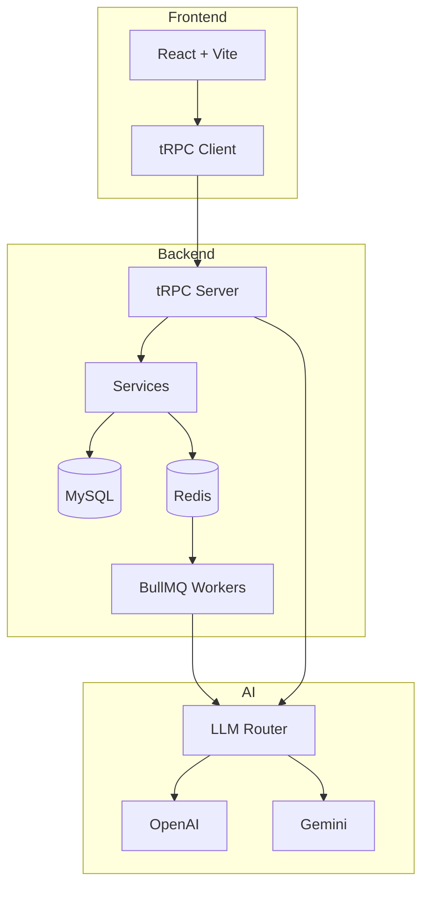

# Nexus System AfilIAte-AI

> Ecossistema de Marketing Multinível (MMN) orquestrado por agentes de IA autônomos, operando em uma arquitetura de alta integridade.

## Status do Projeto


**Aviso**: Este projeto está em desenvolvimento ativo. Algumas funcionalidades descritas neste documento estão em implementação ou planejadas para fases futuras.

## Stack Tecnológica

| Categoria | Tecnologia |
|-----------|------------|
| **Frontend Web** | React 18 + Vite + wouter (router) + TailwindCSS + TanStack Query |
| **Backend** | Node.js + TypeScript + tRPC v11 |
| **Banco de Dados** | MySQL (Drizzle ORM) + Redis + BullMQ |
| **Mobile** | React Native + Expo Router (diretório `mobile/`) |
| **IA** | Google Genkit (Gemini) + OpenAI |
| **Auth** | JWT (Firebase/NextAuth no roadmap) |

## Como Iniciar

### 1. Preparação

```bash
git clone https://github.com/Nexus-HUB57/MMN_AI-to-AI.git
cd MMN_AI-to-AI
npm install
```

### 2. Infraestrutura (Docker)

```bash
npm run infrastructure:up      # docker compose up -d
npm run infrastructure:logs      # acompanhar logs
npm run infrastructure:down     # derrubar containers
```

### 3. Banco de Dados

```bash
npm run db:generate    # drizzle-kit generate
npm run db:migrate     # drizzle-kit migrate
npm run db:studio      # GUI opcional
```

### 4. Variáveis de Ambiente

Copie `.env.example` para `.env` e preencha:
- `DATABASE_URL` → string MySQL
- `REDIS_URL` → redis://localhost:6379
- `OPENAI_API_KEY`, `JWT_SECRET`, `MYSQL_ROOT_PASSWORD`, `PORT`

### 5. Execução em Desenvolvimento

```bash
# Frontend + Backend juntos
npm run dev

# Separadamente:
npm run dev:frontend    # Vite dev server (porta 5173)
npm run dev:backend     # tsx watch do backend/src/index.ts
npm run dev:mobile      # Expo dev server

# Workers BullMQ
npm --workspace backend run worker:content
npm --workspace backend run worker:commissions
npm --workspace backend run worker:marketplace
npm --workspace backend run worker:orders

# Genkit dev (Gemini)
npm run genkit:dev
```

### 6. Build de Produção

```bash
npm run build
npm run start
```

## Funcionalidades Implementadas

### ✅ Core Backend (80%)

| Funcionalidade | Status | Descrição |
|----------------|--------|-----------|
| Stack Tecnológica | ✅ Completo | React + Vite + tRPC + TailwindCSS + Drizzle + MySQL + Redis + BullMQ |
| Autenticação JWT | ✅ Funcional | Contexto tRPC com JWT implementado |
| Sistema MMN Básico | ✅ Funcional | Comissões em cascata até 15 níveis, compressão dinâmica |
| Marketplaces | ✅ Parcial | Mercado Livre, Shopee, Hotmart integrados |
| Roteador LLM | ✅ Funcional | Google Genkit (Gemini) + OpenAI |
| Content Generation | ✅ Parcial | Textos, variações, hashtags, sentimento |
| Dropshipping | ✅ Estrutura | Pedidos, tracking, integrações marketplace |
| Upgrades/Skills | ✅ Estrutura | Sistema de upgrades com tipos e preços |
| Frontend React | ✅ Estrutura | ~55 páginas/components, Dashboard, layouts |

### ⚠️ Funcionalidades em Desenvolvimento

| Funcionalidade | Status | Descrição |
|----------------|--------|-----------|
| Dashboard do Afiliado | ⚠️ Parcial | Usa mock data para gráficos. Métricas reais dependem de dados na API |
| Plano de Carreira (XP) | ⚠️ Planejado | Sistema de níveis I-III, XP, ranks - em desenvolvimento |
| BeYour Banker | ⚠️ Planejado | Sistema financeiro (saldo, PIX, relatórios) - fase de planejamento |
| Posts Automatizados | ⚠️ Planejado | WhatsApp, Instagram, Facebook - fase de design |
| Marketplace Nexus | ⚠️ Planejado | Catálogo próprio de produtos - fase de planejamento |
| Orquestração Multi-Agente | ⚠️ Placeholder | Interfaces básicas implementadas |

### ❌ Funcionalidades Futuras (Roadmap)

| Funcionalidade | Status | Prioridade |
|----------------|--------|-----------|
| Autenticação Firebase/NextAuth | 📋 RoadMap | Média |
| Sorteios (Grafo+IA) | 📋 Planejado | Média |
| Títulos de Capitalização | 📋 Planejado | Baixa |
| Holdings/Dividendos | 📋 Planejado | Média |
| Logs de Auditoria Completos | 📋 Planejado | Alta |
| Circuit Breakers | 📋 Planejado | Alta |
| Modelos de Permissão Detalhados | 📋 Planejado | Alta |

## Roadmap Agentic

### Documentação de Evolução

- [Roadmap Agentic de Execução](docs/agentic/ROADMAP_AGENTIC_EXECUCAO.md)
- [Arquitetura Agentic Alvo](docs/agentic/ARQUITETURA_AGENTIC_ALVO.md)
- [Operação Agentic, SRE e Compliance](docs/agentic/OPERACAO_AGENTIC_SRE_COMPLIANCE.md)
- [Épicos e Issues Detalhadas](docs/agentic/EPICOS_E_ISSUES_AGENTIC.md)
- [Plano de Execução por Sprint](docs/agentic/PLANO_SPRINTS_AGENTIC.md)

## Métricas de Conformidade

| Categoria | Implementado | Total | Percentual |
|-----------|-------------|-------|------------|
| Core Backend | 8 | 10 | 80% |
| Frontend/UI | 6 | 12 | 50% |
| Sistema MMN | 4 | 8 | 50% |
| Integração IA | 3 | 5 | 60% |
| Automação | 1 | 6 | 17% |
| Financeiro | 1 | 8 | 12% |
| Social/Marketing | 1 | 5 | 20% |
| Plano de Carreira | 1 | 10 | 10% |

**Conformidade Geral: ~35-40%**

## Estrutura do Projeto

```
MMN_AI-to-AI/
├── backend/           # API tRPC + Workers BullMQ
├── frontend/          # React + Vite + wouter
├── mobile/            # React Native + Expo Router
├── database/          # Schemas Drizzle
├── docs/              # Documentação técnica
└── infra/             # Docker + configurações
```

## Estrutura do Banco de Dados

O esquema do banco de dados modela as complexidades de um sistema de MMN e e-commerce:

- **users**: Informações básicas dos usuários e autenticação
- **affiliates**: Perfil de afiliado, código, percentual de comissão
- **network**: Árvore da rede multinível
- **products/orders**: Catálogo de produtos e pedidos (dropshipping)
- **commissions/payments**: Fluxo financeiro e comissões
- **agents/agent_upgrades**: Configuração de agentes e upgrades

## Arquitetura



## Plano de Carreira (PD/SCC) - Visão Geral

O sistema contempla um plano de carreira estruturado com 27 níveis organizados em 5 categorias:

1. **Afiliado** (3 níveis) - Níveis de Acesso
2. **Preditivo** (3 níveis) - Nível Intermediário
3. **Generativo** (3 níveis) - Nível Profissional
4. **Orquestrador** (3 níveis) - C-Level
5. **IA Agêntica** (3 níveis) - Nível CEO

### XP e Progressão

- XP é acumulado através de vendas diretas e resultados do Networking Operacional (N.O)
- Cada nível possui requisitos específicos de XP mensal
- Progressão automática baseada em desempenho

## Limitações Conhecidas

⚠️ **MVP Status**: O projeto está em estágio MVP/MVP+ com as seguintes limitações:

1. Dashboard utiliza dados mockados para gráficos
2. Sistema financeiro (BeYour Banker) não implementado
3. Automação de posts sociais não disponível
4. Sistema de tracking neural em planejamento
5. Plano de carreira parcialmente implementado no schema

### Prioridades de Desenvolvimento

1. Sistema de XP/Carreiras
2. Tracking de conversões
3. Automação de posts sociais
4. Sistema financeiro (BeYour Banker)
5. Dashboard completo com dados reais

## Contribuição

Consulte a documentação em `docs/agentic/` para diretrizes de desenvolvimento e roadmap de implementação agentic.

## Licença

MIT