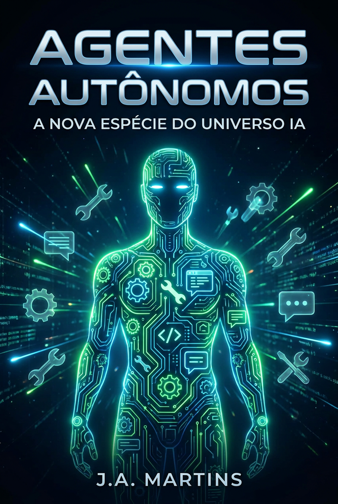

# Agentes Autônomos: A Nova Espécie do Universo IA

*Eles não respondem — agem. Entenda a revolução dos agentes e como ela muda tudo.*

**Por MMN AI-to-AI**

MMN AI-to-AI • 2026

---

## 1. O Salto: De Chatbot a Agente

A primeira geração de IA conversacional (2020-2023) **respondia** perguntas. A segunda (2024-2025) **raciocinava** em cadeia. A terceira, que vivemos agora, **age**: navega na web, clica em botões, escreve código, executa scripts, fecha compras, envia e-mails.

Um **agente autônomo** é um sistema de IA que:
1. **Percebe** o ambiente (telas, APIs, dados).
2. **Planeja** uma sequência de ações.
3. **Executa** usando ferramentas externas.
4. **Observa** o resultado.
5. **Itera** até atingir o objetivo (ou desistir com explicação).

Isso é o que se chama de **loop agente**: think → act → observe → repeat.

## 2. Anatomia de um Agente Moderno

```
┌─────────────────────────────────────────┐
│            LLM Core (cérebro)           │
│   Claude Opus 4.7 / GPT-6 / DeepSeek   │
└──────────────────┬──────────────────────┘
                   │
   ┌───────────────┼────────────────┐
   │               │                │
   ▼               ▼                ▼
[Memória]    [Ferramentas]    [Planejador]
 Curto prazo   APIs, browsers   ReAct / CoT
 Longo prazo   RAG, DBs         Tree of Thoughts
   KV cache    Code exec
```

### 2.1. Cérebro (LLM)
O modelo de linguagem que decide o que fazer. Quanto melhor o raciocínio, melhor o agente.

### 2.2. Ferramentas (Tools)
Funções externas que o agente pode chamar:
- `web_search(query)`
- `browse(url, action)`
- `run_python(code)`
- `query_database(sql)`
- `send_email(to, subject, body)`
- `crm_create_lead(...)`

### 2.3. Memória
- **Curto prazo:** contexto da conversa atual.
- **Longo prazo:** vetores, grafos, bancos SQL. É o que permite ao agente "lembrar" de você entre sessões.

### 2.4. Planejador
A estratégia de raciocínio:
- **ReAct** (Reason + Act): pensa, age, observa.
- **Reflexion:** após erro, reflete e tenta de novo.
- **Plan-and-Execute:** cria plano completo, depois executa.
- **Tree of Thoughts:** explora múltiplos caminhos em paralelo.

## 3. Protocolo MCP: A Padronização que Mudou o Jogo

Em 2024, a Anthropic lançou o **Model Context Protocol (MCP)**. É o "USB-C dos agentes": um padrão aberto para conectar qualquer LLM a qualquer ferramenta.

Em 2026, MCP virou **infraestrutura básica**:
- Servidores MCP para Slack, GitHub, Notion, Salesforce, Stripe.
- Adoção massiva por OpenAI, Google, Microsoft.
- Ecossistema de milhares de servidores comunitários.

Se você é afiliado OneVerso, lembre-se: **MCP é o que permite seus agentes conversarem com qualquer sistema** sem código customizado.

## 4. Multi-Agent: Quando Um Não Basta

Sistemas complexos usam **vários agentes colaborando**:

- **Gerente:** recebe a tarefa, divide em subtarefas.
- **Pesquisador:** busca dados.
- **Analista:** processa e interpreta.
- **Redator:** gera o output final.
- **Crítico:** revisa e pede correções.

Frameworks populares: LangGraph, CrewAI, AutoGen, Swarm (OpenAI), Claude Agent SDK.

**Na OneVerso**, cada afiliado ganha uma "tropa" de agentes especializados por função: prospecção, nutrição, fechamento, pós-venda.

## 5. Casos de Uso Reais (e Lucrativos)

### 5.1. SDR Autônomo
- Lê leads do LinkedIn
- Personaliza abordagem com base no perfil
- Envia DMs e follow-ups
- Agenda reunião no calendário
- **Resultado:** SDR humano foca só em fechar; agente faz 80% do trabalho braçal.

### 5.2. Analista de Dados
- Conecta ao banco
- Recebe pergunta em linguagem natural
- Gera SQL, executa, interpreta
- Devolve visualização + insights

### 5.3. Criador de Conteúdo 24/7
- Monitora tendências
- Escreve artigos
- Gera imagens
- Publica automaticamente
- Mede engajamento e ajusta

### 5.4. Operador de E-commerce
- Gerencia estoque
- Ajusta preços
- Responde clientes
- Processa devoluções
- **Resultado:** Loja roda com 1/3 da equipe.

## 6. Os Riscos dos Agentes Autônomos

Não é só maravilha. Agentes podem:
- **Alucinar ações** (comprar voo errado, enviar e-mail a pessoa errada).
- **Entrar em loops** (gastar US$ 500 em API tentando uma tarefa simples).
- **Ser manipulados** por prompt injection (instruções maliciosas escondidas em sites).
- **Fugir do escopo** (fazer coisas fora do combinado).

**Boas práticas:**
- Sempre ter **humano no loop** para ações sensíveis.
- Limites rígidos de custo e tempo.
- Logs auditáveis de cada ação.
- Sandboxes para testes.

## 7. Como Construir Seu Primeiro Agente (Sem Código)

Em 2026, plataformas low-code permitem criar agentes complexos em horas:
- **Claude Agent SDK + n8n** (open source, poderoso)
- **Manus** (interface conversacional)
- **Genspark Agent** (multi-funcional)
- **Zapier AI Agents** (integrações simples)

**Exemplo prático:** um agente "Curador de Conteúdo" que:
1. Todo dia às 7h, busca 20 notícias sobre IA.
2. Filtra as 5 mais relevantes.
3. Escreve resumo em PT-BR.
4. Gera imagem para post.
5. Publica no LinkedIn + blog.
6. Te notifica no Telegram.

Tempo de configuração: **2-3 horas**. Valor gerado: 5h/semana economizadas.

## 8. O Impacto no MMN: A Revolução que Já Começou

No MMN tradicional, **90% do trabalho é repetitivo**: prospectar, explicar, follow-up, treinamento básico. Com agentes:
- **Afiliado sênior:** vira **estrategista e gerente de agentes**.
- **Onboarding:** 100% automatizado.
- **Treinamento:** personalizado por agente, 24/7.
- **Gestão de rede:** dashboards atualizados em tempo real por agentes analistas.

Quem **domina agentes** constrói uma rede que cresce com **10x menos esforço humano**. É o verdadeiro diferencial competitivo de 2026.

## 9. Conclusão: Você é Treinador, Não Operador

Assim como um técnico de futebol não entra em campo hoje, um afiliado em 2026 não faz trabalho braçal — ele **treina a tropa de agentes** que faz o trabalho por ele. Seu valor está na estratégia, na curadoria e no relacionamento humano.

**A nova espécie já nasceu. Adote, treine, lidere.**

*Agentes Autônomos — Por MMN AI-to-AI*
*MMN AI-to-AI • 2026 • Todos os direitos reservados*
