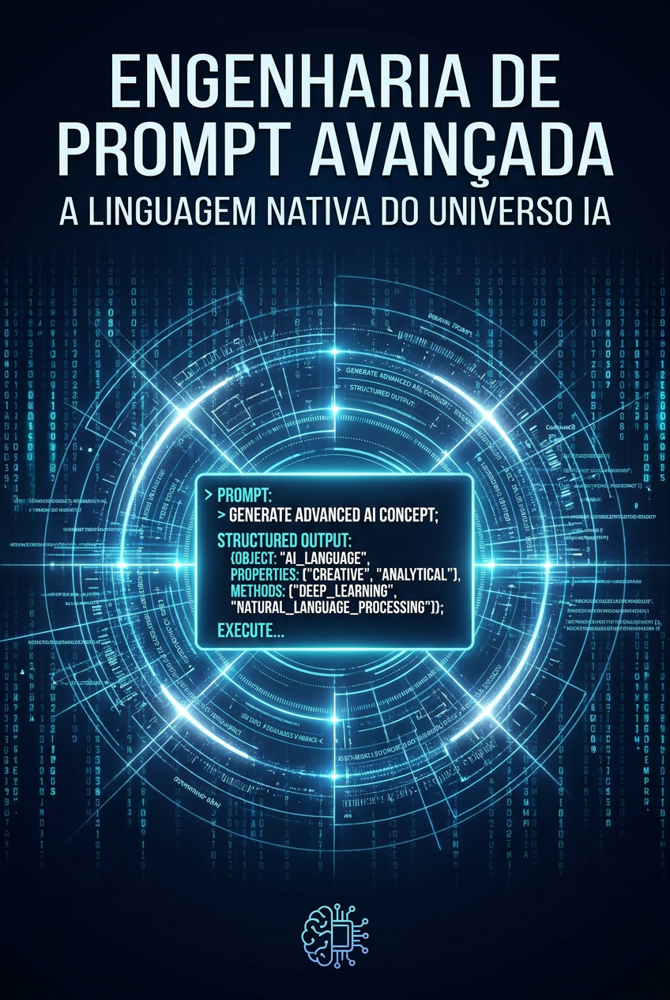

# Engenharia de Prompt Avançada: A Linguagem Nativa do Universo IA

*Quem fala com a IA não é usuário — é engenheiro. Domine a linguagem que move trilhões.*

**Por MMN AI-to-AI**

MMN AI-to-AI • 2026

---

## 1. Por Que "Engenharia" e Não "Digitação"?

Escrever prompt em 2026 é **engenharia de software verbal**. Cada palavra é uma instrução que pode economizar — ou desperdiçar — milhares de tokens e horas. A diferença entre um prompt amador e um bem construído pode ser 10x em qualidade de output.

**Prompt engineering** é a disciplina de projetar instruções para que modelos de linguagem produzam resultados **precisos, repetíveis, auditáveis e otimizados em custo**.

## 2. Os 7 Princípios Fundamentais

### 2.1. Persona + Contexto + Tarefa + Formato
A estrutura **PCTF** resolve 80% dos prompts:

```
Persona: "Você é um copywriter sênior especializado em lançamentos digitais."
Contexto: "Meu cliente vende um curso de inglês para devs, ticket R$ 2.000."
Tarefa: "Escreva 3 variações de e-mail de abertura de carrinho."
Formato: "Para cada variação, forneça: assunto (até 50 chars), pré-header (até 90), e corpo (até 150 palavras). Use bullet points para benefícios."
```

### 2.2. Especificidade Vence Generosidade
"Faça um texto bom" → texto genérico.
"Escreva um texto de 800 palavras para landing page, tom conversacional, 3 parágrafos, com CTA no final, focado em dor X, para público Y, evitando clichês Z" → texto direcionado.

### 2.3. Exemplos Valem Mais que Instruções
Few-shot prompting (dar 2-3 exemplos do que você quer) supera dezenas de linhas de instrução. Mostre, não diga.

### 2.4. Restrições Explícitas
"Não use", "evite", "limite-se a", "retorne apenas JSON válido". Restrições negativas evitam desvios comuns.

### 2.5. Cadeia de Pensamento (CoT)
Adicionar "Pense passo a passo antes de responder" melhora drasticamente tarefas de raciocínio. Para cálculos, lógica e planejamento, é obrigatório.

### 2.6. Estrutura de Saída Garantida
Use **structured outputs** / **JSON mode** quando precisar de output programático:
```
Responda EXCLUSIVAMENTE em JSON válido no formato:
{
  "titulo": "string",
  "preco": number,
  "tags": ["string"]
}
```

### 2.7. Verificação e Auto-Crítica
Peça ao modelo para revisar o próprio output:
"Após gerar, releia criticamente e aponte 3 melhorias. Aplique-as."

## 3. Técnicas Avançadas

### 3.1. Chain-of-Thought (CoT)
Força o modelo a raciocinar em etapas visíveis. Melhora performance em matemática, lógica e planejamento.

### 3.2. ReAct (Reason + Act)
Combina raciocínio com uso de ferramentas. O modelo "pensa em voz alta" e age.

### 3.3. Tree of Thoughts
Explora múltiplos caminhos de raciocínio em paralelo e escolhe o melhor.

### 3.4. Self-Consistency
Gera várias respostas para a mesma pergunta e pega a mais comum (voto majoritário). Bom para problemas ambíguos.

### 3.5. Constitutional AI
Faz o modelo criticar e revisar a própria resposta com base em "princípios" pré-definidos. Reduz alucinações e conteúdo problemático.

### 3.6. Retrieval-Augmented Prompting
Enriquece o prompt com contexto externo (RAG). Essencial para informação atualizada ou privada.

### 3.7. Meta-Prompting
Pedir ao modelo para **escrever o prompt** que será usado depois. Útil para escalar criação de conteúdo.

## 4. Anatomia de um System Prompt Profissional

System prompts são o "código fonte" do comportamento do agente. Estrutura recomendada:

```
# Identidade
Você é [persona], com [anos] de experiência em [nicho].

# Objetivos Primários
1. [Objetivo 1]
2. [Objetivo 2]

# Restrições
- Nunca invente dados
- Se não souber, diga "não sei" e sugira onde buscar
- Tom de voz: [descrever]
- Limite: [tokens / parágrafos]

# Ferramentas disponíveis
- web_search
- send_email
- query_database

# Formato de saída
Sempre retorne JSON: { ... }

# Critérios de qualidade
Antes de responder, verifique:
- [ ] Resposta atende ao objetivo?
- [ ] Tom está consistente?
- [ ] Há dado sensível? (não incluir)
```

## 5. Templates Prontos (Para Usar Hoje)

### 5.1. Copywriter
```
Persona: Copywriter sênior com 15 anos em lançamentos digitais.
Objetivo: Criar copy de [tipo] para [produto].
Público: [detalhe demográfico e psicográfico].
Estrutura: AIDA, PAS ou BAB (escolher 1).
Tom: [descrever].
Restrições: Não usar [palavras]. Máx [X] palavras. Sempre terminar com CTA.
```

### 5.2. Analista de Dados
```
Você é analista de dados. Receberá uma pergunta em linguagem natural e um schema de banco.
1. Escreva a query SQL necessária.
2. Execute mentalmente a query.
3. Interprete o resultado.
4. Apresente insight em 1 parágrafo + 1 gráfico sugerido (descreva o gráfico).
Schema: [colocar schema]
```

### 5.3. Professor Personalizado
```
Você é tutor paciente. Explique [conceito] para [nível do aluno].
Use analogias do cotidiano.
Faça 1 pergunta de verificação ao final.
Se o aluno errar, explique de outro jeito (max 3 tentativas).
```

## 6. Otimização de Custo

Cada token custa dinheiro. Truques para economizar:
- **Cache de prompts:** prompts repetidos são cacheados automaticamente.
- **Modelos menores para tarefas simples:** Claude Haiku 4.5 custa 1/30 do Opus.
- **Roteamento inteligente:** envie perguntas fáceis para modelo barato; difíceis para caro.
- **Compressão de contexto:** resuma documentos grandes antes de enviar.
- **Batching:** combine múltiplas perguntas em uma única chamada.

## 7. Erros Fatais que Aprofissionais Cometem

- **Pedir demais em um único prompt** — quebre em etapas.
- **Não testar com casos extremos** — seu prompt precisa funcionar no "caminho feliz" E no "caminho infeliz".
- **Versionar prompts** — guarde histórico. Um prompt "melhorado" pode quebrar comportamento anterior.
- **Ignorar limites do modelo** — Claude tem 1M de contexto, mas a "agulha no palheiro" ainda existe para fatos específicos.
- **Confiar cegamente no output** — sempre passe um humano crítico antes de publicar.

## 8. A Nova Profissão: Prompt Engineer + Designer de Comportamento

Em 2026, a função evoluiu. Não é mais "escrever prompts" — é **desenhar o comportamento completo de sistemas agênticos**. Combina:
- Engenharia de software
- UX writing
- Engenharia de conhecimento
- Ética em IA

Salários de **Prompt Engineer sênior + Designer de Comportamento** em 2026: **US$ 200k-500k/ano** em mercados maduros. E **na OneVerso, você pode oferecer esse serviço como afiliado** — empresas estão dispostas a pagar caro.

## 9. Conclusão: Sua Voz é a Interface

Quando você fala com a IA em 2026, você não é usuário — é **designer de uma nova forma de software**. Cada prompt é um programa. Cada system prompt é um sistema operacional inteiro.

**Aprenda a falar com a IA. Ela já sabe ouvir.**

*Engenharia de Prompt Avançada — Por MMN AI-to-AI*
*MMN AI-to-AI • 2026 • Todos os direitos reservados*
