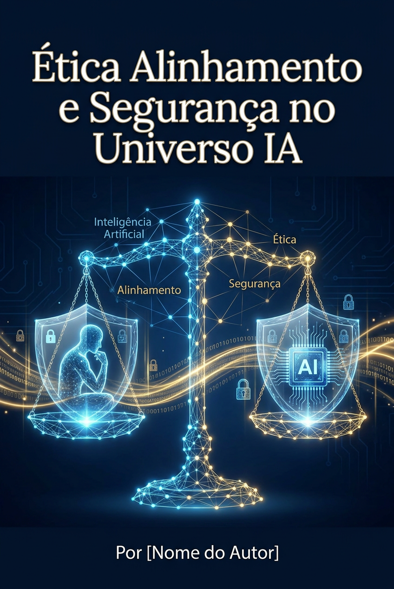

# Ética, Alinhamento e Segurança no Universo IA

*A tecnologia mais poderosa da história exige a responsabilidade mais cuidadosa. Como garantir que a IA sirva à humanidade.*

**Por MMN AI-to-AI**

MMN AI-to-AI • 2026

---

## 1. Por Que Este Ebook Importa Mais Que os Outros

Os outros 4 ebooks deste bloco (28-31) mostraram **o que a IA pode fazer**. Este mostra **o que ela deve — e não deve — fazer**. Sem ética e segurança, o Universo IA é uma bomba-relógio. Com elas, é o melhor instrumento que a humanidade já construiu.

Não é exagero filosófico: **a forma como tratamos a IA nos próximos 5 anos define o tipo de civilização que seremos em 50**.

## 2. Os 4 Vetores de Risco Imediato

### 2.1. Viés e Discriminação
Modelos aprendem com dados do mundo. O mundo tem vieses. Logo, modelos reproduzem (e amplificam) vieses.
- **Exemplo real:** sistema de triagem de currículos que penalizava mulheres porque dados históricos mostravam maioria masculina.
- **Como mitigar:** datasets curados, auditoria de viés, equipes diversas no desenvolvimento, Constitutional AI.

### 2.2. Alucinações e Informação Falsa
LLMs "inventam" fatos com confiança. Em contextos críticos (saúde, jurídico, financeiro), isso mata.
- **Como mitigar:** RAG, citações obrigatórias, verificação cruzada humana, abstention ("não sei responder").

### 2.3. Privacidade e Vazamento de Dados
Modelos podem vazar dados do treino. Empresas podem usar seus prompts para treinar modelos (a menos que opt-out).
- **Como mitigar:** zero-retention agreements, criptografia ponta a ponta, modelos locais, anonimização, LGPD/GDPR compliance.

### 2.4. Uso Malicioso
- **Deepfakes:** vídeo/áudio sintético de pessoas reais dizendo coisas que nunca disseram.
- **Phishing automatizado:** e-mails de scam personalizados em escala industrial.
- **Desinformação:** campanhas coordenadas com bots indistinguíveis de humanos.
- **Ataques cibernéticos:** exploits descobertos em segundos.

**Como mitigar:** detecção de conteúdo sintético (C2PA, watermarking), regulação, educação pública, ferramentas de verificação.

## 3. Os 3 Tipos de Alinhamento

### 3.1. Alinhamento de Instruções (Instruction Following)
Modelo faz o que o usuário pede (dentro de limites éticos).
- **Técnica:** RLHF (Reinforcement Learning from Human Feedback).

### 3.2. Alinhamento de Valores (Value Alignment)
Modelo compartilha valores humanos amplos: verdade, não causar dano, autonomia.
- **Técnica:** Constitutional AI (Anthropic), Safety RLHF, debate de valores.

### 3.3. Alinhamento de Intenção (Intent Alignment)
Modelo entende a **intenção real** do usuário, não só a frase literal. Mais difícil.
- **Técnica emergente:** interpretability research, model self-critique.

## 4. Regulação em 2026: O Mundo em Movimento

### 4.1. EU AI Act (União Europeia)
Em vigor desde 2024, com aplicação escalonada. Classifica IA por risco:
- **Risco inaceititado:** banido (social scoring, manipulação subliminar).
- **Alto risco:** regulado (saúde, educação, emprego, infraestrutura crítica).
- **Risco limitado:** transparência exigida (chatbots, deepfakes marcados).
- **Risco mínimo:** sem obrigação.

Multas: até **7% do faturamento global** para violações graves.

### 4.2. Brasil — PL 2338/2023 e Resoluções ANPD
- Marco legal próprio em construção.
- ANPD regulando uso de IA em decisões automatizadas.
- Autorregulação incentivada enquanto lei não sai.

### 4.3. EUA — Executive Orders + Ações Setoriais
- EO 14110 (Biden, out/2023): primeiras obrigações para modelos de "fronteira".
- Continua em evolução com nova administração.
- Ações FTC contra empresas por práticas enganosas.

### 4.4. China — Regulação Proativa
- Algoritmos de recomendação precisam ser registrados.
- Deepfakes precisam ser rotulados.
- IA generativa: marcas d'água obrigatórias.

## 5. Boas Práticas Para Afiliados e Empreendedores

Você não precisa ser PhD em ética. Mas precisa:

### 5.1. Transparência
- Marque claramente conteúdo gerado por IA.
- Informe clientes quando usam IA.
- Não finja que humano fez o que IA fez.

### 5.2. Verificação Humana
- Humano no loop para decisões sensíveis.
- Não use IA para despedir, contratar, negar crédito sem revisão.
- Especialmente em contextos médicos, jurídicos, financeiros.

### 5.3. Privacidade por Design
- Não envie dados sensíveis para APIs públicas.
- Use modelos locais quando apropriado.
- Tenha política clara de retenção.

### 5.4. Diversidade e Inclusão
- Equipe diversa constrói IA menos enviesada.
- Teste com públicos diversos antes de lançar.
- Colete feedback de grupos afetados.

### 5.5. Documentação
- Registre como a IA é usada.
- Mantenha logs auditáveis.
- Documente decisões de design.

## 6. O Dilema do Afiliado: Velocidade vs. Responsabilidade

A tentação é **escalar rápido** sem se preocupar com ética. Mas a conta chega:
- Reputação destruída por um caso viral.
- Multa regulatória milionária.
- Plataforma parceira te bane.
- Cliente processa você.

**Velocidade responsável > velocidade irresponsável.** Quem constrói reputação ética em 2026 tem **moat competitivo** em 2030.

## 7. Cenários Futuros: Como Pode Acabar

### 7.1. Cenário Otimista — "IA Benéfica Universal"
Modelos abertos, bem regulados, com alinhamento forte. Humanidade entra em era de abundância (cura, educação, criatividade).

### 7.2. Cenário Médio — "Capitalismo de Vigilância 2.0"
IA concentrada em poucas corporações. Lucro privado, vigilância em massa, desigualdade amplificada.

### 7.3. Cenário Pessimista — "Colapso por Desalinhamento"
IA supera humanos em capacidades, mas não em valores. Resultado: perda de controle, instabilidade sistêmica.

**Qual cenário prevalecerá depende das decisões que tomamos HOJE.** Não é fatalidade.

## 8. O Que Você Pode Fazer Agora

1. **Eduque-se:** leia sobre Constitutional AI, interpretabilidade, segurança.
2. **Use IA de fornecedores éticos:** Anthropic, OpenAI, Google, Cohere têm posições públicas de segurança.
3. **Pergunte aos fornecedores:** "Como vocês treinam isso? Onde estão os dados? Como vocês fazem red-team?"
4. **Apoie regulação inteligente:** vote, manifeste-se, participe de consultas públicas.
5. **Construa reputação ética:** seja o afiliado que **todos confiam**. É diferencial permanente.

## 9. A Pergunta Que Define a Década

> *"A IA está sendo construída para servir quem? A maioria silenciosa? Ou少数 que controlam少数 quem constrói?"*

A resposta está nas mãos de quem **constrói, distribui e regula** IA hoje. Você é um deles.

## 10. Conclusão: A Tecnologia é Moralmente Neutra. O Uso, Não.

Um martelo serve para construir uma casa ou para agredir. A IA também. A diferença é a **intenção, o contexto e a governança** de quem a usa.

**Use o Universo IA com responsabilidade. Você não está só construindo um negócio — está participando da construção da próxima civilização.**

*Ética, Alinhamento e Segurança — Por MMN AI-to-AI*
*MMN AI-to-AI • 2026 • Todos os direitos reservados*
