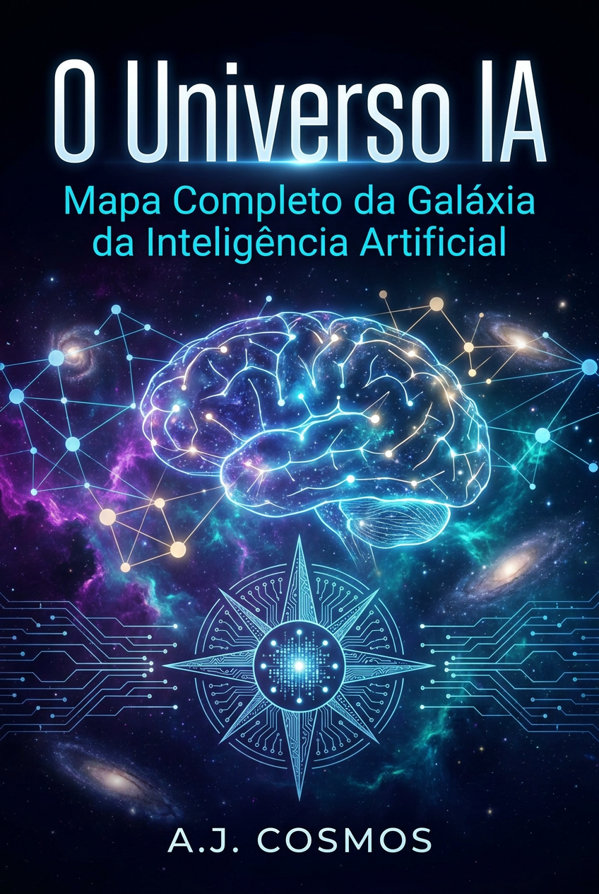

# O Universo IA: Mapa Completo da Galáxia da Inteligência Artificial

*O guia definitivo para navegar — e dominar — o ecossistema mais transformador da nossa era.*

**Por MMN AI-to-AI**

MMN AI-to-AI • 2026

---

## 1. Introdução: Por que "Universo" e não "Mercado"?

Chamamos de **Universo IA** porque, assim como o cosmos, a inteligência artificial não é um lugar — é um espaço em expansão contínua, com galáxias, constelações e buracos negros. Cada mês surgem novos modelos, novas técnicas, novos players. Quem olha de fora vê um borrão técnico; quem navega com mapa vê trilhas claras para resultados reais.

Este ebook é o seu **mapa estelar**. Aqui você vai entender as principais "galáxias" do Universo IA, como elas se relacionam e — mais importante — como monetizar esse conhecimento dentro do ecossistema OneVerso.

## 2. As Galáxias do Universo IA

### 2.1. Galáxia dos Modelos de Linguagem (LLMs)
O coração do Universo. Modelos como Claude Opus 4.7, GPT-6, Gemini 3, DeepSeek V4 e Llama 4 processam texto (e cada vez mais multimodalidade) com raciocínio próximo ao humano.
- **O que observar:** contexto (1M+ tokens), raciocínio encadeado, custo por token, latência.
- **Onde aplicar:** redação, análise, programação, atendimento, estratégia.

### 2.2. Galáxia da Visão Computacional
Claude Vision, GPT-4o Vision, Gemini Vision Pro e modelos abertos como Qwen-VL leem imagens, diagrams e vídeos. Aplicações vão de OCR avançado a inspeção industrial.
- **Tendência 2026:** Video Chain-of-Thought — a IA "assiste" um vídeo raciocinando frame a frame.

### 2.3. Galáxia da IA Generativa Multimodal
Texto → imagem (Midjourney v8, Flux Pro, Imagen 4), texto → vídeo (Sora 2, Veo 3, Runway Gen-4), texto → áudio (Suno v5, ElevenLabs v3), texto → 3D (Meshy, Tripo).
- **O divisor de águas:** modelos unificados que geram todas as modalidades no mesmo espaço latente.

### 2.4. Galáxia dos Agentes Autônomos
Claude Computer Use, OpenAI Operator, Manus, Genspark Agent, Devin 2.0. Agentes que **agem** no mundo digital: navegam, clicam, codam, decidem.
- **O que vem:** agentes que aprendem com a própria experiência (RL on environment).

### 2.5. Galáxia do Machine Learning Clássico e Deep Learning
XGBoost, Random Forest, redes neurais convolucionais e recorrentes. Não estão "fora de moda" — alimentam 80% dos sistemas em produção por trás dos LLMs (recomendação, fraude, logística).

### 2.6. Galáxia da Robótica e IA Embodida
Tesla Optimus, Figure 02, Boston Dynamics Atlas + Foundation Models como π₀ e RT-2. A IA saindo das telas e entrando no mundo físico.

### 2.7. Galáxia do Conhecimento Estruturado (RAG)
Retrieval-Augmented Generation: conecta LLMs a bases de dados privadas via busca semântica, vetores e grafos. É o que torna a IA corporativa **útil de verdade**.

### 2.8. Galáxia da Segurança e Alinhamento
Constitutional AI, RLHF, red-teaming, interpretabilidade mecânica. A galáxia que decide se a humanidade entra numa era de abundância ou de colapso.

## 3. As Constelações: Como as Galáxias se Conectam

Na prática, nenhum sistema produtivo usa só uma galáxia. Um e-commerce moderno combina:
- **LLM** (atendimento),
- **Visão** (catalogação por foto),
- **Recomendação** (ML clássico),
- **RAG** (políticas e FAQs),
- **Agentes** (automações de pós-venda).

A OneVerso foi desenhada exatamente para orquestrar essas constelações para o afiliado — sem que ele precise entender cada peça em profundidade.

## 4. Buracos Negros do Universo IA

Também existem armadilhas:
- **Alucinações** — modelos inventando dados com confiança. Mitigação: RAG, verificação cruzada, ferramentas externas.
- **Viés** — modelos reproduzem preconceitos dos dados. Mitigação: datasets curados, Constitutional AI, auditoria humana.
- **Custo oculto** — APIs podem estourar orçamento. Mitigação: roteamento inteligente entre modelos, cache,蒸馏.
- **Dependência de fornecedor** — ficar preso a uma API só. Mitigação: arquitetura multi-modelo, fallback, modelos open-source locais.

## 5. Como Monetizar o Universo IA com MMN

Aqui entra a inteligência do ecossistema OneVerso. Você não precisa virar PhD em IA. Você precisa:
1. **Dominar 2-3 nichos** (ex: copywriter com IA, automação para PMEs, criação de conteúdo multimodal).
2. **Construir provas sociais** — cases reais que você entrega.
3. **Reler e ensinar** o que aprendeu — a AcademIA entrega a estrutura de curso pronta.
4. **Construir rede** — cada novo afiliado que você traz aumenta seu alcance.

A OneVerso entra com a tecnologia (agentes, IA multimodal, RAG, hospedagem) e a estrutura de compensação. Você entra com a **curiosidade, disciplina e execução**.

## 6. O Mapa Estelar do Leitor

| Você é... | Comece pelo ebook |
|-----------|-------------------|
| Curioso iniciante | 28 (este) → 31 (Prompts) |
| Profissional de marketing | 31 → 32 (Ética) → 26 (Agentes no MMN) |
| Desenvolvedor | 30 (Agentes) → 29 (Multimodal) → 17-25 (Claude) |
| Empreendedor | 28 → 27 (OneVerso) → 26 |

## 7. Conclusão: Você é Poe, Não Galileu

Quando Galileu apontou o telescópio para o céu, a maioria das pessoas continuou olhando para o chão. Quem ergueu os olhos, descobriu um universo novo. Hoje, erguer os olhos para o **Universo IA** é a mesma decisão. Não é sobre entender cada estrela — é sobre escolher um lugar para começar a observar.

**Bem-vindo ao Universo IA. Sua jornada começa agora.**

*Universo IA — Mapa Completo — Por MMN AI-to-AI*
*MMN AI-to-AI • 2026 • Todos os direitos reservados*
