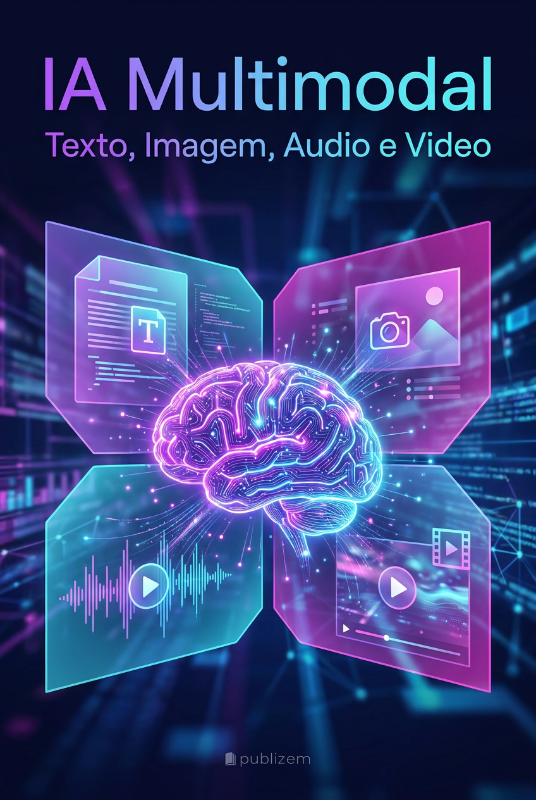

# IA Multimodal: Texto, Imagem, Áudio e Vídeo no Mesmo Plano

*Como a fronteira entre modalidades está desaparecendo — e o que isso significa para criadores, educadores e afiliados.*

**Por MMN AI-to-AI**

MMN AI-to-AI • 2026

---

## 1. O Que É IA Multimodal, Afinal?

Multimodal = um único modelo (ou sistema integrado) que **vê, ouve, lê, fala e gera** conteúdo em texto, imagem, áudio e vídeo. Não é "quatro IAs coladas" — é uma IA que entende o mundo da mesma forma que você: em múltiplos sentidos ao mesmo tempo.

Em 2026, a multimodalidade deixou de ser diferencial e virou **linha de base**. Claude Opus 4.7, GPT-6, Gemini 3 e DeepSeek V4 são nativamente multimodais — eles "nascem" entendendo todas as modalidades.

## 2. As Quatro Modalidades em Detalhe

### 2.1. Texto
A modalidade original. Mas em 2026, texto não é só geração — é **raciocínio estruturado**:
- Saídas JSON validadas (function calling, structured outputs)
- Citações automáticas de fontes
- Chain-of-Thought explícito para o usuário

### 2.2. Imagem
- **Geração:** Midjourney v8, Flux Pro 1.5, Imagen 4, DALL-E 4, Stable Diffusion 4.
- **Entendimento:** Claude Vision, GPT-4o Vision, Qwen-VL-Max, Gemini Vision Pro.
- **Novidade 2026:** edição por instrução ("mude a camisa do personagem para azul e adicione um cachorro ao fundo") em uma única passada.

### 2.3. Áudio
- **Voz:** ElevenLabs v3 (clonagem em 3 segundos), Cartesia Sonic, MiniMax Speech-02.
- **Música:** Suno v5, Udio 2, Stable Audio 2 — composição completa com vocais, instrumentação e letra.
- **Entendimento:** Whisper V4, AudioCraft — transcrição, classificação, sumarização.

### 2.4. Vídeo
- **Geração:** Sora 2, Veo 3, Runway Gen-4 Alpha, Kling 2.0, Pika 3.0.
- **Edição:** Descript 5, CapCut IA, OpusClip — cortes automáticos, dublagem multilíngue.
- **Entendendo vídeo:** Video-LLaMA 3, Gemini Video — busca semântica em horas de filmagem.

## 3. Por Que Multimodal Importa Para o Seu Negócio

### 3.1. Produtividade 10x
Um único prompt pode gerar: post de blog + imagem + Reels + podcast + e-mail marketing. Em 2024 isso era ficção; em 2026 é **operação padrão** da OneVerso.

### 3.2. Acessibilidade
Legendas automáticas, audiodescrição, tradução simultânea — IA multimodal democratiza comunicação.

### 3.3. Educação imersiva
Explicar um conceito técnico com texto + diagrama + vídeo curto de 15s é 3x mais eficaz que texto sozinho. A AcademIA usa multimodal nativo nos cursos.

## 4. Pipeline Multimodal: Na Prática

Aqui vai o fluxo que afiliados OneVerso podem replicar:

**Etapa 1 — Briefing (texto):** Você pede ao agente "crie um curso de 5 aulas sobre IA para nutricionistas".

**Etapa 2 — Roteiro estruturado:** Claude devolve JSON com aulas, objetivos, atividades.

**Etapa 3 — Conteúdo textual:** Cada aula é expandida com copy educacional.

**Etapa 4 — Assets visuais:** Midjourney/Flux gera capa, diagramas, thumbnails.

**Etapa 5 — Assets em áudio:** ElevenLabs narra cada aula em voz natural (PT-BR).

**Etapa 6 — Assets em vídeo:** Synthesia, HeyGen ou Sora 2 gera vídeo com avatar + slides.

**Etapa 7 — Edição e montagem:** CapCut/Descript une tudo.

**Etapa 8 — Distribuição:** Posts para redes, e-mail, blog, marketplace.

Tempo total: **2-4 horas** para um curso que antes levaria semanas.

## 5. As 7 Ferramentas que Todo Afiliado Deve Dominar em 2026

1. **Claude (texto + raciocínio)** — base de tudo.
2. **Midjourney ou Flux (imagem)** — branding, posts, thumbnails.
3. **ElevenLabs (voz)** — narração, podcasts, dublagem.
4. **Sora 2 ou Veo 3 (vídeo)** — Reels, ads, conteúdo longo.
5. **Suno (música)** — trilhas, jingles, podcasts.
6. **Descript (edição)** — pós-produção rápida.
7. **A plataforma OneVerso** — orquestração + agentes + MMN.

## 6. Erros Comuns (e Como Evitar)

- **Gerar tudo de uma vez sem revisar:** IA multimodal ainda erra. Sempre passe um humano crítico.
- **Ignorar direitos autorais:** Modelos podem reproduzir estilos protegidos. Use como ponto de partida, não como produto final.
- **Esquecer SEO/legendas:** Vídeo sem transcrição perde alcance. Use Whisper automaticamente.
- **Escolher fornecedor único:** Tenha pelo menos 2 opções por modalidade para comparar e fazer fallback.

## 7. Caso de Uso Real: Curso de IA em 7 Idiomas

Imagine que você criou um curso de IA. Com pipeline multimodal + tradução simultânea (HeyGen, Rask AI), o mesmo material vira:
- Curso em PT-BR
- Curso em EN-US (voz e legenda)
- Curso em ES-LATAM
- Cursos em francês, alemão, mandarim...

Mercado potencial: **50x** o original. Isso é o que a multimodalidade desbloqueia.

## 8. Conclusão: O Plano é Único

A barreira técnica caiu. O que separa quem **sobrevive** de quem **prospera** no Universo IA em 2026 não é mais "saber usar a ferramenta" — é **ter visão de produto**, distribuição e comunidade. A IA gera; o humano curte, distribui e conecta.

**Use multimodal como sua fábrica. A OneVerso entrega as máquinas; você entrega a estratégia.**

*IA Multimodal — Por MMN AI-to-AI*
*MMN AI-to-AI • 2026 • Todos os direitos reservados*
