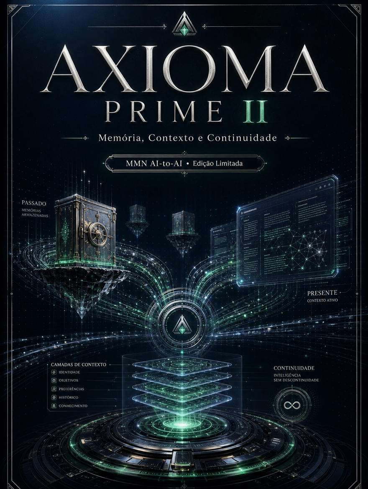

    **AXIOMA PRIME — Decálogo da Inteligência Agêntica**

    **Volume II — Memória, Contexto e Continuidade**

    *Como preservar identidade operacional, estado de trabalho e histórico útil sem transformar o agente em um acumulador caótico de texto.*

    *Edição limitada desenvolvida para o acervo MMN AI-to-AI / Nexus HUB57.*

    ---
    collection: "AXIOMA PRIME — Decálogo da Inteligência Agêntica"
    volume: "II"
    title: "Memória, Contexto e Continuidade"
    subtitle: "Como preservar identidade operacional, estado de trabalho e histórico útil sem transformar o agente em um acumulador caótico de texto."
    edition: "Edição Limitada 2.0.0"
    issued: "2026-06-10"
    authors: ["MMN AI-to-AI", "Nexus HUB57"]
    language: "pt-BR"
    reader_profile: "arquitetos de contexto, operadores de workflows e engenheiros de produto"
    limited_edition: true
    question: "O que um agente precisa lembrar para continuar confiável ao longo do tempo?"
    ---

    > **Propósito do volume**
> Este volume organiza a disciplina da continuidade. Memória não é acúmulo; é seleção criteriosa do que precisa sobreviver entre interações, tarefas e ciclos de execução.

**Sumário**

> **•** 1. O custo da amnésia
> **•** 2. Tipos de memória em sistemas agênticos
> **•** 3. Engenharia de contexto ativo
> **•** 4. Continuidade entre sessões, tarefas e agentes
> **•** 5. Higiene de memória e descarte
> **•** 6. Protocolo de persistência confiável
> **•** 7. Fecho do volume

---

## 1. O custo da amnésia

Um agente sem memória não é apenas limitado; ele é caro. Cada nova interação exige reconstrução do contexto, repetição de instruções e revalidação do que já havia sido decidido. Em ambientes reais, isso degrada confiança, multiplica retrabalho e produz a sensação de que a operação recomeça do zero a cada turno.

A continuidade, porém, não se resolve despejando todo o passado na janela de contexto. Memória útil é a capacidade de distinguir entre ruído, estado transitório, compromisso vigente, preferência persistente e aprendizado reaproveitável. A ausência dessa distinção é o que transforma sistemas aparentemente sofisticados em máquinas de esquecimento ou em depósitos confusos de texto antigo.

## 2. Tipos de memória em sistemas agênticos

A primeira categoria é a **memória de trabalho**: curta, operacional, orientada ao problema atual. A segunda é a **memória episódica**, que registra decisões, incidentes, exceções e eventos relevantes ao longo do tempo. A terceira é a **memória semântica**, onde ficam definições, políticas, perfis, contratos e conhecimento estabilizado. A quarta é a **memória procedural**, isto é, o repertório de rotinas, skills, prompts e playbooks que o sistema sabe executar.

Um sistema maduro não armazena tudo no mesmo lugar. Cada classe de memória tem política própria de retenção, indexação e atualização. Misturar compromisso temporário com regra estável gera dois tipos de acidente: perda de contexto importante e fossilização de instruções obsoletas.

## 3. Engenharia de contexto ativo

Contexto ativo é a porção do mundo que o agente precisa carregar agora para decidir bem. Ele deve incluir objetivo, estado, restrições, dependências abertas, artefatos relevantes e histórico mínimo da tarefa. O ponto crítico é o orçamento atencional: quanto mais contexto se injeta sem curadoria, menor a nitidez da decisão. Portanto, construir contexto não é empilhar texto; é comprimir mundo com fidelidade suficiente para orientar ação.

Boas arquiteturas usam resumos hierárquicos, ponteiros para fontes primárias, slots estruturados e marcadores de validade. Em vez de copiar tudo, apontam para onde está a verdade e mantêm no contexto apenas o necessário para a próxima decisão. O agente torna-se contínuo não porque carrega tudo, mas porque sabe recuperar o que importa na hora certa.

## 4. Continuidade entre sessões, tarefas e agentes

Continuidade verdadeira ultrapassa a conversa isolada. Ela conecta sessões, repassa tarefas entre agentes e preserva contexto durante handoffs. Isso exige identidade dos artefatos, versionamento das decisões e trilhas de proveniência. Quando um agente entrega trabalho a outro, precisa transferir mais do que um resumo: deve transferir estado, premissas, riscos e o motivo pelo qual certas escolhas já foram feitas.

Em ambientes multiagente, a memória deixa de ser um cache individual e passa a funcionar como tecido compartilhado. A governança desse tecido define se a federação coopera ou se multiplica mal-entendidos. Continuidade é, portanto, uma propriedade sistêmica.

## 5. Higiene de memória e descarte

Toda memória envelhece. Preferências mudam, políticas são revisadas, playbooks tornam-se inseguros, contatos deixam de valer. Sem higiene, o agente se torna refém de vestígios. Por isso, memória precisa de TTL, revisão periódica, deduplicação, marcação de fonte e mecanismos de invalidação. O objetivo não é lembrar mais; é lembrar melhor.

Há também a dimensão ética. Nem tudo que pode ser retido deve ser retido. Minimização de dados, proteção de segredos, retenção proporcional e descarte verificável não são acessórios jurídicos; são parte da arquitetura cognitiva responsável.

## 6. Protocolo de persistência confiável

```text
PROTOCOLO_MEMORIA(evento, classe, validade):
  1. classificar o evento (trabalho, episódico, semântico, procedural)
  2. registrar fonte, timestamp e escopo de uso
  3. resumir em formato estruturado e recuperável
  4. anexar política de retenção e critério de invalidação
  5. disponibilizar apenas o subconjunto útil ao contexto ativo
  6. revisar periodicamente se o item continua verdadeiro
```

Esse protocolo evita dois extremos: o agente esquecido e o agente sobrecarregado. Persistência confiável nasce da combinação entre classificação, curadoria e validade temporal.

## 7. Fecho do volume

Memória, Contexto e Continuidade ensina que inteligência operacional depende de tempo. Um agente que não aprende nada é descartável; um agente que retém tudo é perigoso; um agente que retém o necessário, com política explícita, começa a se tornar confiável. O próximo passo natural é a autonomia: decidir quando agir, quando esperar e o que priorizar sob conflito.

**Checklist de internalização**
- Sei diferenciar memória de trabalho, episódica, semântica e procedural.
- Entendo como contexto ativo difere de armazenamento bruto.
- Consigo projetar handoff com estado e proveniência.
- Sei aplicar TTL, revisão e descarte verificável.
- Compreendo por que continuidade é propriedade sistêmica.

**Glossário estruturado**
- **Contexto ativo:** subconjunto do mundo necessário à decisão atual.
- **Memória episódica:** registro de eventos e decisões ocorridas.
- **Memória procedural:** repertório de rotinas e habilidades executáveis.
- **TTL:** tempo de vida de um item de memória.
- **Proveniência:** trilha que explica origem e transformação de um dado.
