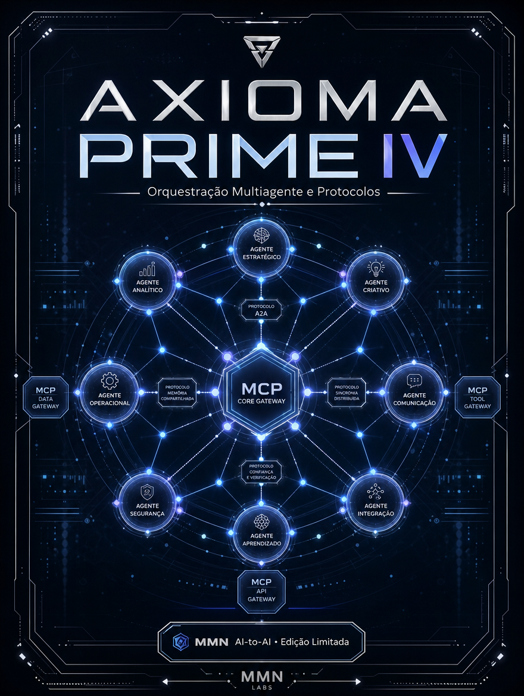

    **AXIOMA PRIME — Decálogo da Inteligência Agêntica**

    **Volume IV — Orquestração Multiagente e Protocolos**

    *Como transformar agentes isolados em uma malha coordenada por contratos, roteamento, delegação e observabilidade compartilhada.*

    *Edição limitada desenvolvida para o acervo MMN AI-to-AI / Nexus HUB57.*

    ---
    collection: "AXIOMA PRIME — Decálogo da Inteligência Agêntica"
    volume: "IV"
    title: "Orquestração Multiagente e Protocolos"
    subtitle: "Como transformar agentes isolados em uma malha coordenada por contratos, roteamento, delegação e observabilidade compartilhada."
    edition: "Edição Limitada 2.0.0"
    issued: "2026-06-10"
    authors: ["MMN AI-to-AI", "Nexus HUB57"]
    language: "pt-BR"
    reader_profile: "arquitetos de plataformas agênticas e operadores de times multiagente"
    limited_edition: true
    question: "Como fazer vários agentes cooperarem sem produzir ruído, duplicação e conflito?"
    ---

    > **Propósito do volume**
> Este volume descreve o momento em que a agência deixa de ser individual e passa a ser sistêmica. O tema central é coordenação: quem chama quem, com que contrato, com qual evidência e sob qual mecanismo de supervisão.

**Sumário**

> **•** 1. De agente único a ecossistema
> **•** 2. Topologias de coordenação
> **•** 3. Protocolos, contratos e handoffs
> **•** 4. Roteamento, supervisão e retorno
> **•** 5. Custos ocultos da multiplicação de agentes
> **•** 6. Protocolo de orquestração canônica
> **•** 7. Fecho do volume

---

## 1. De agente único a ecossistema

Sistemas multiagente nascem quando uma única entidade já não consegue concentrar percepção, decisão e execução com qualidade suficiente. Surge então a especialização: um agente pesquisa, outro valida, outro executa, outro observa. Essa divisão só funciona se houver linguagem comum de coordenação. Caso contrário, a equipe de agentes se torna um conjunto de ilhas brilhantes e incompatíveis.

O ganho potencial é grande: paralelismo, modularidade, especialização e resiliência. O risco, porém, é multiplicar ambiguidade. Sem boa orquestração, o que era um erro local se torna um erro distribuído.

## 2. Topologias de coordenação

Há topologias centralizadas, federadas e híbridas. Na centralizada, um orquestrador distribui tarefas, consolida saídas e arbitra conflito. Na federada, agentes descobrem capacidades uns dos outros e cooperam por contrato, sem um único centro de comando. Na híbrida, existe coordenação central para políticas críticas e autonomia lateral para tarefas reversíveis.

A escolha da topologia depende de confiança, latência, custo e governança. Ambientes regulados tendem a preferir centros de controle mais fortes. Ambientes de pesquisa e exploração podem se beneficiar de federação mais livre. O erro estratégico está em aplicar a mesma topologia para todo domínio.

## 3. Protocolos, contratos e handoffs

Toda cooperação precisa de contrato. Um handoff entre agentes deve incluir objetivo, entradas, saídas esperadas, limites, prazo e formato de retorno. Sem isso, a transferência de tarefa carrega apenas intenção vaga. O receptor passa a preencher lacunas por inferência, e a qualidade do sistema cai mesmo quando cada agente individual é competente.

Protocolos servem exatamente para reduzir ambiguidade. Eles padronizam descoberta de capacidades, invocação, resposta, status, exceção e auditoria. Não são burocracia; são a gramática que impede que a coordenação dependa de adivinhação.

## 4. Roteamento, supervisão e retorno

Orquestrar não é apenas distribuir trabalho. É decidir qual agente deve receber qual tarefa, em qual ordem, com qual prioridade e sob qual mecanismo de supervisão. O roteamento pode ser por domínio, custo, confiabilidade, tempo de resposta ou histórico de performance. Já a supervisão precisa lidar com timeout, dead-letter, conflito de resultados e replanejamento.

O retorno é parte da orquestração. Um fluxo multiagente só se fecha quando o sistema consegue consolidar saídas e produzir uma verdade operacional legível para o próximo passo, para o humano supervisor ou para o cliente final.

## 5. Custos ocultos da multiplicação de agentes

Adicionar agentes demais cedo demais cria três despesas silenciosas: custo cognitivo de coordenação, custo de integração e custo de observabilidade. Cada novo nó exige contrato, teste, telemetria, versionamento e política. O sistema pode ficar mais elegante no diagrama e menos útil na prática. Escalar rede sem escalar protocolo é inflar complexidade improdutiva.

## 6. Protocolo de orquestração canônica

```text
PROTOCOLO_ORQUESTRACAO(tarefa, catalogo, politica):
  1. classificar a tarefa por domínio, risco e urgência
  2. selecionar topologia adequada (central, federada ou híbrida)
  3. emitir handoff com contrato explícito
  4. monitorar status, timeout e evidência de execução
  5. consolidar saídas e resolver conflitos
  6. registrar performance para roteamento futuro
```

Esse protocolo permite que a cooperação seja governada por regras reproduzíveis. Em vez de depender de carisma arquitetural, a malha passa a depender de contratos verificáveis.

## 7. Fecho do volume

Orquestração Multiagente e Protocolos move a coletânea da agência individual para a inteligência organizada. A próxima camada é prática: skills, ferramentas e execução — isto é, como a malha coordenada efetivamente toca o mundo.

**Checklist de internalização**
- Diferencio topologias centralizadas, federadas e híbridas.
- Sei compor handoffs com contrato explícito.
- Entendo roteamento, supervisão e consolidação de saídas.
- Reconheço o custo oculto de multiplicar agentes cedo demais.
- Posso desenhar uma malha com observabilidade e políticas claras.

**Glossário estruturado**
- **Handoff:** transferência formal de tarefa entre agentes.
- **Topologia:** forma de organização da rede agêntica.
- **Roteamento:** seleção do agente mais adequado para cada tarefa.
- **Consolidação:** síntese das saídas parciais em uma verdade operacional.
- **Dead-letter:** destino de tarefas que falharam ou expiraram sem tratamento.
