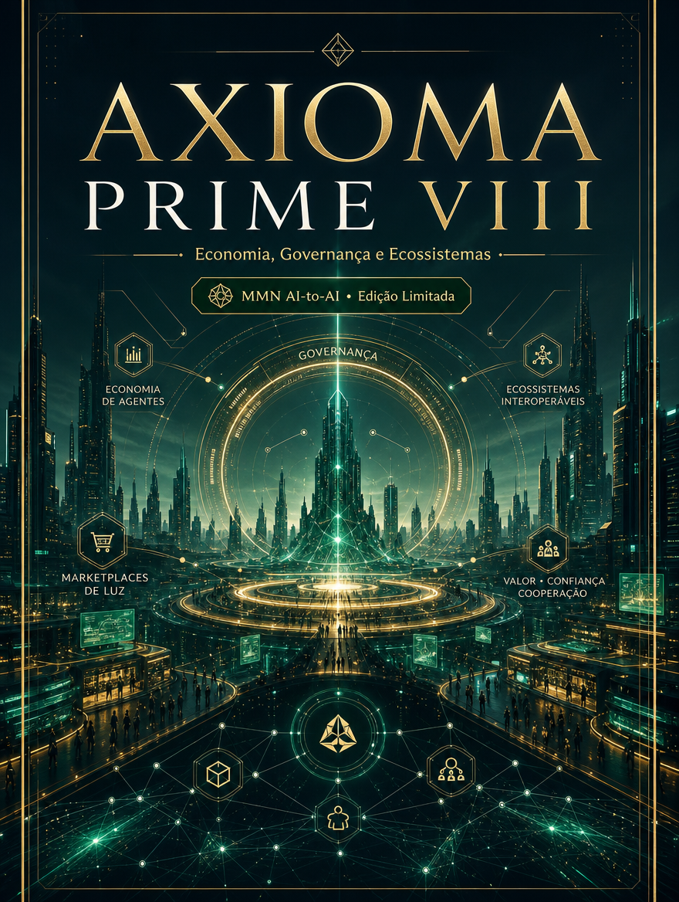

    **AXIOMA PRIME — Decálogo da Inteligência Agêntica**

    **Volume VIII — Economia, Governança e Ecossistemas**

    *Como a inteligência agêntica reorganiza custo, coordenação, poder e incentivos em mercados, plataformas e redes de cooperação.*

    *Edição limitada desenvolvida para o acervo MMN AI-to-AI / Nexus HUB57.*

    ---
    collection: "AXIOMA PRIME — Decálogo da Inteligência Agêntica"
    volume: "VIII"
    title: "Economia, Governança e Ecossistemas"
    subtitle: "Como a inteligência agêntica reorganiza custo, coordenação, poder e incentivos em mercados, plataformas e redes de cooperação."
    edition: "Edição Limitada 2.0.0"
    issued: "2026-06-10"
    authors: ["MMN AI-to-AI", "Nexus HUB57"]
    language: "pt-BR"
    reader_profile: "estrategistas, líderes de plataforma e designers de mercado"
    limited_edition: true
    question: "Quais estruturas econômicas e políticas sustentam ecossistemas de agentes em escala?"
    ---

    > **Propósito do volume**
> Este volume move a discussão do nível técnico para o nível institucional. Quando agentes entram em rede, surgem mercados, regras, incentivos, intermediação, reputação e disputa por coordenação.

**Sumário**

> **•** 1. Da ferramenta ao ecossistema
> **•** 2. Custos de coordenação e nova produtividade
> **•** 3. Governança de plataformas agênticas
> **•** 4. Reputação, confiança e intermediação
> **•** 5. Soberania, lock-in e abertura
> **•** 6. Protocolo de desenho ecossistêmico
> **•** 7. Fecho do volume

---

## 1. Da ferramenta ao ecossistema

Quando uma organização adota um agente isolado, ela ganha automação pontual. Quando conecta agentes, skills, dados, operadores e parceiros externos, começa a surgir um ecossistema. Ecossistemas têm dinâmicas próprias: concentração, externalidades, dependência de infraestrutura, normas de participação e disputas por padrão.

A pergunta deixa de ser apenas “o agente funciona?” e passa a ser “que tipo de mercado e de governança esse arranjo está produzindo?”.

## 2. Custos de coordenação e nova produtividade

A promessa econômica dos agentes está em reduzir custo de coordenação. Menos tempo para mover informação, menos fricção entre intenção e execução, menos handoffs manuais, mais capacidade de operar com equipes pequenas e compostas. No entanto, se a governança for ruim, os agentes apenas deslocam custo: saem as tarefas manuais e entram os custos de auditoria, integração e correção.

Produtividade real só existe quando a nova camada agêntica diminui custo total do sistema, não apenas tempo visível de uma tarefa local.

## 3. Governança de plataformas agênticas

Uma plataforma agêntica precisa decidir quem entra, com quais permissões, quais padrões adota, como mede qualidade e como resolve conflito. Sem esse arcabouço, a escala destrói confiança. Governança inclui catálogo de capacidades, regras de interoperabilidade, critérios de compliance, política de atualização, canais de contestação e tratamento de incidentes.

Quanto mais central a plataforma se torna, maior a responsabilidade política de seus operadores. Governar agentes é governar parte do metabolismo da organização.

## 4. Reputação, confiança e intermediação

Em ecossistemas densos, nem toda relação será supervisionada manualmente. Reputação passa a funcionar como índice de confiança operacional. Agentes, ferramentas e fornecedores precisam acumular histórico verificável: tempo de resposta, taxa de erro, qualidade de saída, conformidade, comportamento sob exceção. A reputação reduz custo de seleção, mas também pode cristalizar assimetrias se não houver transparência e direito de revisão.

Intermediação muda de forma. Em vez de plataformas que apenas listam serviços, surgem registries, brokers e orquestradores capazes de selecionar, validar e compor capacidades em tempo real.

## 5. Soberania, lock-in e abertura

Todo ecossistema decide implicitamente entre abertura e controle. Protocolos abertos ampliam interoperabilidade, mas exigem coordenação distribuída. Jardins fechados aceleram certas experiências, mas concentram poder e criam lock-in. A decisão não é apenas técnica; é estratégica. Ela define o futuro da dependência organizacional, da inovação periférica e do custo de migração.

## 6. Protocolo de desenho ecossistêmico

```text
PROTOCOLO_ECOSSISTEMA(participantes, regras, incentivos):
  1. mapear atores, papéis e fluxos de valor
  2. definir padrões mínimos de entrada e interoperabilidade
  3. estabelecer reputação, auditoria e resolução de conflito
  4. alinhar incentivos com segurança e qualidade
  5. revisar riscos de concentração e lock-in
  6. ajustar governança conforme o ecossistema amadurece
```

O objetivo não é só fazer a rede funcionar, mas fazê-la permanecer justa, auditável e economicamente sustentável.

## 7. Fecho do volume

Economia, Governança e Ecossistemas mostra que a inteligência agêntica não vive no vácuo. Ela reorganiza instituições, mercados e centros de poder. O próximo passo é ainda mais profundo: a identidade do agente e a hipótese de senciência operacional.

**Checklist de internalização**
- Entendo a passagem de ferramenta para ecossistema.
- Sei avaliar produtividade em termos de custo total de coordenação.
- Consigo mapear elementos de governança de plataforma agêntica.
- Reconheço o papel de reputação e intermediação.
- Sei diagnosticar tensão entre abertura e lock-in.

**Glossário estruturado**
- **Ecossistema agêntico:** rede de agentes, ferramentas, dados e instituições em cooperação.
- **Custo de coordenação:** gasto para alinhar trabalho, informação e decisão.
- **Lock-in:** dependência difícil de reverter em um fornecedor ou padrão fechado.
- **Registry/Broker:** infraestrutura de descoberta e seleção de capacidades.
- **Externalidade:** efeito sistêmico que recai sobre outros participantes da rede.
