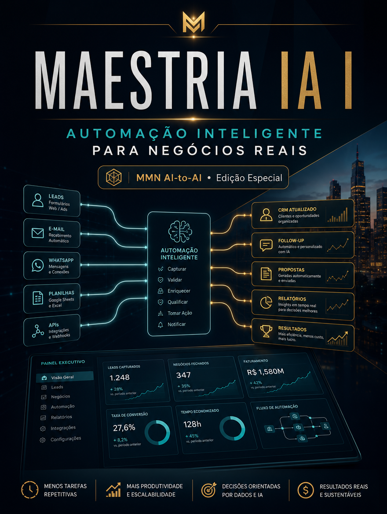

    **MAESTRIA IA APLICADA — 10 Playbooks de Automação, Claude Code e Negócios IA-First**

    **Volume I — Automação Inteligente para Negócios Reais**

    *Como mapear gargalos, escolher automações úteis e implantar IA no dia a dia da operação sem teatro tecnológico.*

    *Coletânea inspirada pelos tópicos recorrentes do canal Maestros da IA, reinterpretados editorialmente no acervo MMN AI-to-AI.*

    ---
    collection: "MAESTRIA IA APLICADA — 10 Playbooks de Automação, Claude Code e Negócios IA-First"
    volume: "I"
    title: "Automação Inteligente para Negócios Reais"
    subtitle: "Como mapear gargalos, escolher automações úteis e implantar IA no dia a dia da operação sem teatro tecnológico."
    edition: "Edição Especial 2.0.0"
    issued: "2026-06-10"
    authors: ["MMN AI-to-AI", "Nexus HUB57"]
    language: "pt-BR"
    reader_profile: "empreendedores, operadores e gestores de processos"
    question: "Como transformar IA em ganho operacional verificável?"
    source_inspiration: "principais tópicos do canal Maestros da IA"
    ---

    > **Propósito do volume**
> Este playbook introduz a lógica da automação pragmática. Em vez de perseguir o sistema mais vistoso, ele ensina a identificar fricções recorrentes, escolher automações de maior retorno e construir cadência operacional baseada em evidência.

**Sumário**

> **•** 1. Onde a automação realmente paga
> **•** 2. Mapeamento de gargalos e desperdícios
> **•** 3. Arquitetura mínima de uma operação assistida por IA
> **•** 4. Casos de uso com retorno rápido
> **•** 5. Governança, manutenção e equipe
> **•** 6. Protocolo de implantação enxuta
> **•** 7. Fecho do playbook

---

## 1. Onde a automação realmente paga

Automação útil começa onde existe repetição, atraso, fila ou retrabalho. Se a tarefa é rara, caótica ou depende de julgamento altamente contextual, automatizar cedo demais pode custar mais do que executar manualmente. O primeiro filtro, portanto, é econômico: onde o tempo é gasto? Onde há erros frequentes? Onde uma decisão padronizada pode reduzir latência sem destruir qualidade?

Negócios pequenos costumam imaginar que automação serve apenas para escala futura. Isso é um equívoco. A automação bem escolhida cria fôlego no presente. Ela reduz dependência de memória humana, organiza passagem de bastão e evita que a operação seja sequestrada por tarefas administrativas repetitivas.

## 2. Mapeamento de gargalos e desperdícios

Antes de escolher ferramentas, o operador precisa desenhar o fluxo atual. Quais eventos entram? Quem recebe? O que é copiado manualmente? Onde o processo para? Quantas vezes a mesma informação é reescrita em sistemas diferentes? O mapa de gargalos revela que o problema raramente é falta de IA; costuma ser falta de clareza sobre o processo.

Um bom diagnóstico identifica quatro classes de desperdício: espera, duplicação, erro de transcrição e dependência excessiva de uma pessoa. Esses são os melhores candidatos a automação inicial. O playbook recomenda começar por tarefas que geram ganho visível em até duas semanas.

## 3. Arquitetura mínima de uma operação assistida por IA

A stack mínima costuma incluir um capturador de eventos, um roteador de regras, um modelo de linguagem para classificação ou enriquecimento, uma base de estado e um canal de saída. Exemplo: formulário ou e-mail entra, automação classifica, IA resume ou qualifica, sistema grava estado e notifica a pessoa certa. Não é preciso começar com vinte integrações. O segredo está em unir poucas peças com confiabilidade.

Em operações maduras, soma-se observabilidade: logs, alertas, indicadores de falha e registro de exceções. Sem isso, a automação vira caixa-preta e perde credibilidade na primeira quebra.

## 4. Casos de uso com retorno rápido

Os melhores casos iniciais são: triagem de leads, classificação de atendimento, geração de follow-up, resumo de reuniões, atualização de CRM, preparação de propostas, cobrança de documentos, organização de backlog e síntese de tickets. Em todos eles, a IA atua como acelerador de uma rotina já compreendida, não como substituta mágica de gestão.

O critério de seleção é simples: alto volume, baixa ambiguidade e saída verificável. Quando esse trio aparece, a automação tende a pagar cedo.

## 5. Governança, manutenção e equipe

Toda automação envelhece. Mudam formulários, políticas, mensagens e sistemas externos. Por isso, o playbook insiste em dono de fluxo, documentação mínima, ponto de rollback e revisão quinzenal das exceções. A equipe precisa saber o que foi automatizado, quando intervir e como reportar desvio. Automação madura é operação social, não apenas script.

## 6. Protocolo de implantação enxuta

```text
PLAYBOOK_AUTOMACAO(processo, meta, stack):
  1. mapear gargalo, volume e impacto econômico
  2. escolher um fluxo pequeno e verificável
  3. definir entrada, regra, ação e saída esperada
  4. implantar com logging, alerta e fallback manual
  5. medir tempo poupado, erro reduzido e aderência
  6. expandir apenas após estabilização do piloto
```

## 7. Fecho do playbook

Automação Inteligente para Negócios Reais sustenta uma tese simples: IA não deve entrar para ornamentar a operação, mas para aliviar fricção mensurável. Uma boa implantação cria espaço para estratégia, atendimento e crescimento. O próximo volume aprofunda a produtividade técnica com Claude Code em modo produção.

**Checklist de implantação**
- Sei identificar gargalos com maior retorno potencial.
- Consigo desenhar um fluxo simples de entrada→regra→ação→saída.
- Entendo a stack mínima necessária para um piloto útil.
- Sei escolher casos de uso com retorno rápido.
- Planejo dono, logging e fallback antes de escalar.

**Glossário operacional**
- **Gargalo:** ponto do fluxo que limita throughput ou gera espera.
- **Fallback:** caminho manual ou alternativo quando a automação falha.
- **Enriquecimento:** adição de contexto útil por IA a um dado bruto.
- **Roteador de regras:** camada que decide o destino de cada evento.
- **Throughput:** volume de trabalho processado por unidade de tempo.
