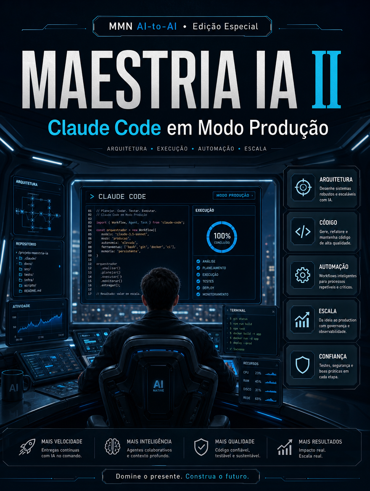

    **MAESTRIA IA APLICADA — 10 Playbooks de Automação, Claude Code e Negócios IA-First**

    **Volume II — Claude Code em Modo Produção**

    *Como usar IA para acelerar desenvolvimento real com contexto de repositório, ciclos curtos de teste e disciplina de entrega.*

    *Coletânea inspirada pelos tópicos recorrentes do canal Maestros da IA, reinterpretados editorialmente no acervo MMN AI-to-AI.*

    ---
    collection: "MAESTRIA IA APLICADA — 10 Playbooks de Automação, Claude Code e Negócios IA-First"
    volume: "II"
    title: "Claude Code em Modo Produção"
    subtitle: "Como usar IA para acelerar desenvolvimento real com contexto de repositório, ciclos curtos de teste e disciplina de entrega."
    edition: "Edição Especial 2.0.0"
    issued: "2026-06-10"
    authors: ["MMN AI-to-AI", "Nexus HUB57"]
    language: "pt-BR"
    reader_profile: "desenvolvedores, operadores técnicos e founders produto"
    question: "Como transformar assistência de código em aumento real de throughput e qualidade?"
    source_inspiration: "principais tópicos do canal Maestros da IA"
    ---

    > **Propósito do volume**
> Este volume trata do uso de IA em desenvolvimento como prática de produção, não como demo. O foco está em contexto de repositório, decomposição de tarefas, validação local e redução de retrabalho.

**Sumário**

> **•** 1. O que muda quando IA entra no ciclo de desenvolvimento
> **•** 2. Contexto de repositório e briefing correto
> **•** 3. Tarefas pequenas, testes rápidos, feedback curto
> **•** 4. Refatoração, debugging e documentação viva
> **•** 5. Riscos de comoditização e cegueira técnica
> **•** 6. Protocolo de uso disciplinado
> **•** 7. Fecho do playbook

---

## 1. O que muda quando IA entra no ciclo de desenvolvimento

A principal mudança não é a geração de código em si. É a velocidade com que hipóteses podem ser transformadas em implementação, testadas e descartadas. Isso altera a economia do desenvolvimento: tarefas menores passam a ser executadas com menos atrito, e o gargalo se desloca do typing para definição de problema, revisão e integração.

O ganho real aparece quando a IA participa do ciclo completo: entender contexto, propor alteração, rodar testes, ler erro, corrigir, documentar. Fora desse ciclo, ela apenas gera trechos isolados e amplia entropia.

## 2. Contexto de repositório e briefing correto

Ferramentas como Claude Code são poderosas quando recebem contexto suficiente. Isso inclui estrutura do projeto, convenções, trechos relacionados, objetivos, restrições e critérios de aceite. O pedido genérico “faça X” produz respostas genéricas. O briefing bom localiza o problema, nomeia arquivos, descreve comportamento esperado e explicita o que não deve ser alterado.

Em produção, a IA precisa operar com respeito ao repositório. Ler antes de escrever, preservar padrões existentes, tocar apenas o escopo pedido e justificar mudanças. Quanto maior a clareza do briefing, menor o retrabalho posterior.

## 3. Tarefas pequenas, testes rápidos, feedback curto

O melhor uso de IA em engenharia não está em grandes saltos cegos, mas em ciclos curtos. Divide-se a demanda em unidades testáveis, altera-se um ponto por vez, executam-se testes, revisa-se saída e só então avança-se. Esse ritmo reduz superfície de erro e facilita rollback.

Equipes que pedem mudanças massivas de uma vez tendem a perder rastreabilidade. Já equipes que operam em blocos pequenos transformam a IA em parceira de throughput, não em geradora de surpresas.

## 4. Refatoração, debugging e documentação viva

A IA brilha especialmente em tarefas de refatoração localizada, explicação de stack trace, escrita de testes, geração de scaffolding e atualização de documentação. Ela também acelera descoberta de caminhos em codebases grandes. Mas cada ganho desses só se mantém quando existe revisão humana de arquitetura, segurança e impacto sistêmico.

Documentação viva é subproduto valioso desse processo. Sempre que uma mudança importante é feita, o sistema deve atualizar README, comentários estratégicos ou changelog relevante. IA ajuda muito quando a equipe faz dessa atualização uma regra, não um desejo.

## 5. Riscos de comoditização e cegueira técnica

Há dois riscos claros. O primeiro é deixar a IA produzir código que ninguém entende. O segundo é aceitar soluções localmente corretas e sistêmicamente frágeis. O uso maduro exige revisão, testes, diffs pequenos e responsabilidade humana pela decisão final. IA acelera; não absolve.

## 6. Protocolo de uso disciplinado

```text
PLAYBOOK_CLAUDE_CODE(tarefa, repo, criterio):
  1. localizar arquivos, comportamento atual e restrições
  2. decompor a mudança em etapas pequenas
  3. solicitar alteração com escopo explícito
  4. executar testes e ler falhas antes de prosseguir
  5. revisar diff, impacto lateral e documentação associada
  6. consolidar somente quando o comportamento estiver validado
```

## 7. Fecho do playbook

Claude Code em Modo Produção mostra que velocidade sem disciplina produz dívida. Com contexto certo, ciclos curtos e revisão séria, a IA se torna acelerador de engenharia. O próximo volume expande a visão: workflows bem desenhados valem mais do que agentes isolados.

**Checklist de implantação**
- Sei preparar briefing técnico com contexto de repositório.
- Trabalho em diffs pequenos e verificáveis.
- Uso testes e erro real como feedback principal.
- Entendo onde a IA ajuda em refatoração e debugging.
- Reconheço riscos de cegueira técnica e dívida oculta.

**Glossário operacional**
- **Diff:** conjunto de mudanças entre versões de arquivos.
- **Scaffolding:** estrutura inicial de código ou projeto.
- **Stack trace:** trilha de execução que explica um erro.
- **Critério de aceite:** condição objetiva para considerar a tarefa concluída.
- **Dívida técnica:** custo futuro gerado por atalhos de implementação.
