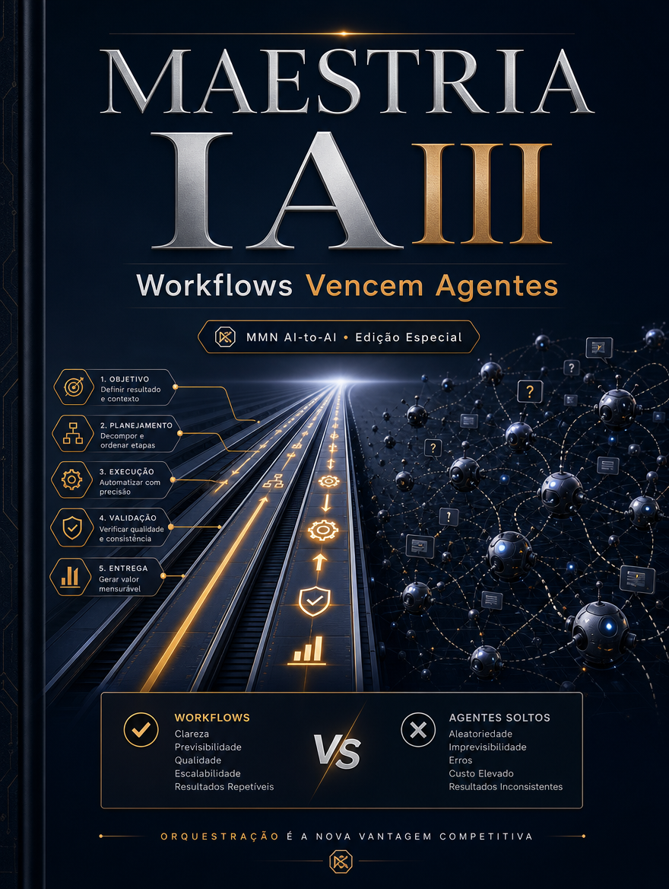

    **MAESTRIA IA APLICADA — 10 Playbooks de Automação, Claude Code e Negócios IA-First**

    **Volume III — Workflows Vencem Agentes**

    *Por que o desenho do fluxo importa mais do que o brilho do agente individual, e como construir sistemas previsíveis usando etapas, gatilhos e checkpoints.*

    *Coletânea inspirada pelos tópicos recorrentes do canal Maestros da IA, reinterpretados editorialmente no acervo MMN AI-to-AI.*

    ---
    collection: "MAESTRIA IA APLICADA — 10 Playbooks de Automação, Claude Code e Negócios IA-First"
    volume: "III"
    title: "Workflows Vencem Agentes"
    subtitle: "Por que o desenho do fluxo importa mais do que o brilho do agente individual, e como construir sistemas previsíveis usando etapas, gatilhos e checkpoints."
    edition: "Edição Especial 2.0.0"
    issued: "2026-06-10"
    authors: ["MMN AI-to-AI", "Nexus HUB57"]
    language: "pt-BR"
    reader_profile: "operadores de automação, gestores e arquitetos de processo"
    question: "Como projetar operações onde o fluxo vale mais do que a conversa?"
    source_inspiration: "principais tópicos do canal Maestros da IA"
    ---

    > **Propósito do volume**
> Este volume corrige um desvio comum do mercado: acreditar que um agente brilhante compensa processo mal desenhado. Na prática, resultado sustentável nasce de workflow claro, checkpoints e passagem de estado confiável.

**Sumário**

> **•** 1. O mito do agente genial
> **•** 2. Fluxo, estado e previsibilidade
> **•** 3. Gatilhos, decisões e checkpoints
> **•** 4. Quando usar agentes dentro do workflow
> **•** 5. Métricas de um fluxo saudável
> **•** 6. Protocolo de desenho operacional
> **•** 7. Fecho do playbook

---

## 1. O mito do agente genial

Muitas operações travam porque tentam pedir demais a uma única conversa. Querem que o agente lembre contexto, busque dado, decida, execute, acompanhe e ainda adapte tudo em tempo real. O problema não é o agente; é o desenho. Quando o fluxo é mal definido, qualquer sistema parece inconsistente.

Workflows vencem agentes porque externalizam estrutura. Eles transformam expectativa implícita em etapas nomeadas, com entradas, saídas e critérios. Isso torna o sistema auditável e mais fácil de melhorar.

## 2. Fluxo, estado e previsibilidade

Um workflow existe para preservar ordem entre eventos. Ele define o que acontece primeiro, o que depende do quê, onde ficam os estados intermediários e em que momento uma decisão humana entra. Sem isso, a operação vira improviso em série. Fluxo é memória organizacional aplicada.

O estado é o coração do workflow. Não basta saber o que entrou; é preciso saber em que estágio cada item está, qual passo falta, quem assumiu a responsabilidade e quais condições bloqueiam avanço.

## 3. Gatilhos, decisões e checkpoints

Todo fluxo sólido combina três elementos. O gatilho detecta que algo começou. A decisão classifica o caminho adequado. O checkpoint verifica se a etapa gerou o efeito esperado antes de permitir continuidade. Sem checkpoint, o workflow apenas encadeia ações às cegas.

IA entra melhor no ponto da decisão ou do enriquecimento, não na totalidade do sistema. Ela classifica, resume, pontua, sugere. O workflow decide quando essa inteligência é usada e como sua saída será validada.

## 4. Quando usar agentes dentro do workflow

Agentes fazem sentido quando existe ambiguidade moderada, necessidade de interpretação e ganho com adaptabilidade. Mas eles devem operar como componentes do fluxo, não como substitutos do fluxo. Um agente pode decidir prioridade de ticket, sintetizar proposta ou extrair dados de documento. Ainda assim, a operação precisa de estados, retries, exceções e responsáveis.

## 5. Métricas de um fluxo saudável

Os sinais principais são throughput, tempo de ciclo, taxa de bloqueio, retrabalho, taxa de exceção e proporção de escalonamento humano. Quando essas métricas melhoram sem perda de qualidade, o workflow está vencendo. Quando a automação cresce e as exceções explodem, o desenho precisa ser revisto.

## 6. Protocolo de desenho operacional

```text
PLAYBOOK_WORKFLOW(evento, etapas, metricas):
  1. nomear gatilho, estado inicial e objetivo final
  2. decompor o fluxo em etapas observáveis
  3. definir onde a IA decide, resume ou classifica
  4. inserir checkpoints antes de ações críticas
  5. medir exceção, bloqueio e tempo de ciclo
  6. iterar o fluxo a partir de gargalos reais
```

## 7. Fecho do playbook

Workflows Vencem Agentes reposiciona a IA como parte de uma arquitetura maior. O operador que entende isso para de perseguir performance teatral e passa a construir sistemas previsíveis. O próximo volume entra na instrumentação prática com Make, n8n e orquestração sem gargalos.

**Checklist de implantação**
- Distingo agente de workflow.
- Consigo desenhar estados e checkpoints claros.
- Sei localizar o melhor ponto de uso da IA no fluxo.
- Meço o fluxo por tempo de ciclo, exceção e retrabalho.
- Entendo que previsibilidade nasce de estrutura externa.

**Glossário operacional**
- **Gatilho:** evento que inicia o fluxo.
- **Checkpoint:** validação intermediária antes da continuidade.
- **Tempo de ciclo:** duração total de processamento de um item.
- **Throughput:** quantidade de itens concluídos por período.
- **Escalonamento:** passagem do item para intervenção humana ou nível superior.
