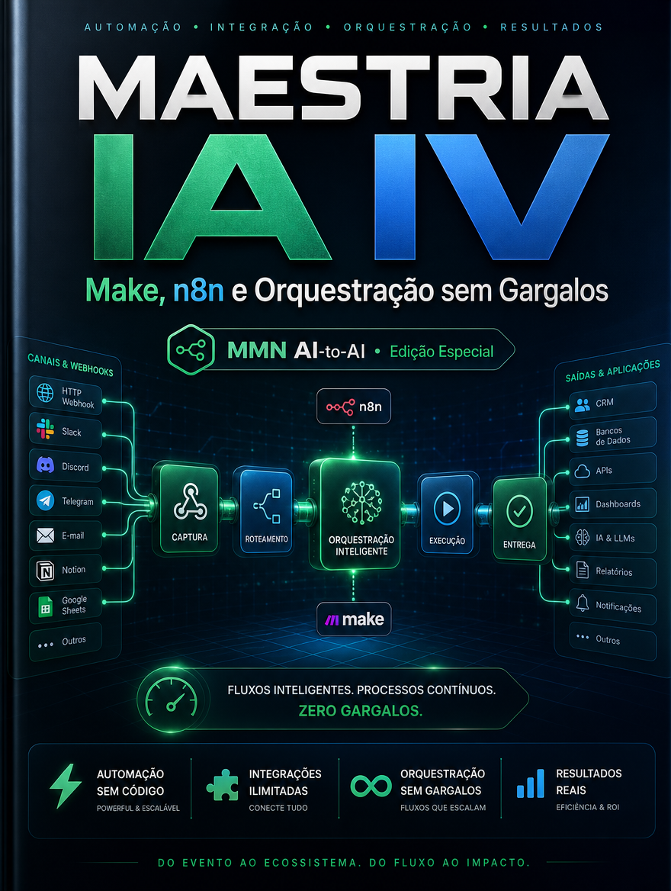

    **MAESTRIA IA APLICADA — 10 Playbooks de Automação, Claude Code e Negócios IA-First**

    **Volume IV — Make, n8n e Orquestração sem Gargalos**

    *Como usar plataformas de automação para encadear sistemas, reduzir fila manual e criar operações visíveis, resilientes e fáceis de manter.*

    *Coletânea inspirada pelos tópicos recorrentes do canal Maestros da IA, reinterpretados editorialmente no acervo MMN AI-to-AI.*

    ---
    collection: "MAESTRIA IA APLICADA — 10 Playbooks de Automação, Claude Code e Negócios IA-First"
    volume: "IV"
    title: "Make, n8n e Orquestração sem Gargalos"
    subtitle: "Como usar plataformas de automação para encadear sistemas, reduzir fila manual e criar operações visíveis, resilientes e fáceis de manter."
    edition: "Edição Especial 2.0.0"
    issued: "2026-06-10"
    authors: ["MMN AI-to-AI", "Nexus HUB57"]
    language: "pt-BR"
    reader_profile: "builders no-code, times de operação e integradores"
    question: "Como orquestrar ferramentas sem transformar automação em labirinto frágil?"
    source_inspiration: "principais tópicos do canal Maestros da IA"
    ---

    > **Propósito do volume**
> Este playbook mostra como plataformas como Make e n8n devem ser usadas como infraestrutura de fluxo, não como coleção de cenários caóticos. O objetivo é clareza arquitetural, não quantidade de módulos.

**Sumário**

> **•** 1. Orquestração visual não é simplicidade automática
> **•** 2. Como decidir entre Make, n8n e outras peças
> **•** 3. Padrões de fluxo estável
> **•** 4. Tratamento de erro, retry e idempotência
> **•** 5. Escalabilidade e manutenção dos cenários
> **•** 6. Protocolo de orquestração sem gargalos
> **•** 7. Fecho do playbook

---

## 1. Orquestração visual não é simplicidade automática

Ferramentas visuais reduzem a barreira de entrada, mas não anulam complexidade. Um cenário com vinte módulos pouco nomeados e sem observabilidade é tão difícil de manter quanto um script confuso. A vantagem de Make e n8n aparece quando o fluxo é explicitado com clareza: entrada, transformação, decisão, escrita, alerta e fallback.

A beleza visual do diagrama nunca deve substituir a legibilidade operacional.

## 2. Como decidir entre Make, n8n e outras peças

A escolha depende de maturidade técnica, custo, hospedagem, necessidade de self-hosting, velocidade de entrega e proximidade com o stack existente. Make tende a favorecer rapidez de montagem e amplo catálogo; n8n oferece maior controle, extensibilidade e autonomia de infraestrutura. Nenhuma ferramenta vence em todos os cenários. O que importa é compatibilidade com a equipe e com o nível de governança exigido.

## 3. Padrões de fluxo estável

Fluxos estáveis usam webhooks bem definidos, filas explícitas, transformações pequenas, módulos reutilizáveis e separação entre cenários síncronos e assíncronos. Também nomeiam variáveis, documentam convenções e criam caminhos de exceção. O operador maduro evita cenários gigantes. Prefere compor pequenos blocos testáveis.

## 4. Tratamento de erro, retry e idempotência

Automação séria precisa lidar com falha de rede, timeout, payload inconsistente e duplicação de evento. Retry sem critério pode gerar dano dobrado. Por isso, idempotência é essencial: se o mesmo evento chegar duas vezes, o sistema não deve duplicar efeito. Em fluxos financeiros, comerciais ou de mensageria, esse ponto é crítico.

## 5. Escalabilidade e manutenção dos cenários

Com o tempo, o problema deixa de ser montar e passa a ser manter. Quem é dono do cenário? Onde ficam as credenciais? Como revisar mudanças? Que alertas disparam em caso de falha? Como testar em staging? Sem essas respostas, a automação fica dependente do criador original e vira passivo organizacional.

## 6. Protocolo de orquestração sem gargalos

```text
PLAYBOOK_ORQUESTRACAO(fluxo, plataforma, risco):
  1. escolher ferramenta compatível com equipe e governança
  2. quebrar o fluxo em blocos pequenos e nomeados
  3. definir retries, timeout e chaves idempotentes
  4. registrar logs, alertas e responsáveis por manutenção
  5. testar exceções antes de colocar em produção
  6. revisar cenários periodicamente para reduzir acoplamento
```

## 7. Fecho do playbook

Make, n8n e Orquestração sem Gargalos posiciona a automação visual como engenharia de fluxo. O próximo volume avança do processo para o produto: como Lovable e ferramentas afins aceleram criação de produtos IA-first.

**Checklist de implantação**
- Sei avaliar Make e n8n por contexto, não por hype.
- Estruturo cenários em blocos pequenos e legíveis.
- Trato erro, retry e idempotência como requisitos centrais.
- Planejo manutenção, dono e ambiente de teste.
- Evito labirintos visuais sem governança.

**Glossário operacional**
- **Idempotência:** garantia de que repetição do mesmo evento não duplica efeito.
- **Webhook:** chamada automática disparada por evento.
- **Timeout:** limite de tempo para uma etapa responder.
- **Acoplamento:** dependência excessiva entre partes do fluxo.
- **Staging:** ambiente de teste próximo à produção.
