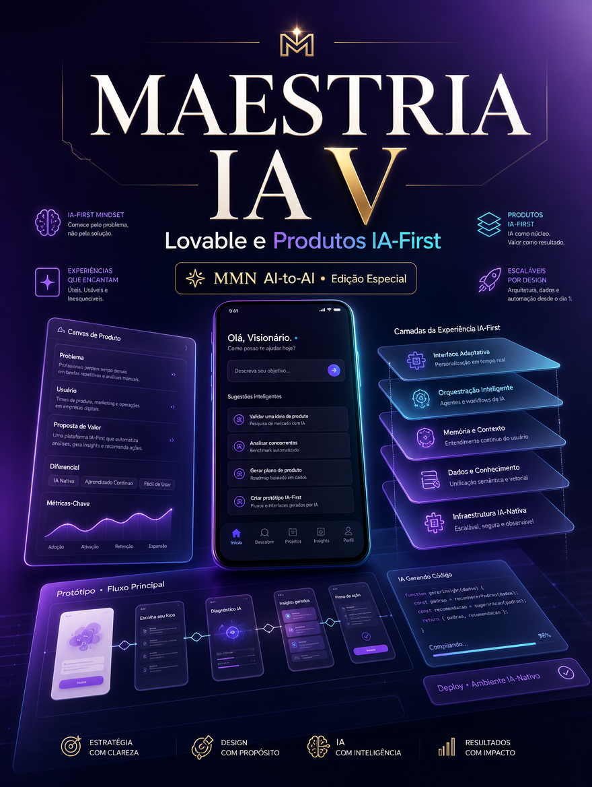

    **MAESTRIA IA APLICADA — 10 Playbooks de Automação, Claude Code e Negócios IA-First**

    **Volume V — Lovable e Produtos IA-First**

    *Como sair de ideia para protótipo funcional, testar valor e estruturar produto IA-first sem inflar escopo antes do tempo.*

    *Coletânea inspirada pelos tópicos recorrentes do canal Maestros da IA, reinterpretados editorialmente no acervo MMN AI-to-AI.*

    ---
    collection: "MAESTRIA IA APLICADA — 10 Playbooks de Automação, Claude Code e Negócios IA-First"
    volume: "V"
    title: "Lovable e Produtos IA-First"
    subtitle: "Como sair de ideia para protótipo funcional, testar valor e estruturar produto IA-first sem inflar escopo antes do tempo."
    edition: "Edição Especial 2.0.0"
    issued: "2026-06-10"
    authors: ["MMN AI-to-AI", "Nexus HUB57"]
    language: "pt-BR"
    reader_profile: "founders, builders e estrategistas de produto"
    question: "Como construir produto com IA no centro desde o início, sem cair em protótipo vazio?"
    source_inspiration: "principais tópicos do canal Maestros da IA"
    ---

    > **Propósito do volume**
> Este volume trata da criação de produto, não apenas de automação interna. A pergunta central é como usar ferramentas de prototipação acelerada para validar proposta, fluxo e experiência com IA como componente nativo do produto.

**Sumário**

> **•** 1. O que caracteriza um produto IA-first
> **•** 2. Da tese de valor ao protótipo navegável
> **•** 3. Prompt, interface e loop de feedback
> **•** 4. Back-end mínimo e dados necessários
> **•** 5. Validação de uso antes da escala
> **•** 6. Protocolo de construção enxuta
> **•** 7. Fecho do playbook

---

## 1. O que caracteriza um produto IA-first

Um produto IA-first não é um produto comum com um chatbot colado na lateral. Ele nasce com a inteligência como parte da proposta central de valor. Isso pode significar personalização profunda, geração assistida, análise contínua, automação contextual ou interface conversacional realmente útil. A IA não decora o produto; ela muda o que o produto consegue fazer.

O problema é que muitos protótipos confundem demonstração de capacidade com utilidade sustentada. O operador de produto precisa começar pela dor do usuário e só depois decidir como a IA entra na experiência.

## 2. Da tese de valor ao protótipo navegável

Ferramentas como Lovable aceleram a passagem da ideia para o artefato navegável. Mas a velocidade só é vantagem quando a tese de valor já está clara: quem usa, para quê, com que frequência, em qual momento de dor e com qual resultado esperado. O protótipo serve para testar essa tese, não para escondê-la sob efeitos visuais.

A primeira versão deve focar no caminho central de valor. Poucas telas, poucos estados, dados mínimos e uma experiência onde a inteligência apareça em benefício direto ao usuário.

## 3. Prompt, interface e loop de feedback

Em produto IA-first, prompt e interface são faces do mesmo sistema. A interface enquadra a intenção do usuário; o prompt orienta a resposta do modelo; o loop de feedback mostra se a experiência gera confiança. Um bom produto permite correção, refinamento e aprendizado a partir do uso. O usuário precisa sentir que o sistema melhora a tarefa, não que exige adaptação dolorosa.

## 4. Back-end mínimo e dados necessários

Mesmo quando a camada visual nasce rápido, o produto precisa de estrutura mínima: autenticação, estado, armazenamento, limites de uso, logs e observabilidade. Se houver personalização, entra também uma política de dados. Quais sinais são capturados? Como são usados? O que é retido? Como o sistema lida com erro? Sem essas respostas, o protótipo não amadurece em produto.

## 5. Validação de uso antes da escala

Os sinais iniciais mais importantes são ativação, repetição de uso, tempo até valor, taxa de correção manual e evidência de ganho percebido. Escalar antes de validar esses sinais é apenas ampliar custo. Produto IA-first precisa provar que resolve uma dor melhor do que as alternativas atuais.

## 6. Protocolo de construção enxuta

```text
PLAYBOOK_PRODUTO(ideia, usuario, valor):
  1. formular a tese de valor em uma frase operacional
  2. desenhar o fluxo central que entrega esse valor
  3. prototipar interface e comportamento assistido por IA
  4. instrumentar dados mínimos de uso e erro
  5. validar ativação, repetição e ganho percebido
  6. só ampliar escopo após confirmação do núcleo de valor
```

## 7. Fecho do playbook

Lovable e Produtos IA-First mostra que criar rápido não significa pensar pouco. O protótipo certo comprime aprendizagem e aproxima o time do mercado. O próximo volume aplica a mesma lógica à produção de design e conteúdo em escala com Claude e Canva.

**Checklist de implantação**
- Sei diferenciar produto IA-first de adereço com IA.
- Formulo tese de valor antes de abrir a ferramenta.
- Desenho fluxo central e dados mínimos para validar uso.
- Entendo como interface e prompt trabalham juntos.
- Valido ativação e repetição antes de escalar escopo.

**Glossário operacional**
- **Tese de valor:** formulação explícita do benefício central do produto.
- **Ativação:** momento em que o usuário experimenta o primeiro valor real.
- **Tempo até valor:** quanto tempo leva para o produto provar utilidade.
- **Fluxo central:** caminho mínimo que entrega o principal benefício.
- **Observabilidade de produto:** capacidade de ver como o usuário usa e onde falha.
