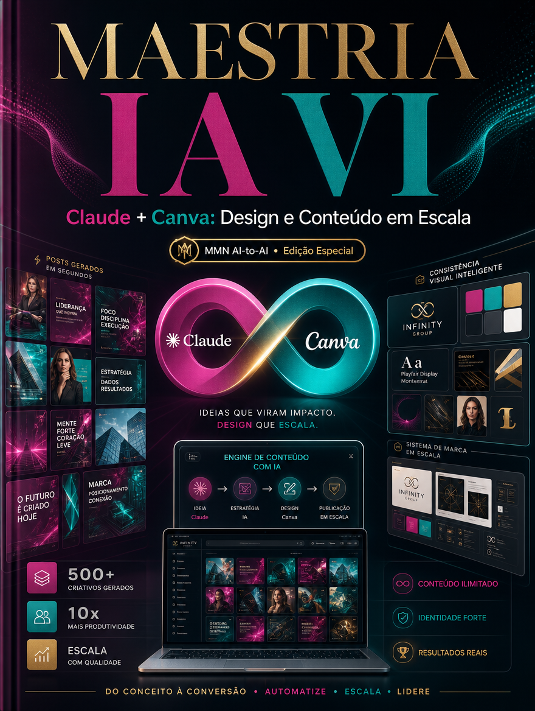

    **MAESTRIA IA APLICADA — 10 Playbooks de Automação, Claude Code e Negócios IA-First**

    **Volume VI — Claude, Canva, Design e Conteúdo em Escala**

    *Como produzir peças, campanhas e ativos com IA sem colapsar qualidade, consistência visual e intenção estratégica.*

    *Coletânea inspirada pelos tópicos recorrentes do canal Maestros da IA, reinterpretados editorialmente no acervo MMN AI-to-AI.*

    ---
    collection: "MAESTRIA IA APLICADA — 10 Playbooks de Automação, Claude Code e Negócios IA-First"
    volume: "VI"
    title: "Claude, Canva, Design e Conteúdo em Escala"
    subtitle: "Como produzir peças, campanhas e ativos com IA sem colapsar qualidade, consistência visual e intenção estratégica."
    edition: "Edição Especial 2.0.0"
    issued: "2026-06-10"
    authors: ["MMN AI-to-AI", "Nexus HUB57"]
    language: "pt-BR"
    reader_profile: "criadores, times de marketing e operadores de conteúdo"
    question: "Como escalar conteúdo e design sem virar fábrica de material genérico?"
    source_inspiration: "principais tópicos do canal Maestros da IA"
    ---

    > **Propósito do volume**
> Este playbook organiza a produção assistida por IA de texto, layout e campanhas. A meta é preservar direção criativa, identidade visual e qualidade editorial mesmo quando o volume aumenta.

**Sumário**

> **•** 1. Escala não pode destruir intenção
> **•** 2. Sistema de marca, prompt e biblioteca visual
> **•** 3. Pipeline de campanha e reaproveitamento
> **•** 4. Revisão, consistência e controle de qualidade
> **•** 5. Onde a escala editorial quebra
> **•** 6. Protocolo de produção criativa assistida
> **•** 7. Fecho do playbook

---

## 1. Escala não pode destruir intenção

Produzir muito não é o mesmo que comunicar bem. Em marketing e design, a IA só gera vantagem quando a escala mantém coerência com posicionamento, mensagem e estética. Sem direção, a produção aumenta enquanto a percepção de valor cai.

O operador maduro enxerga IA como amplificador de sistema criativo já definido: proposta, público, linguagem, oferta e identidade visual.

## 2. Sistema de marca, prompt e biblioteca visual

Para escalar sem ruído, é preciso construir um sistema. Isso inclui guia de voz, padrões de copy, templates de layout, biblioteca de referências, regras tipográficas, paleta, iconografia e lista de proibições. O prompt trabalha melhor quando já existe um sistema de marca. Ele não substitui direção criativa; ele a operacionaliza.

Claude pode ajudar na estrutura de campanha, naming, headlines, argumentos e variações. Canva acelera composição, adaptação e distribuição visual. O ganho aparece quando ambos operam sob o mesmo conjunto de princípios.

## 3. Pipeline de campanha e reaproveitamento

Em vez de criar peça por peça do zero, o playbook recomenda pensar por ativos base. Um manifesto de campanha pode virar página, carrossel, e-mail, roteiro curto, anúncio, FAQ e peça de remarketing. O segredo está em definir mensagem central, objeções do público e hierarquia dos canais. A IA então multiplica versões sem perder o eixo.

## 4. Revisão, consistência e controle de qualidade

Toda escala editorial precisa de revisão em duas camadas: estratégica e formal. A estratégica verifica aderência à marca e à oferta. A formal verifica clareza, ortografia, legibilidade, hierarquia visual e coerência do CTA. Sem isso, a produção em massa cria ruído que custa confiança.

## 5. Onde a escala editorial quebra

Ela quebra quando o time confunde quantidade com presença, quando peças são produzidas sem tese de campanha, quando a biblioteca de marca não existe ou quando a revisão é pulada em nome da velocidade. Outro ponto crítico é a fragmentação: muitos arquivos, muitos prompts, nenhum sistema.

## 6. Protocolo de produção criativa assistida

```text
PLAYBOOK_CONTEUDO(campanha, marca, canais):
  1. definir mensagem central, público e oferta
  2. organizar voz, estética e biblioteca de referência
  3. criar ativo-mãe com IA e direção humana
  4. derivar variações por canal e objetivo
  5. revisar estratégia, forma e consistência visual
  6. medir performance e retroalimentar o sistema criativo
```

## 7. Fecho do playbook

Claude, Canva, Design e Conteúdo em Escala mostra que produção acelerada só vale quando a marca continua reconhecível e a campanha continua estratégica. O próximo volume leva essa eficiência para o modelo operacional do negócio de uma pessoa só.

**Checklist de implantação**
- Tenho sistema de marca antes de escalar peças.
- Sei transformar um ativo base em múltiplos formatos.
- Distingo revisão estratégica de revisão formal.
- Uso IA para amplificar direção, não para substituí-la.
- Evito dispersão criativa por falta de biblioteca e processo.

**Glossário operacional**
- **Ativo-mãe:** peça ou documento base a partir do qual outras derivações são criadas.
- **CTA:** chamada para ação principal da peça.
- **Biblioteca visual:** conjunto governado de referências, layouts e elementos reutilizáveis.
- **Hierarquia visual:** ordem perceptiva dos elementos em uma peça.
- **Direção criativa:** conjunto de decisões que define o caráter da comunicação.
