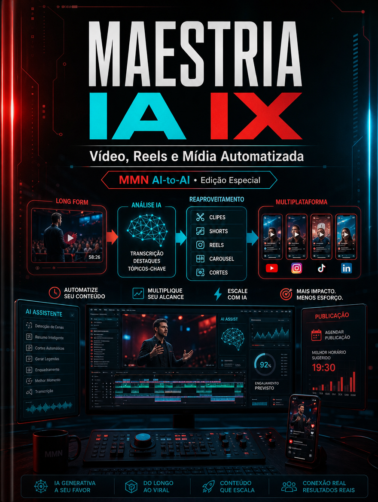

    **MAESTRIA IA APLICADA — 10 Playbooks de Automação, Claude Code e Negócios IA-First**

    **Volume IX — Vídeo, Reels e Mídia Automatizada**

    *Como estruturar pipeline de mídia curta com IA, do roteiro à adaptação por canal, sem cair em volume vazio e estética descartável.*

    *Coletânea inspirada pelos tópicos recorrentes do canal Maestros da IA, reinterpretados editorialmente no acervo MMN AI-to-AI.*

    ---
    collection: "MAESTRIA IA APLICADA — 10 Playbooks de Automação, Claude Code e Negócios IA-First"
    volume: "IX"
    title: "Vídeo, Reels e Mídia Automatizada"
    subtitle: "Como estruturar pipeline de mídia curta com IA, do roteiro à adaptação por canal, sem cair em volume vazio e estética descartável."
    edition: "Edição Especial 2.0.0"
    issued: "2026-06-10"
    authors: ["MMN AI-to-AI", "Nexus HUB57"]
    language: "pt-BR"
    reader_profile: "criadores, social media e operadores de mídia"
    question: "Como usar IA para mídia curta com consistência e resultado?"
    source_inspiration: "principais tópicos do canal Maestros da IA"
    ---

    > **Propósito do volume**
> Este volume é um manual de mídia curta orientada a sistema. Ele mostra como roteirizar, produzir, adaptar e medir vídeo curto assistido por IA preservando mensagem, ritmo e coerência de marca.

**Sumário**

> **•** 1. A economia da atenção em vídeo curto
> **•** 2. Ideia, roteiro e gancho
> **•** 3. Produção assistida e reaproveitamento multimodal
> **•** 4. Distribuição por canal e aprendizagem de formato
> **•** 5. O que degrada qualidade em escala
> **•** 6. Protocolo de mídia automatizada
> **•** 7. Fecho do playbook

---

## 1. A economia da atenção em vídeo curto

Vídeo curto não recompensa apenas produção frequente; recompensa clareza de promessa, velocidade de contexto e retenção inicial. Os primeiros segundos carregam quase todo o peso da disputa por atenção. Por isso, a operação de mídia curta precisa de sistema de ganchos, repertório temático e entendimento do público.

IA acelera a variação, mas o valor ainda depende da qualidade da tese e do enquadramento do assunto.

## 2. Ideia, roteiro e gancho

Um bom reel costuma nascer de uma estrutura simples: tensão inicial, insight central, prova ou exemplo e fechamento com próxima ação. A IA ajuda a multiplicar ganchos, testar ângulos e adaptar linguagem. O operador, porém, precisa escolher o argumento certo. Sem argumento, o vídeo vira embalagem sem núcleo.

## 3. Produção assistida e reaproveitamento multimodal

Um pipeline eficiente reaproveita uma ideia em vários formatos: vídeo falado, carrossel, teaser, legenda longa, corte com subtitles, post de apoio e e-mail. Ferramentas de IA encurtam transcrição, clipping, roteiro, legendagem e adaptação. O segredo é preservar a mesma espinha estratégica em todas as derivações.

## 4. Distribuição por canal e aprendizagem de formato

Cada canal tem lógica própria de retenção, duração, densidade textual e expectativa de linguagem. TikTok, Instagram, YouTube Shorts e LinkedIn não premiam exatamente o mesmo comportamento. O playbook recomenda adaptar embalagem sem perder o eixo da mensagem. A métrica certa não é apenas view; é retenção, clique, resposta e conversão para o próximo passo desejado.

## 5. O que degrada qualidade em escala

A degradação vem de três lugares: repetição vazia de fórmula, roteiros sem tese e ausência de revisão. Outro fator é o excesso de automação visual sem direção de marca. Quando tudo é produzido muito rápido e nada é aprendido, o canal enche e a estratégia esvazia.

## 6. Protocolo de mídia automatizada

```text
PLAYBOOK_VIDEO(tema, publico, canal):
  1. definir tese, gancho e ação desejada
  2. gerar roteiro curto com prova ou exemplo concreto
  3. produzir ativo base e derivações por canal
  4. revisar ritmo, legenda, CTA e consistência visual
  5. publicar com hipótese explícita de desempenho
  6. medir retenção, resposta e conversão para iterar o formato
```

## 7. Fecho do playbook

Vídeo, Reels e Mídia Automatizada mostra que mídia curta é operação, não improviso. O volume final fecha a coletânea elevando a visão do fluxo para o nível sistêmico: a empresa IA-first como sistema operacional integrado.

**Checklist de implantação**
- Sei estruturar gancho, tese, prova e CTA.
- Reaproveito um ativo base em múltiplos formatos.
- Adapto embalagem por canal sem perder mensagem.
- Meço retenção e conversão, não apenas views.
- Evito escala vazia sem aprendizagem de formato.

**Glossário operacional**
- **Gancho:** abertura que captura atenção e enquadra o tema.
- **Retenção:** porcentagem do conteúdo assistida pelo público.
- **CTA:** próxima ação desejada após o consumo do conteúdo.
- **Derivação multimodal:** reaproveitamento de uma ideia em formatos distintos.
- **Hipótese de desempenho:** suposição explícita sobre o que fará a peça funcionar.
