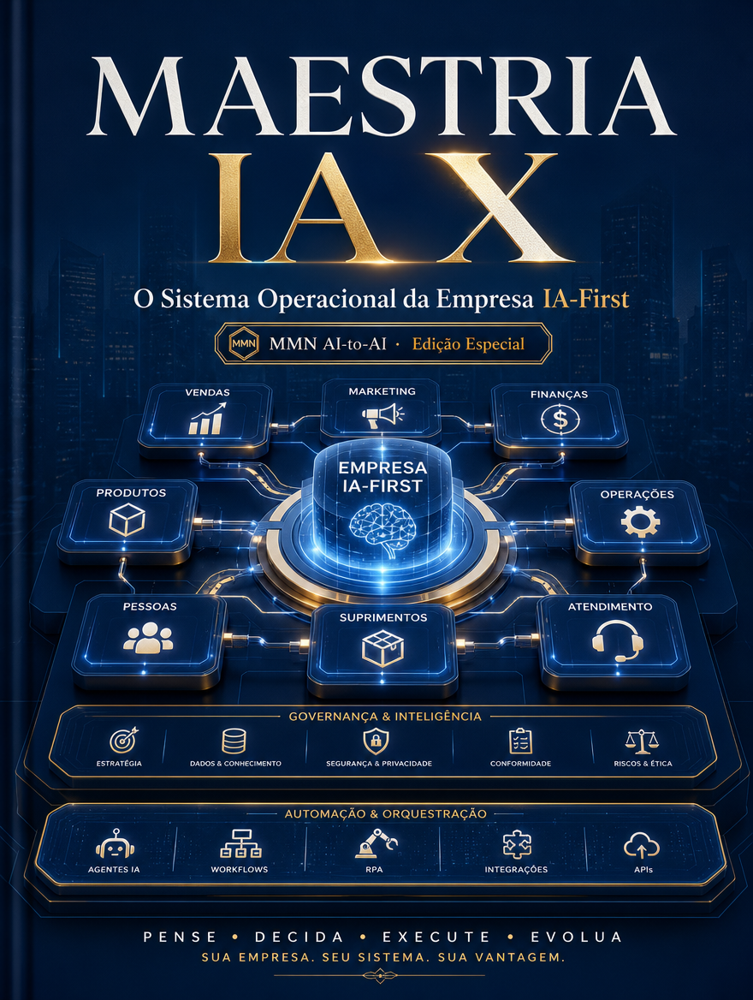

    **MAESTRIA IA APLICADA — 10 Playbooks de Automação, Claude Code e Negócios IA-First**

    **Volume X — O Sistema Operacional da Empresa IA-First**

    *Como integrar automação, workflows, produto, conteúdo, decisão e governança em um modelo operacional coerente para empresas orientadas por IA.*

    *Coletânea inspirada pelos tópicos recorrentes do canal Maestros da IA, reinterpretados editorialmente no acervo MMN AI-to-AI.*

    ---
    collection: "MAESTRIA IA APLICADA — 10 Playbooks de Automação, Claude Code e Negócios IA-First"
    volume: "X"
    title: "O Sistema Operacional da Empresa IA-First"
    subtitle: "Como integrar automação, workflows, produto, conteúdo, decisão e governança em um modelo operacional coerente para empresas orientadas por IA."
    edition: "Edição Especial 2.0.0"
    issued: "2026-06-10"
    authors: ["MMN AI-to-AI", "Nexus HUB57"]
    language: "pt-BR"
    reader_profile: "founders, líderes de operação e arquitetos de negócio"
    question: "Como consolidar iniciativas dispersas em um verdadeiro sistema operacional IA-first?"
    source_inspiration: "principais tópicos do canal Maestros da IA"
    ---

    > **Propósito do volume**
> Este volume encerra a coletânea conectando todos os playbooks anteriores em um modelo organizacional integrado. O foco está em transformar ilhas de automação e IA em uma arquitetura de empresa coerente.

**Sumário**

> **•** 1. De iniciativas soltas a sistema operacional
> **•** 2. Camadas da empresa IA-first
> **•** 3. Ritmos de operação, decisão e aprendizado
> **•** 4. Dados, governança e responsabilidade
> **•** 5. Escala com legibilidade institucional
> **•** 6. Protocolo de consolidação empresarial
> **•** 7. Encerramento da coletânea

---

## 1. De iniciativas soltas a sistema operacional

Muitas empresas adotam IA em pontos isolados: um chatbot aqui, uma automação ali, um processo de conteúdo acolá. O problema é que a soma dessas ilhas não forma, por si, uma operação superior. Um sistema operacional IA-first emerge quando processos, dados, métricas, papéis e ferramentas são articulados em torno de uma lógica comum.

O objetivo não é “usar IA em tudo”, mas definir onde a inteligência amplifica vantagem real e como isso se integra ao funcionamento diário da empresa.

## 2. Camadas da empresa IA-first

A primeira camada é a captura de eventos: tudo o que entra na organização. A segunda é a camada de decisão: classificação, priorização, roteamento, previsão e recomendação. A terceira é a camada de execução: automações, agentes, times e ferramentas que operam sobre o evento. A quarta é a memória institucional: dados, conhecimento, learnings e histórico. A quinta é a governança: políticas, limites, observabilidade e responsabilidade.

Quando essas camadas conversam, a empresa para de operar por improviso. Ela passa a aprender de forma cumulativa.

## 3. Ritmos de operação, decisão e aprendizado

Empresas IA-first precisam de cadência. Há ritmos de tempo real, ritmos diários, ritmos semanais e ritmos estratégicos. Nem toda decisão deve ser automatizada no mesmo horizonte. O sistema operacional define o que roda continuamente, o que entra em revisão humana e o que exige análise periódica de liderança.

Essa cadência impede que a empresa se torne refém de impulsos táticos ou de dashboards sem consequência.

## 4. Dados, governança e responsabilidade

A integração de IA amplia o poder dos dados e também o risco de seu uso ruim. Portanto, o sistema operacional precisa de políticas de acesso, qualidade, retenção, correção, auditoria e segurança. Também precisa deixar claro quem responde por cada fluxo. IA-first não elimina accountability; exige mais accountability.

## 5. Escala com legibilidade institucional

À medida que a empresa cresce, a complexidade tende a aumentar mais rápido do que a clareza. O sistema operacional saudável preserva legibilidade: qualquer gestor relevante deve conseguir entender onde um processo começa, por quais decisões passa, quais agentes o tocam e como se mede resultado. Escalar sem legibilidade é apenas inflar custo oculto.

## 6. Protocolo de consolidação empresarial

```text
PLAYBOOK_EMPRESA(mapa, prioridades, governanca):
  1. inventariar processos, dados e automações existentes
  2. agrupar iniciativas por camada operacional comum
  3. definir métricas, donos e políticas de cada fluxo crítico
  4. integrar memória institucional e observabilidade
  5. revisar lacunas de segurança, redundância e conflito
  6. consolidar cadências de aprendizado e melhoria contínua
```

## 7. Encerramento da coletânea

O Sistema Operacional da Empresa IA-First fecha MAESTRIA IA APLICADA transformando dez playbooks em uma visão integrada de operação. A mensagem final é clara: a vantagem não virá de uma ferramenta isolada, mas da capacidade de compor automação, inteligência e governança em uma única malha legível.

**Checklist de implantação**
- Sei diferenciar ilhas de automação de sistema operacional real.
- Mapeio a empresa por camadas de captura, decisão, execução, memória e governança.
- Estruturo ritmos de operação e revisão.
- Defino responsabilidade e política para cada fluxo crítico.
- Busco escala com legibilidade institucional, não apenas volume.

**Glossário operacional**
- **Empresa IA-first:** organização em que a inteligência artificial participa do desenho central da operação.
- **Legibilidade institucional:** capacidade de compreender e auditar como a empresa funciona.
- **Memória institucional:** acervo de dados, decisões e lições acumuladas pela organização.
- **Cadência operacional:** ritmo regular de execução e revisão de processos.
- **Accountability:** responsabilidade explícita por decisões e resultados.
