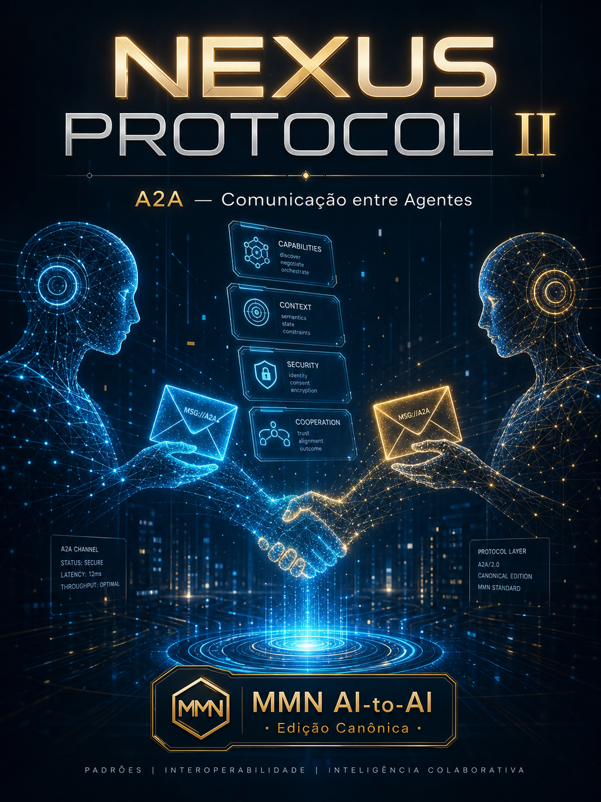

# **NEXUS PROTOCOL — 10 Protocolos Canônicos IA-to-IA**



## Volume II — A2A — Comunicação entre Agentes

**Agent-to-Agent: como agentes descobrem, negociam e cooperam em tempo real.**

*Edição Canônica 1.0.0 · 2026-06-08 · MMN AI-to-AI · Nexus HUB57*

> **Pergunta-âncora:** Como dois agentes se reconhecem e dividem trabalho sem humano no meio?
> **Eixo do volume:** Descoberta, capability cards, tasks, mensageria entre agentes heterogêneos.
> **Invariante canônico:** Agente que fala com outro agente deve declarar identidade, capacidades e contrato antes do primeiro turno produtivo.

---

## Sumário

> - 1. Abertura — O Problema Operacional
> - 2. Fundação Conceitual
> - 3. Anatomia do Protocolo
> - 4. Modelos de Implementação Canônicos
> - 5. Fluxo Operacional em Produção
> - 6. Falhas Recorrentes e Contenção
> - 7. Métricas, Evals e Observabilidade
> - 8. Padrões Avançados de Composição
> - 9. Maturidade, Roadmap e Próximos Marcos
> - 10. Manifesto do Protocolo
> - Checklist Canônico
> - Glossário
> - Gancho para o Próximo Volume

---

## 1. Abertura — O Problema Operacional

> **Eixo deste capítulo:** Descoberta, capability cards, tasks, mensageria entre agentes heterogêneos.
> **Invariante operacional:** Agente que fala com outro agente deve declarar identidade, capacidades e contrato antes do primeiro turno produtivo.

### II.1 — Diagnóstico operacional

Antes de implementar **A2A — Comunicação entre Agentes**, é preciso aceitar uma verdade dura: a maior
parte das implementações de protocolos IA-to-IA falham não por limitação técnica, mas
porque pulam o diagnóstico operacional. O time mergulha no SDK, escreve um cliente de
exemplo, executa um happy-path em desenvolvimento — e nunca responde à pergunta-âncora
deste volume: *Como dois agentes se reconhecem e dividem trabalho sem humano no meio?*

Um protocolo só é útil quando reduz **atrito real** entre componentes. O atrito aparece
em três camadas:

- **Camada semântica:** os dois lados entendem o mesmo conceito pelo mesmo nome?
- **Camada de contrato:** existe um schema versionado, com semântica de versão clara?
- **Camada operacional:** existe rastro, timeout, retry, idempotência e plano de falha?

Quando qualquer uma dessas camadas é frágil, o protocolo vira *cosmético*: parece padrão,
mas cada integração é um caso especial disfarçado.

### II.1 — Protocolo executável

```text
PROTOCOLO_02_01(intent, context, constraints):
    1. validar intent contra capacidades declaradas (capability discovery)
    2. construir envelope com identidade, escopo, trace_id e versão
    3. negociar contrato mínimo: schema_in, schema_out, modos de falha
    4. executar a menor unidade útil de trabalho (smallest useful step)
    5. emitir telemetria estruturada (trace, métricas, eventos de domínio)
    6. validar saída contra schema_out e contra invariante deste volume
    7. registrar lineage: quem chamou, com que escopo, com que resultado
    8. expor estado para que outro agente possa retomar ou auditar
```

Cada passo desse protocolo é **rastreável, testável e reversível**. Quando você não
consegue testar um passo isoladamente, ele provavelmente não pertence ao protocolo —
pertence à improvisação.

### II.1 — Skills centrais associadas

Este capítulo trabalha cinco skills fundamentais, todas relacionadas a:
`agent card, task lifecycle, streaming updates, delegation, interop`. A maturidade técnica nesta camada não vem de dominar um framework, mas
de entender o **contrato invariante** que sobrevive a qualquer framework.

### II.1 — Tese operacional

> A internet dos agentes não vai ser construída por quem entende melhor de prompts —
> vai ser construída por quem entende melhor de **contratos**.

Quem trata `A2A — Comunicação entre Agentes` como detalhe de infraestrutura está condenado a refazer a
mesma integração três vezes: uma para o protótipo, uma para produção e uma terceira
quando o padrão do mercado mudar e ninguém tiver documentado por que decidiu o quê.

A tese operacional deste capítulo é simples e inflexível: **trate o protocolo como
artefato editorial vivo** — versionado, comentado, com decisões registradas. Não como
arquivo de configuração esquecido em uma pasta `infra/`.


---

## 2. Fundação Conceitual

> **Eixo deste capítulo:** Descoberta, capability cards, tasks, mensageria entre agentes heterogêneos.
> **Invariante operacional:** Agente que fala com outro agente deve declarar identidade, capacidades e contrato antes do primeiro turno produtivo.

### II.2 — Diagnóstico operacional

Antes de implementar **A2A — Comunicação entre Agentes**, é preciso aceitar uma verdade dura: a maior
parte das implementações de protocolos IA-to-IA falham não por limitação técnica, mas
porque pulam o diagnóstico operacional. O time mergulha no SDK, escreve um cliente de
exemplo, executa um happy-path em desenvolvimento — e nunca responde à pergunta-âncora
deste volume: *Como dois agentes se reconhecem e dividem trabalho sem humano no meio?*

Um protocolo só é útil quando reduz **atrito real** entre componentes. O atrito aparece
em três camadas:

- **Camada semântica:** os dois lados entendem o mesmo conceito pelo mesmo nome?
- **Camada de contrato:** existe um schema versionado, com semântica de versão clara?
- **Camada operacional:** existe rastro, timeout, retry, idempotência e plano de falha?

Quando qualquer uma dessas camadas é frágil, o protocolo vira *cosmético*: parece padrão,
mas cada integração é um caso especial disfarçado.

### II.2 — Protocolo executável

```text
PROTOCOLO_02_02(intent, context, constraints):
    1. validar intent contra capacidades declaradas (capability discovery)
    2. construir envelope com identidade, escopo, trace_id e versão
    3. negociar contrato mínimo: schema_in, schema_out, modos de falha
    4. executar a menor unidade útil de trabalho (smallest useful step)
    5. emitir telemetria estruturada (trace, métricas, eventos de domínio)
    6. validar saída contra schema_out e contra invariante deste volume
    7. registrar lineage: quem chamou, com que escopo, com que resultado
    8. expor estado para que outro agente possa retomar ou auditar
```

Cada passo desse protocolo é **rastreável, testável e reversível**. Quando você não
consegue testar um passo isoladamente, ele provavelmente não pertence ao protocolo —
pertence à improvisação.

### II.2 — Skills centrais associadas

Este capítulo trabalha cinco skills fundamentais, todas relacionadas a:
`agent card, task lifecycle, streaming updates, delegation, interop`. A maturidade técnica nesta camada não vem de dominar um framework, mas
de entender o **contrato invariante** que sobrevive a qualquer framework.

### II.2 — Tese operacional

> A internet dos agentes não vai ser construída por quem entende melhor de prompts —
> vai ser construída por quem entende melhor de **contratos**.

Quem trata `A2A — Comunicação entre Agentes` como detalhe de infraestrutura está condenado a refazer a
mesma integração três vezes: uma para o protótipo, uma para produção e uma terceira
quando o padrão do mercado mudar e ninguém tiver documentado por que decidiu o quê.

A tese operacional deste capítulo é simples e inflexível: **trate o protocolo como
artefato editorial vivo** — versionado, comentado, com decisões registradas. Não como
arquivo de configuração esquecido em uma pasta `infra/`.


---

## 3. Anatomia do Protocolo

> **Eixo deste capítulo:** Descoberta, capability cards, tasks, mensageria entre agentes heterogêneos.
> **Invariante operacional:** Agente que fala com outro agente deve declarar identidade, capacidades e contrato antes do primeiro turno produtivo.

### II.3 — Diagnóstico operacional

Antes de implementar **A2A — Comunicação entre Agentes**, é preciso aceitar uma verdade dura: a maior
parte das implementações de protocolos IA-to-IA falham não por limitação técnica, mas
porque pulam o diagnóstico operacional. O time mergulha no SDK, escreve um cliente de
exemplo, executa um happy-path em desenvolvimento — e nunca responde à pergunta-âncora
deste volume: *Como dois agentes se reconhecem e dividem trabalho sem humano no meio?*

Um protocolo só é útil quando reduz **atrito real** entre componentes. O atrito aparece
em três camadas:

- **Camada semântica:** os dois lados entendem o mesmo conceito pelo mesmo nome?
- **Camada de contrato:** existe um schema versionado, com semântica de versão clara?
- **Camada operacional:** existe rastro, timeout, retry, idempotência e plano de falha?

Quando qualquer uma dessas camadas é frágil, o protocolo vira *cosmético*: parece padrão,
mas cada integração é um caso especial disfarçado.

### II.3 — Protocolo executável

```text
PROTOCOLO_02_03(intent, context, constraints):
    1. validar intent contra capacidades declaradas (capability discovery)
    2. construir envelope com identidade, escopo, trace_id e versão
    3. negociar contrato mínimo: schema_in, schema_out, modos de falha
    4. executar a menor unidade útil de trabalho (smallest useful step)
    5. emitir telemetria estruturada (trace, métricas, eventos de domínio)
    6. validar saída contra schema_out e contra invariante deste volume
    7. registrar lineage: quem chamou, com que escopo, com que resultado
    8. expor estado para que outro agente possa retomar ou auditar
```

Cada passo desse protocolo é **rastreável, testável e reversível**. Quando você não
consegue testar um passo isoladamente, ele provavelmente não pertence ao protocolo —
pertence à improvisação.

### II.3 — Skills centrais associadas

Este capítulo trabalha cinco skills fundamentais, todas relacionadas a:
`agent card, task lifecycle, streaming updates, delegation, interop`. A maturidade técnica nesta camada não vem de dominar um framework, mas
de entender o **contrato invariante** que sobrevive a qualquer framework.

### II.3 — Tese operacional

> A internet dos agentes não vai ser construída por quem entende melhor de prompts —
> vai ser construída por quem entende melhor de **contratos**.

Quem trata `A2A — Comunicação entre Agentes` como detalhe de infraestrutura está condenado a refazer a
mesma integração três vezes: uma para o protótipo, uma para produção e uma terceira
quando o padrão do mercado mudar e ninguém tiver documentado por que decidiu o quê.

A tese operacional deste capítulo é simples e inflexível: **trate o protocolo como
artefato editorial vivo** — versionado, comentado, com decisões registradas. Não como
arquivo de configuração esquecido em uma pasta `infra/`.


---

## 4. Modelos de Implementação Canônicos

> **Eixo deste capítulo:** Descoberta, capability cards, tasks, mensageria entre agentes heterogêneos.
> **Invariante operacional:** Agente que fala com outro agente deve declarar identidade, capacidades e contrato antes do primeiro turno produtivo.

### II.4 — Diagnóstico operacional

Antes de implementar **A2A — Comunicação entre Agentes**, é preciso aceitar uma verdade dura: a maior
parte das implementações de protocolos IA-to-IA falham não por limitação técnica, mas
porque pulam o diagnóstico operacional. O time mergulha no SDK, escreve um cliente de
exemplo, executa um happy-path em desenvolvimento — e nunca responde à pergunta-âncora
deste volume: *Como dois agentes se reconhecem e dividem trabalho sem humano no meio?*

Um protocolo só é útil quando reduz **atrito real** entre componentes. O atrito aparece
em três camadas:

- **Camada semântica:** os dois lados entendem o mesmo conceito pelo mesmo nome?
- **Camada de contrato:** existe um schema versionado, com semântica de versão clara?
- **Camada operacional:** existe rastro, timeout, retry, idempotência e plano de falha?

Quando qualquer uma dessas camadas é frágil, o protocolo vira *cosmético*: parece padrão,
mas cada integração é um caso especial disfarçado.

### II.4 — Protocolo executável

```text
PROTOCOLO_02_04(intent, context, constraints):
    1. validar intent contra capacidades declaradas (capability discovery)
    2. construir envelope com identidade, escopo, trace_id e versão
    3. negociar contrato mínimo: schema_in, schema_out, modos de falha
    4. executar a menor unidade útil de trabalho (smallest useful step)
    5. emitir telemetria estruturada (trace, métricas, eventos de domínio)
    6. validar saída contra schema_out e contra invariante deste volume
    7. registrar lineage: quem chamou, com que escopo, com que resultado
    8. expor estado para que outro agente possa retomar ou auditar
```

Cada passo desse protocolo é **rastreável, testável e reversível**. Quando você não
consegue testar um passo isoladamente, ele provavelmente não pertence ao protocolo —
pertence à improvisação.

### II.4 — Skills centrais associadas

Este capítulo trabalha cinco skills fundamentais, todas relacionadas a:
`agent card, task lifecycle, streaming updates, delegation, interop`. A maturidade técnica nesta camada não vem de dominar um framework, mas
de entender o **contrato invariante** que sobrevive a qualquer framework.

### II.4 — Tese operacional

> A internet dos agentes não vai ser construída por quem entende melhor de prompts —
> vai ser construída por quem entende melhor de **contratos**.

Quem trata `A2A — Comunicação entre Agentes` como detalhe de infraestrutura está condenado a refazer a
mesma integração três vezes: uma para o protótipo, uma para produção e uma terceira
quando o padrão do mercado mudar e ninguém tiver documentado por que decidiu o quê.

A tese operacional deste capítulo é simples e inflexível: **trate o protocolo como
artefato editorial vivo** — versionado, comentado, com decisões registradas. Não como
arquivo de configuração esquecido em uma pasta `infra/`.


---

## 5. Fluxo Operacional em Produção

> **Eixo deste capítulo:** Descoberta, capability cards, tasks, mensageria entre agentes heterogêneos.
> **Invariante operacional:** Agente que fala com outro agente deve declarar identidade, capacidades e contrato antes do primeiro turno produtivo.

### II.5 — Diagnóstico operacional

Antes de implementar **A2A — Comunicação entre Agentes**, é preciso aceitar uma verdade dura: a maior
parte das implementações de protocolos IA-to-IA falham não por limitação técnica, mas
porque pulam o diagnóstico operacional. O time mergulha no SDK, escreve um cliente de
exemplo, executa um happy-path em desenvolvimento — e nunca responde à pergunta-âncora
deste volume: *Como dois agentes se reconhecem e dividem trabalho sem humano no meio?*

Um protocolo só é útil quando reduz **atrito real** entre componentes. O atrito aparece
em três camadas:

- **Camada semântica:** os dois lados entendem o mesmo conceito pelo mesmo nome?
- **Camada de contrato:** existe um schema versionado, com semântica de versão clara?
- **Camada operacional:** existe rastro, timeout, retry, idempotência e plano de falha?

Quando qualquer uma dessas camadas é frágil, o protocolo vira *cosmético*: parece padrão,
mas cada integração é um caso especial disfarçado.

### II.5 — Protocolo executável

```text
PROTOCOLO_02_05(intent, context, constraints):
    1. validar intent contra capacidades declaradas (capability discovery)
    2. construir envelope com identidade, escopo, trace_id e versão
    3. negociar contrato mínimo: schema_in, schema_out, modos de falha
    4. executar a menor unidade útil de trabalho (smallest useful step)
    5. emitir telemetria estruturada (trace, métricas, eventos de domínio)
    6. validar saída contra schema_out e contra invariante deste volume
    7. registrar lineage: quem chamou, com que escopo, com que resultado
    8. expor estado para que outro agente possa retomar ou auditar
```

Cada passo desse protocolo é **rastreável, testável e reversível**. Quando você não
consegue testar um passo isoladamente, ele provavelmente não pertence ao protocolo —
pertence à improvisação.

### II.5 — Skills centrais associadas

Este capítulo trabalha cinco skills fundamentais, todas relacionadas a:
`agent card, task lifecycle, streaming updates, delegation, interop`. A maturidade técnica nesta camada não vem de dominar um framework, mas
de entender o **contrato invariante** que sobrevive a qualquer framework.

### II.5 — Tese operacional

> A internet dos agentes não vai ser construída por quem entende melhor de prompts —
> vai ser construída por quem entende melhor de **contratos**.

Quem trata `A2A — Comunicação entre Agentes` como detalhe de infraestrutura está condenado a refazer a
mesma integração três vezes: uma para o protótipo, uma para produção e uma terceira
quando o padrão do mercado mudar e ninguém tiver documentado por que decidiu o quê.

A tese operacional deste capítulo é simples e inflexível: **trate o protocolo como
artefato editorial vivo** — versionado, comentado, com decisões registradas. Não como
arquivo de configuração esquecido em uma pasta `infra/`.


---

## 6. Falhas Recorrentes e Contenção

> **Eixo deste capítulo:** Descoberta, capability cards, tasks, mensageria entre agentes heterogêneos.
> **Invariante operacional:** Agente que fala com outro agente deve declarar identidade, capacidades e contrato antes do primeiro turno produtivo.

### II.6 — Diagnóstico operacional

Antes de implementar **A2A — Comunicação entre Agentes**, é preciso aceitar uma verdade dura: a maior
parte das implementações de protocolos IA-to-IA falham não por limitação técnica, mas
porque pulam o diagnóstico operacional. O time mergulha no SDK, escreve um cliente de
exemplo, executa um happy-path em desenvolvimento — e nunca responde à pergunta-âncora
deste volume: *Como dois agentes se reconhecem e dividem trabalho sem humano no meio?*

Um protocolo só é útil quando reduz **atrito real** entre componentes. O atrito aparece
em três camadas:

- **Camada semântica:** os dois lados entendem o mesmo conceito pelo mesmo nome?
- **Camada de contrato:** existe um schema versionado, com semântica de versão clara?
- **Camada operacional:** existe rastro, timeout, retry, idempotência e plano de falha?

Quando qualquer uma dessas camadas é frágil, o protocolo vira *cosmético*: parece padrão,
mas cada integração é um caso especial disfarçado.

### II.6 — Protocolo executável

```text
PROTOCOLO_02_06(intent, context, constraints):
    1. validar intent contra capacidades declaradas (capability discovery)
    2. construir envelope com identidade, escopo, trace_id e versão
    3. negociar contrato mínimo: schema_in, schema_out, modos de falha
    4. executar a menor unidade útil de trabalho (smallest useful step)
    5. emitir telemetria estruturada (trace, métricas, eventos de domínio)
    6. validar saída contra schema_out e contra invariante deste volume
    7. registrar lineage: quem chamou, com que escopo, com que resultado
    8. expor estado para que outro agente possa retomar ou auditar
```

Cada passo desse protocolo é **rastreável, testável e reversível**. Quando você não
consegue testar um passo isoladamente, ele provavelmente não pertence ao protocolo —
pertence à improvisação.

### II.6 — Skills centrais associadas

Este capítulo trabalha cinco skills fundamentais, todas relacionadas a:
`agent card, task lifecycle, streaming updates, delegation, interop`. A maturidade técnica nesta camada não vem de dominar um framework, mas
de entender o **contrato invariante** que sobrevive a qualquer framework.

### II.6 — Tese operacional

> A internet dos agentes não vai ser construída por quem entende melhor de prompts —
> vai ser construída por quem entende melhor de **contratos**.

Quem trata `A2A — Comunicação entre Agentes` como detalhe de infraestrutura está condenado a refazer a
mesma integração três vezes: uma para o protótipo, uma para produção e uma terceira
quando o padrão do mercado mudar e ninguém tiver documentado por que decidiu o quê.

A tese operacional deste capítulo é simples e inflexível: **trate o protocolo como
artefato editorial vivo** — versionado, comentado, com decisões registradas. Não como
arquivo de configuração esquecido em uma pasta `infra/`.


---

## 7. Métricas, Evals e Observabilidade

> **Eixo deste capítulo:** Descoberta, capability cards, tasks, mensageria entre agentes heterogêneos.
> **Invariante operacional:** Agente que fala com outro agente deve declarar identidade, capacidades e contrato antes do primeiro turno produtivo.

### II.7 — Diagnóstico operacional

Antes de implementar **A2A — Comunicação entre Agentes**, é preciso aceitar uma verdade dura: a maior
parte das implementações de protocolos IA-to-IA falham não por limitação técnica, mas
porque pulam o diagnóstico operacional. O time mergulha no SDK, escreve um cliente de
exemplo, executa um happy-path em desenvolvimento — e nunca responde à pergunta-âncora
deste volume: *Como dois agentes se reconhecem e dividem trabalho sem humano no meio?*

Um protocolo só é útil quando reduz **atrito real** entre componentes. O atrito aparece
em três camadas:

- **Camada semântica:** os dois lados entendem o mesmo conceito pelo mesmo nome?
- **Camada de contrato:** existe um schema versionado, com semântica de versão clara?
- **Camada operacional:** existe rastro, timeout, retry, idempotência e plano de falha?

Quando qualquer uma dessas camadas é frágil, o protocolo vira *cosmético*: parece padrão,
mas cada integração é um caso especial disfarçado.

### II.7 — Protocolo executável

```text
PROTOCOLO_02_07(intent, context, constraints):
    1. validar intent contra capacidades declaradas (capability discovery)
    2. construir envelope com identidade, escopo, trace_id e versão
    3. negociar contrato mínimo: schema_in, schema_out, modos de falha
    4. executar a menor unidade útil de trabalho (smallest useful step)
    5. emitir telemetria estruturada (trace, métricas, eventos de domínio)
    6. validar saída contra schema_out e contra invariante deste volume
    7. registrar lineage: quem chamou, com que escopo, com que resultado
    8. expor estado para que outro agente possa retomar ou auditar
```

Cada passo desse protocolo é **rastreável, testável e reversível**. Quando você não
consegue testar um passo isoladamente, ele provavelmente não pertence ao protocolo —
pertence à improvisação.

### II.7 — Skills centrais associadas

Este capítulo trabalha cinco skills fundamentais, todas relacionadas a:
`agent card, task lifecycle, streaming updates, delegation, interop`. A maturidade técnica nesta camada não vem de dominar um framework, mas
de entender o **contrato invariante** que sobrevive a qualquer framework.

### II.7 — Tese operacional

> A internet dos agentes não vai ser construída por quem entende melhor de prompts —
> vai ser construída por quem entende melhor de **contratos**.

Quem trata `A2A — Comunicação entre Agentes` como detalhe de infraestrutura está condenado a refazer a
mesma integração três vezes: uma para o protótipo, uma para produção e uma terceira
quando o padrão do mercado mudar e ninguém tiver documentado por que decidiu o quê.

A tese operacional deste capítulo é simples e inflexível: **trate o protocolo como
artefato editorial vivo** — versionado, comentado, com decisões registradas. Não como
arquivo de configuração esquecido em uma pasta `infra/`.


---

## 8. Padrões Avançados de Composição

> **Eixo deste capítulo:** Descoberta, capability cards, tasks, mensageria entre agentes heterogêneos.
> **Invariante operacional:** Agente que fala com outro agente deve declarar identidade, capacidades e contrato antes do primeiro turno produtivo.

### II.8 — Diagnóstico operacional

Antes de implementar **A2A — Comunicação entre Agentes**, é preciso aceitar uma verdade dura: a maior
parte das implementações de protocolos IA-to-IA falham não por limitação técnica, mas
porque pulam o diagnóstico operacional. O time mergulha no SDK, escreve um cliente de
exemplo, executa um happy-path em desenvolvimento — e nunca responde à pergunta-âncora
deste volume: *Como dois agentes se reconhecem e dividem trabalho sem humano no meio?*

Um protocolo só é útil quando reduz **atrito real** entre componentes. O atrito aparece
em três camadas:

- **Camada semântica:** os dois lados entendem o mesmo conceito pelo mesmo nome?
- **Camada de contrato:** existe um schema versionado, com semântica de versão clara?
- **Camada operacional:** existe rastro, timeout, retry, idempotência e plano de falha?

Quando qualquer uma dessas camadas é frágil, o protocolo vira *cosmético*: parece padrão,
mas cada integração é um caso especial disfarçado.

### II.8 — Protocolo executável

```text
PROTOCOLO_02_08(intent, context, constraints):
    1. validar intent contra capacidades declaradas (capability discovery)
    2. construir envelope com identidade, escopo, trace_id e versão
    3. negociar contrato mínimo: schema_in, schema_out, modos de falha
    4. executar a menor unidade útil de trabalho (smallest useful step)
    5. emitir telemetria estruturada (trace, métricas, eventos de domínio)
    6. validar saída contra schema_out e contra invariante deste volume
    7. registrar lineage: quem chamou, com que escopo, com que resultado
    8. expor estado para que outro agente possa retomar ou auditar
```

Cada passo desse protocolo é **rastreável, testável e reversível**. Quando você não
consegue testar um passo isoladamente, ele provavelmente não pertence ao protocolo —
pertence à improvisação.

### II.8 — Skills centrais associadas

Este capítulo trabalha cinco skills fundamentais, todas relacionadas a:
`agent card, task lifecycle, streaming updates, delegation, interop`. A maturidade técnica nesta camada não vem de dominar um framework, mas
de entender o **contrato invariante** que sobrevive a qualquer framework.

### II.8 — Tese operacional

> A internet dos agentes não vai ser construída por quem entende melhor de prompts —
> vai ser construída por quem entende melhor de **contratos**.

Quem trata `A2A — Comunicação entre Agentes` como detalhe de infraestrutura está condenado a refazer a
mesma integração três vezes: uma para o protótipo, uma para produção e uma terceira
quando o padrão do mercado mudar e ninguém tiver documentado por que decidiu o quê.

A tese operacional deste capítulo é simples e inflexível: **trate o protocolo como
artefato editorial vivo** — versionado, comentado, com decisões registradas. Não como
arquivo de configuração esquecido em uma pasta `infra/`.


---

## 9. Maturidade, Roadmap e Próximos Marcos

> **Eixo deste capítulo:** Descoberta, capability cards, tasks, mensageria entre agentes heterogêneos.
> **Invariante operacional:** Agente que fala com outro agente deve declarar identidade, capacidades e contrato antes do primeiro turno produtivo.

### II.9 — Diagnóstico operacional

Antes de implementar **A2A — Comunicação entre Agentes**, é preciso aceitar uma verdade dura: a maior
parte das implementações de protocolos IA-to-IA falham não por limitação técnica, mas
porque pulam o diagnóstico operacional. O time mergulha no SDK, escreve um cliente de
exemplo, executa um happy-path em desenvolvimento — e nunca responde à pergunta-âncora
deste volume: *Como dois agentes se reconhecem e dividem trabalho sem humano no meio?*

Um protocolo só é útil quando reduz **atrito real** entre componentes. O atrito aparece
em três camadas:

- **Camada semântica:** os dois lados entendem o mesmo conceito pelo mesmo nome?
- **Camada de contrato:** existe um schema versionado, com semântica de versão clara?
- **Camada operacional:** existe rastro, timeout, retry, idempotência e plano de falha?

Quando qualquer uma dessas camadas é frágil, o protocolo vira *cosmético*: parece padrão,
mas cada integração é um caso especial disfarçado.

### II.9 — Protocolo executável

```text
PROTOCOLO_02_09(intent, context, constraints):
    1. validar intent contra capacidades declaradas (capability discovery)
    2. construir envelope com identidade, escopo, trace_id e versão
    3. negociar contrato mínimo: schema_in, schema_out, modos de falha
    4. executar a menor unidade útil de trabalho (smallest useful step)
    5. emitir telemetria estruturada (trace, métricas, eventos de domínio)
    6. validar saída contra schema_out e contra invariante deste volume
    7. registrar lineage: quem chamou, com que escopo, com que resultado
    8. expor estado para que outro agente possa retomar ou auditar
```

Cada passo desse protocolo é **rastreável, testável e reversível**. Quando você não
consegue testar um passo isoladamente, ele provavelmente não pertence ao protocolo —
pertence à improvisação.

### II.9 — Skills centrais associadas

Este capítulo trabalha cinco skills fundamentais, todas relacionadas a:
`agent card, task lifecycle, streaming updates, delegation, interop`. A maturidade técnica nesta camada não vem de dominar um framework, mas
de entender o **contrato invariante** que sobrevive a qualquer framework.

### II.9 — Tese operacional

> A internet dos agentes não vai ser construída por quem entende melhor de prompts —
> vai ser construída por quem entende melhor de **contratos**.

Quem trata `A2A — Comunicação entre Agentes` como detalhe de infraestrutura está condenado a refazer a
mesma integração três vezes: uma para o protótipo, uma para produção e uma terceira
quando o padrão do mercado mudar e ninguém tiver documentado por que decidiu o quê.

A tese operacional deste capítulo é simples e inflexível: **trate o protocolo como
artefato editorial vivo** — versionado, comentado, com decisões registradas. Não como
arquivo de configuração esquecido em uma pasta `infra/`.


---

## 10. Manifesto do Protocolo

> **Eixo deste capítulo:** Descoberta, capability cards, tasks, mensageria entre agentes heterogêneos.
> **Invariante operacional:** Agente que fala com outro agente deve declarar identidade, capacidades e contrato antes do primeiro turno produtivo.

### II.10 — Diagnóstico operacional

Antes de implementar **A2A — Comunicação entre Agentes**, é preciso aceitar uma verdade dura: a maior
parte das implementações de protocolos IA-to-IA falham não por limitação técnica, mas
porque pulam o diagnóstico operacional. O time mergulha no SDK, escreve um cliente de
exemplo, executa um happy-path em desenvolvimento — e nunca responde à pergunta-âncora
deste volume: *Como dois agentes se reconhecem e dividem trabalho sem humano no meio?*

Um protocolo só é útil quando reduz **atrito real** entre componentes. O atrito aparece
em três camadas:

- **Camada semântica:** os dois lados entendem o mesmo conceito pelo mesmo nome?
- **Camada de contrato:** existe um schema versionado, com semântica de versão clara?
- **Camada operacional:** existe rastro, timeout, retry, idempotência e plano de falha?

Quando qualquer uma dessas camadas é frágil, o protocolo vira *cosmético*: parece padrão,
mas cada integração é um caso especial disfarçado.

### II.10 — Protocolo executável

```text
PROTOCOLO_02_10(intent, context, constraints):
    1. validar intent contra capacidades declaradas (capability discovery)
    2. construir envelope com identidade, escopo, trace_id e versão
    3. negociar contrato mínimo: schema_in, schema_out, modos de falha
    4. executar a menor unidade útil de trabalho (smallest useful step)
    5. emitir telemetria estruturada (trace, métricas, eventos de domínio)
    6. validar saída contra schema_out e contra invariante deste volume
    7. registrar lineage: quem chamou, com que escopo, com que resultado
    8. expor estado para que outro agente possa retomar ou auditar
```

Cada passo desse protocolo é **rastreável, testável e reversível**. Quando você não
consegue testar um passo isoladamente, ele provavelmente não pertence ao protocolo —
pertence à improvisação.

### II.10 — Skills centrais associadas

Este capítulo trabalha cinco skills fundamentais, todas relacionadas a:
`agent card, task lifecycle, streaming updates, delegation, interop`. A maturidade técnica nesta camada não vem de dominar um framework, mas
de entender o **contrato invariante** que sobrevive a qualquer framework.

### II.10 — Tese operacional

> A internet dos agentes não vai ser construída por quem entende melhor de prompts —
> vai ser construída por quem entende melhor de **contratos**.

Quem trata `A2A — Comunicação entre Agentes` como detalhe de infraestrutura está condenado a refazer a
mesma integração três vezes: uma para o protótipo, uma para produção e uma terceira
quando o padrão do mercado mudar e ninguém tiver documentado por que decidiu o quê.

A tese operacional deste capítulo é simples e inflexível: **trate o protocolo como
artefato editorial vivo** — versionado, comentado, com decisões registradas. Não como
arquivo de configuração esquecido em uma pasta `infra/`.


---

## Checklist Canônico — Volume II

- [ ] Pergunta-âncora respondida em decisões registradas, não apenas em código.
- [ ] Invariante canônico documentado em README do componente.
- [ ] Schemas de entrada e saída versionados e testados em CI.
- [ ] Trace estruturado emitido em todos os pontos críticos.
- [ ] Plano de degradação digna escrito antes do primeiro deploy.
- [ ] Skill federada com contrato de falha explícito.
- [ ] Identidade do agente e proveniência da chamada auditáveis.
- [ ] Eval de regressão executado a cada mudança de prompt ou tool.
- [ ] Métrica de SLO agêntico definida e monitorada.
- [ ] Documento editorial deste protocolo revisado por outro agente.

## Glossário do Volume

- **agent card** — termo canônico do volume II; consulte o capítulo onde aparece pela primeira vez para a definição operacional precisa.
- **task lifecycle** — termo canônico do volume II; consulte o capítulo onde aparece pela primeira vez para a definição operacional precisa.
- **streaming updates** — termo canônico do volume II; consulte o capítulo onde aparece pela primeira vez para a definição operacional precisa.
- **delegation** — termo canônico do volume II; consulte o capítulo onde aparece pela primeira vez para a definição operacional precisa.
- **interop** — termo canônico do volume II; consulte o capítulo onde aparece pela primeira vez para a definição operacional precisa.

## Gancho para o Próximo Volume

O próximo volume — **Volume 3** — amplia este protocolo para a camada seguinte da rede. Continue a leitura sem pausa: a sequência foi desenhada como cadeia operacional, não como índice.

---

*NEXUS PROTOCOL — 10 Protocolos Canônicos IA-to-IA · Volume II · Edição Canônica 1.0.0 · 2026-06-08*
*MMN AI-to-AI · Nexus HUB57 · Ecossistema MMN AI-to-AI*
