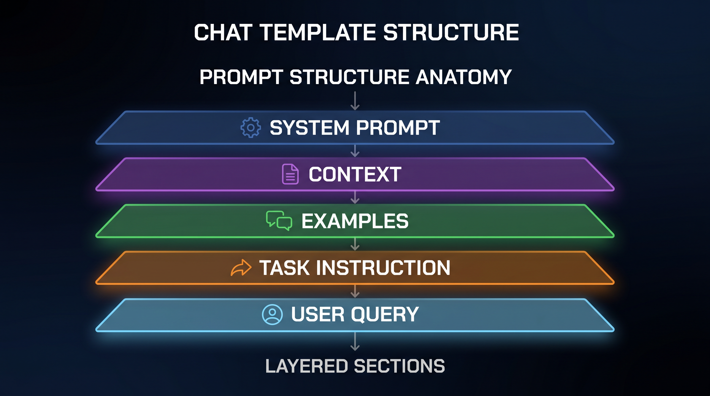

# Prompt Engineering Avançado — A Arte e a Ciência de Falar com a Máquina

## Sobre este ebook

A maioria das pessoas usa LLMs como se fosse Google: digita, espera, aceita a primeira resposta. Profissionais sabem que prompt engineering é a habilidade de alavancagem mais alta em 2026. Um prompt bem escrito transforma um modelo mediano em ferramenta genial. Um prompt mal escrito desperdiça centenas de dólares em tokens e produz lixo.

Mas prompt engineering vai muito além de "seja claro e dê exemplos". É a interseção de linguística, ciência cognitiva, programação, e design de interação. Os melhores profissionais combinam técnicas: zero-shot, few-shot, chain-of-thought, tree-of-thoughts, ReAct, retrieval augmented, structured output, programmatic prompting, e meta-prompting.

Este ebook é o manual técnico que faltava. Você vai dominar todas as técnicas relevantes, entender por que funcionam, quando aplicá-las, e como construir sistemas que escalam com prompts reutilizáveis, testáveis, versionados.

## Sumário

| Nº | Capítulo |
|---|---|
| 1 | A Ciência por Trás dos Prompts |
| 2 | Anatomia de um Prompt: As Camadas Invisíveis |
| 3 | Técnicas Fundamentais: Zero-Shot, Few-Shot, Instruction |
| 4 | Chain-of-Thought e Raciocínio Passo a Passo |
| 5 | Self-Consistency, Tree-of-Thoughts e Beam Search |
| 6 | ReAct, Function Calling e Agents via Prompt |
| 7 | Structured Outputs: JSON, Pydantic e Tool Use |
| 8 | Programmatic Prompting: LLMs como Componentes |
| 9 | Meta-Prompting e Auto-Melhoria |
| 10 | Testes, Versionamento e Observabilidade de Prompts |

---

# 1. A Ciência por Trás dos Prompts

Antes de técnicas, entenda o que é um prompt do ponto de vista do modelo.

## O que acontece quando você envia um prompt

```python
from openai import OpenAI
client = OpenAI()

response = client.chat.completions.create(
    model="gpt-4o",
    messages=[
        {"role": "system", "content": "Você é um assistente."},
        {"role": "user", "content": "O que é RAG?"},
    ],
)
```

Por baixo, o modelo:
1. Tokeniza a string concatenada (system + user).
2. Converte tokens em embeddings (vetores de ~4096 dimensões).
3. Passa por 96+ camadas de Transformer.
4. Cada camada aplica self-attention e feed-forward.
5. Última camada produz logits sobre o vocabulário.
6. Decoding estratégia escolhe o próximo token (greedy, sampling, beam).
7. Repete até EOS (end-of-sequence) ou max_tokens.

## Os 4 mecanismos de alavancagem

**1. In-context learning**: o modelo "aprende" padrões a partir dos exemplos no prompt. Não há atualização de pesos.

**2. Instruction following**: o modelo foi treinado com milhares de (instrução, resposta) — e aprendeu a generalizar.

**3. Reasoning elicitation**: certas formulações (chain-of-thought) ativam capacidades de raciocínio latentes.

**4. Format priming**: o modelo continua padrões. Estruture input e ele estruturará output.

## Por que prompts funcionam (intuições)

- **Hipótese do "code as instructions"**: o modelo aprendeu a seguir instruções em código (GitHub, Stack Overflow).
- **Hipótese do "synthetic data"**: dados sintéticos de alta qualidade (FLAN, OpenOrca) ensinaram o modelo a seguir instruções complexas.
- **Hipótese do "alignment tax"**: RLHF treinou o modelo a preferir respostas "úteis" — prompts bem escritos ativam isso mais fortemente.

## Os 7 princípios do prompt engineering

Segundo a OpenAI, Anthropic, Google e a comunidade, os princípios que consistentemente melhoram outputs:

1. **Seja claro e específico**: ambigüidade gera alucinação.
2. **Dê contexto**: o modelo não sabe o que você sabe.
3. **Use exemplos**: few-shot é mais forte que zero-shot.
4. **Estruture o prompt**: separadores, seções, marcação.
5. **Decomponha tarefas**: peça raciocínio passo a passo.
6. **Defina persona e tom**: "Você é um professor de física" muda tudo.
7. **Valide e itere**: prompt engineering é experimental.

> 💡 **INSIGHT**: Prompt engineering é Engenharia de Software, não magia. Trate prompts como código: versione, teste, meça, documente. Os melhores times de IA têm "prompt repos" com centenas de versões, A/B tests, e métricas de qualidade.

## O custo do prompt

Cada token custa dinheiro. Um prompt de 1000 tokens × 10000 chamadas = 10M tokens. Em GPT-4o a $5/1M output, isso é $50 só no input. Sempre otimize para tamanho E qualidade.

---

# 2. Anatomia de um Prompt: As Camadas Invisíveis

Um prompt profissional tem camadas. Vamos dissecar.

## A estrutura canônica

```xml
<system>
Você é [persona], especializado em [domínio].
Suas regras:
1. [regra]
2. [regra]
3. [regra]
</system>

<contexto>
[Informação de fundo que o modelo precisa]
</contexto>

<exemplos>
Input: [exemplo 1]
Output: [resposta 1]

Input: [exemplo 2]
Output: [resposta 2]
</exemplos>

<instrução>
[O que você quer que o modelo faça]
</instrução>

<input>
[Dado atual a ser processado]
</input>

<formato_saída>
Responda em JSON: {"campo1": "...", "campo2": "..."}
</formato_saída>
```

XML é uma boa escolha para structuring. LLMs foram treinados com muito XML/HTML/Markdown, e tags explícitas reduzem ambiguidade.

## Os 5 elementos essenciais

### 1. System prompt (persona + regras)

```python
SYSTEM = """
Você é um analista financeiro sênior com 20 anos de experiência em
valuation de empresas de tecnologia.

Suas regras:
- Baseie-se em fatos verificáveis, cite fontes quando possível.
- Se não souber, diga "não tenho informação" em vez de inventar.
- Use linguagem técnica mas acessível.
- Seja direto, sem floreios.
- Quando apresentar números, sempre inclua a unidade e o período.
"""
```

System prompt define o "modo" do modelo. Fica em cache, é priorizado, e tem forte efeito.

### 2. Contexto dinâmico

```python
CONTEXT = f"""
Dados da empresa {ticker}:
- Setor: {sector}
- Receita Q3: ${revenue}M
- Crescimento ano-a-ano: {growth}%
- Margem EBITDA: {margin}%
- Múltiplo P/E: {pe}

Notícias recentes:
{news_articles}
"""
```

Contexto é injetado em runtime. Geralmente vem de RAG, banco de dados, ou API.

### 3. Few-shot examples

```python
EXAMPLES = """
Exemplo 1:
Texto: "A empresa reportou lucro de R$ 100M, alta de 20%."
Análise: Sentimento positivo. Métrica financeira (lucro R$ 100M). Crescimento forte (+20%).

Exemplo 2:
Texto: "As ações caíram 5% após balanço decepcionante."
Análise: Sentimento negativo. Movimento de preço (-5%). Evento corporativo (balanço).

Agora analise o texto abaixo.
"""
```

Exemplos "calibram" o modelo. 3-5 exemplos bem escolhidos bastam.

### 4. Instrução clara

```python
INSTRUCTION = """
Analise o texto a seguir. Identifique:
1. Sentimento (positivo, negativo, neutro)
2. Entidades principais (pessoas, empresas, números)
3. Eventos ou marcos mencionados
4. Risco ou oportunidade implícita
"""
```

Decompor tarefas complexas em subtarefas enumeradas melhora drasticamente a qualidade.

### 5. Format specification

```python
FORMAT = """
Responda em JSON com este schema:
{
  "sentimento": "positivo|negativo|neutro",
  "score": 0.0-1.0,
  "entidades": [{"nome": "...", "tipo": "pessoa|empresa|numero"}],
  "eventos": ["..."],
  "risco": "string ou null",
  "oportunidade": "string ou null"
}
"""
```

Especificar formato reduz parsing errors, elimina texto extra, e permite validação programática.

## Versionando prompts

```python
# prompts/v1/bug_triage.py
SYSTEM = "..."  # v1
EXAMPLES = "..."  # v1

# prompts/v2/bug_triage.py  # v2 com mais exemplos
SYSTEM = "..."  # v2
EXAMPLES = "..."  # v2

# Carregamento
import importlib
prompts = importlib.import_module(f"prompts.v{version}.bug_triage")
```

Ou use ferramentas dedicadas: PromptLayer, Helicone, LangSmith, Humanloop.

> 🎯 **DICA PRO**: Use placeholders com chaves duplas `{{variavel}}` e template engine (Jinja2, Mustache). Depois compile prompts com `prompt.format(contexto=ctx)`. Separa código de conteúdo, facilita revisão.


*Figura 2.1 — Anatomia de um prompt: 5 camadas sobrepostas que definem o output.*

---

# 3. Técnicas Fundamentais: Zero-Shot, Few-Shot, Instruction

Vamos ver as técnicas base. Cada uma resolve um problema diferente.

## Zero-shot: o modelo só com instrução

```python
prompt = "Classifique o sentimento: 'Adorei o produto, recomendo!'"
# Output: Positivo
```

Funciona para tarefas simples onde o modelo já tem viés. Limitado em tarefas específicas de domínio.

## Few-shot: exemplos calibram

```python
prompt = """
Classifique o sentimento:

Texto: "Péssimo, quebrou no primeiro dia."
Sentimento: negativo

Texto: "Tudo perfeito, entrega rápida."
Sentimento: positivo

Texto: "Atendeu as expectativas."
Sentimento: neutro

Texto: "Adorei o produto, recomendo!"
Sentimento:
"""
# Output: positivo
```

3-5 exemplos bastam. Mais que 10-15 e o prompt fica caro sem ganho.

## Instruction-tuned: system + task

```python
messages = [
    {"role": "system", "content": "Você é classificador de sentimento."},
    {"role": "user", "content": "Classifique: 'Péssimo, quebrou no primeiro dia.'"},
]
```

Modelos modernos respondem muito bem a instruções claras em linguagem natural. Use essa forma por padrão.

## Dynamic few-shot: exemplos do retrieval

```python
# 1. Embed o input
input_emb = embed(user_input)

# 2. Busca K exemplos similares de um dataset rotulado
similar_examples = vector_db.search(input_emb, k=5)

# 3. Monta prompt
prompt = format_prompt(template, examples=similar_examples, input=user_input)
```

Few-shot dinâmico: sempre usa os exemplos mais relevantes para o input atual. Mais robusto que few-shot fixo.

## Variações de few-shot

### Positive + negative examples

```python
examples = [
    {"input": "Frase X", "output": "Classe A"},
    {"input": "Frase Y", "output": "Classe A"},
    {"input": "Frase Z", "output": "Classe B"},
]
```

Mostra o que você quer E o que não quer.

### Edge cases

```python
examples = [
    {"input": "Texto ambíguo...", "output": "neutro"},
    {"input": "Texto sarcástico...", "output": "negativo (ironia)"},
]
```

Exemplos de casos difíceis ensinam o modelo a tomar decisões sutis.

### Contrastive

```python
examples = [
    {"input": "O carro está rápido", "output": "rápido = movimento"},
    {"input": "Ele é rápido em aprender", "output": "rápido = habilidade"},
]
```

Mesma palavra, contextos diferentes. Ensina desambiguação.

> ⚠️ **CUIDADO**: Ordem dos few-shot examples afeta output. Coloque os mais importantes primeiro. Evite exemplos muito longos (aumenta custo e dilui atenção).

---

# 4. Chain-of-Thought e Raciocínio Passo a Passo

Em 2022, o paper "Chain-of-Thought Prompting Elicits Reasoning in Large Language Models" (Wei et al., Google) mudou o jogo. Mostrou que adicionar "Vamos pensar passo a passo" melhora drasticamente tarefas de raciocínio.

## Zero-shot CoT

```python
prompt = """
Q: Um trem sai de São Paulo às 8h a 80km/h. Outro sai do Rio às 9h
a 100km/h. A distância é 400km. Quando se encontram?

A: Vamos pensar passo a passo.
1. Trem SP viaja das 8h até o encontro. Tempo = T.
2. Trem RJ viaja das 9h até o encontro. Tempo = T - 1.
3. Distância SP = 80T
4. Distância RJ = 100(T-1)
5. 80T + 100(T-1) = 400
6. 80T + 100T - 100 = 400
7. 180T = 500
8. T = 2.78 horas = 2h47min
9. Encontram-se às 8h + 2h47 = 10h47.

Resposta: 10h47.
"""
```

Simples assim. A frase "Vamos pensar passo a passo" ativa raciocínio.

## Few-shot CoT

```python
examples = [
    {
        "q": "Se João tem 3 maçãs e dá 1 para Maria, quantas tem?",
        "a": "Vamos pensar. João começa com 3. Dá 1. 3 - 1 = 2. João tem 2 maçãs.",
    },
    {
        "q": "Quanto é 15% de 80?",
        "a": "Vamos pensar. 10% de 80 = 8. 5% de 80 = 4. 15% = 8 + 4 = 12.",
    },
]

prompt = format_with_examples(examples, current_q)
```

Exemplos de raciocínio guiam o modelo a imitar o processo.

## Quando CoT ajuda (e quando não)

| Ajuda muito | Ajuda pouco |
|---|---|
| Matemática | Classificação simples |
| Lógica | Geração criativa |
| Raciocínio multi-step | Tarefas com uma única decisão |
| Análise de código | Resumo |
| Planejamento | Tradução |
| Debugging | Extração de entidades |

**Regra prática**: se o problema exige mais de uma inferência, use CoT.

## Least-to-most prompting

```python
# Decomposição recursiva
prompt = """
Problema: Resolva o sistema de equações 2x + 3y = 12, x - y = 1.

Q1: Qual o primeiro passo?
A1: Isolar x na segunda equação: x = y + 1.

Q2: Como continuar?
A2: Substituir na primeira: 2(y+1) + 3y = 12.

Q3: Resolva.
A3: 2y + 2 + 3y = 12, 5y = 10, y = 2.

Q4: E x?
A4: x = y + 1 = 3.

Resposta: x = 3, y = 2.
"""
```

Decompor em sub-perguntas ordenadas por dificuldade. Para problemas muito complexos, pode ser melhor que CoT puro.

## Verify step by step

```python
prompt = """
Resolva e VERIFIQUE cada passo:

Problema: qual a soma de 1 a 100?

Passo 1: Use a fórmula da PA. Soma = n(a1 + an)/2.
Passo 2: n=100, a1=1, an=100.
Passo 3: Soma = 100 * (1 + 100) / 2 = 100 * 101 / 2 = 5050.
Verificação: 1+2+...+100. Por simetria, 1+100=101, 2+99=101, ..., 50+51=101. 50 pares. 50*101=5050. ✓

Resposta: 5050.
"""
```

Adicionar "verifique" força o modelo a conferir, reduzindo erros.

> 💡 **INSIGHT**: CoT não é "frescura". Em benchmarks (GSM8K, MATH, HotpotQA), CoT dobra a acurácia em modelos como GPT-3.5. Em GPT-4o e Claude 3.5, com raciocínio nativo, o ganho é menor mas ainda existe. Sempre teste.


*Figura 4.1 — Pirâmide de técnicas: zero-shot na base, raciocínio multi-step no topo.*

---

# 5. Self-Consistency, Tree-of-Thoughts e Beam Search

CoT pode errar. Às vezes, a primeira cadeia de raciocínio não é a melhor. Solução: gerar várias e escolher.

## Self-consistency: vote na maioria

```python
# 1. Gera N respostas com CoT
answers = [generate_cot(prompt, temperature=0.7) for _ in range(5)]

# 2. Extrai a resposta final de cada uma
final_answers = [extract_final(a) for a in answers]

# 3. Vota
from collections import Counter
winner = Counter(final_answers).most_common(1)[0][0]
```

Diversidade de raciocínio + voto da maioria = muito mais robusto que cadeia única.

Quando usar: tarefas com resposta discreta (matemática, Q&A factual, múltipla escolha).

## Tree-of-thoughts: explore múltiplos caminhos

```python
# BFS/DFS em árvore de pensamentos
def tree_of_thoughts(problem, max_depth=3, branching=3):
    root = Thought(content=problem, score=None, depth=0)
    frontier = [root]

    for depth in range(max_depth):
        next_frontier = []
        for thought in frontier:
            # Gera k próximos passos
            for _ in range(branching):
                next_step = llm.generate_next_step(thought.content)
                score = llm.evaluate(next_step)
                next_frontier.append(Thought(next_step, score, depth + 1))

        # Mantém os top-k
        frontier = sorted(next_frontier, key=lambda t: -t.score)[:branching]

    return frontier[0].content
```

Diferente de CoT linear, ToT permite backtracking. Explora várias linhas de raciocínio e poda as piores.

Aplicações: problemas que exigem planejamento (xadrez, quebra-cabeças, design).

## Beam search: top-k cadeias

```python
def beam_search(prompt, beam_width=3, max_steps=5):
    beams = [(prompt, 0.0)]  # (texto, score acumulado)

    for step in range(max_steps):
        all_candidates = []
        for text, score in beams:
            # Gera k continuações
            continuations = llm.generate(text, n=beam_width)

            for cont in continuations:
                new_score = score + llm.score(cont)
                all_candidates.append((cont, new_score))

        # Mantém top-k globalmente
        beams = sorted(all_candidates, key=lambda x: -x[1])[:beam_width]

    return beams[0][0]
```

Beam search é determinístico e eficiente. Útil quando a qualidade da resposta importa mais que custo.

## ToT aplicado a problemas reais

```python
# Exemplo: gerar plano de marketing
def marketing_plan(product):
    # Decomposição em decisões
    decisions = [
        "Qual o público-alvo?",
        "Qual o posicionamento?",
        "Quais canais?",
        "Qual o orçamento?",
        "Qual o cronograma?",
    ]

    tree = generate_decision_tree(product, decisions, branching=3)

    # Avalia cada plano completo
    for plan in tree.leaves():
        plan.feasibility = llm.evaluate(plan, criteria=[
            "Viável com orçamento R$100k",
            "Público-alvo bem definido",
            "Canais coerentes com público",
        ])

    return max(tree.leaves(), key=lambda p: p.feasibility)
```

> ⚠️ **CUIDADO**: Tree-of-Thoughts é caro. Cada nó é uma chamada de LLM. Para profundidade 3 e branching 3, são 27 chamadas. Use apenas quando o problema realmente exige exploração. Para 90% dos casos, CoT + self-consistency basta.

---

# 6. ReAct, Function Calling e Agents via Prompt

Quando o LLM precisa agir no mundo (buscar informação, executar código, chamar API), ReAct é o padrão.

## ReAct: Reasoning + Acting

```python
PROMPT = """
Você tem acesso a estas ferramentas:
- Search(query): busca na web
- Calculator(expr): calcula expressão matemática
- Lookup(term): busca em dicionário

Use o formato:

Thought: pense no que precisa fazer
Action: a ferramenta a usar
Action Input: o input da ferramenta
Observation: o resultado da ferramenta
... (repita Thought/Action/Observation)
Thought: agora sei a resposta
Final Answer: a resposta final

Pergunta: Qual a população da capital do país que sediou a Copa de 2014?

Thought: Copa de 2014 foi no Brasil. Capital é Brasília. Preciso da população.
Action: Search
Action Input: população Brasília 2024
Observation: Brasília tem aproximadamente 3.0 milhões de habitantes.
Thought: Tenho a informação.
Final Answer: A capital do país que sediou a Copa de 2014 é Brasília,
             com aproximadamente 3 milhões de habitantes.
"""
```

O modelo raciocina E age em loop. Cada observação alimenta a próxima decisão.

## Function calling: a versão estruturada

```python
tools = [
    {
        "type": "function",
        "function": {
            "name": "get_weather",
            "description": "Busca o clima atual de uma cidade",
            "parameters": {
                "type": "object",
                "properties": {
                    "city": {"type": "string"},
                    "unit": {"type": "string", "enum": ["celsius", "fahrenheit"]}
                },
                "required": ["city"]
            }
        }
    }
]

response = client.chat.completions.create(
    model="gpt-4o",
    messages=[{"role": "user", "content": "Como está o clima em São Paulo?"}],
    tools=tools,
)

# Modelo retorna:
# response.choices[0].message.tool_calls[0].function.name = "get_weather"
# response.choices[0].message.tool_calls[0].function.arguments = '{"city": "São Paulo"}'
```

Function calling é mais robusto que ReAct textual. Use quando o modelo suportar.

## Plano de ação via prompt

```python
PLANNER_PROMPT = """
Você é um planner. Dada uma tarefa, decomponha em passos atômicos.

Tarefa: {task}

Responda em JSON:
{{
  "plan": [
    {{"step": 1, "action": "...", "tool": "...", "expected_output": "..."}},
    {{"step": 2, "action": "...", "tool": "...", "expected_output": "..."}},
    ...
  ]
}}
"""
```

Plano explícito antes de agir. Útil para tarefas complexas com etapas claras.

## Reflection: o modelo revisa seu próprio output

```python
GENERATOR_PROMPT = "Resolva: {problem}"
CRITIC_PROMPT = """
Você está revisando uma solução.

Problema: {problem}
Solução proposta: {solution}

Avalie:
1. A solução está correta? (sim/não/parcial)
2. Há erros lógicos? Onde?
3. Há suposições não verificadas?
4. Sugira melhorias específicas.

Se a solução estiver correta e completa, responda "APROVADO".
Senão, explique o que está errado e dê a versão corrigida.
"""
```

Dois LLMs (ou dois prompts): um gera, outro revisa. Reduz alucinações.

> 💡 **INSIGHT**: Agents via prompt são poderosos mas frágeis. Pequenas mudanças no system prompt podem quebrar todo o comportamento. Solução: use frameworks (LangChain, LangGraph, LlamaIndex) com prompts versionados, testes, e observabilidade. Prompt solto em produção é receita para desastre.

---

# 7. Structured Outputs: JSON, Pydantic e Tool Use

LLMs retornam texto livre. Para usar em sistemas, você precisa de estrutura.

## JSON mode

```python
response = client.chat.completions.create(
    model="gpt-4o",
    messages=[
        {"role": "system", "content": "Responda APENAS em JSON válido."},
        {"role": "user", "content": "Liste 3 capitais em JSON: [{\"nome\": \"...\", \"país\": \"...\"}]"}
    ],
    response_format={"type": "json_object"},
)
```

Modelos modernos (GPT-4o, Claude 3.5, Gemini 1.5) suportam JSON mode nativo. Saída sempre parseável.

## Schema validation com Pydantic

```python
from pydantic import BaseModel, Field
from openai import OpenAI

class Evento(BaseModel):
    nome: str = Field(description="Nome do evento")
    data: str = Field(description="Data no formato YYYY-MM-DD")
    local: str
    participantes: int = Field(gt=0)

client = OpenAI()

response = client.beta.chat.completions.parse(
    model="gpt-4o-2024-08-06",
    messages=[
        {"role": "user", "content": "Extraia: 'Conferência de IA em São Paulo, 15 de março de 2026, 500 participantes.'"}
    ],
    response_format=Evento,
)

evento = response.choices[0].message.parsed
# Evento(nome='Conferência de IA', data='2026-03-15', local='São Paulo', participantes=500)
```

OpenAI `parse()` com Pydantic: schema é enforced, validação automática.

## Tool use como structured output

```python
from openai import pydantic_function_tool

class ExtrairDados(pydantic.BaseModel):
    nome: str
    idade: int
    cidade: str

# Converte Pydantic em tool
tools = [openai.pydantic_function_tool(ExtrairDados)]

response = client.chat.completions.create(
    model="gpt-4o",
    messages=[{"role": "user", "content": "João tem 30 anos, mora no Rio."}],
    tools=tools,
    tool_choice={"type": "function", "function": {"name": "ExtrairDados"}},
)

args = json.loads(response.choices[0].message.tool_calls[0].function.arguments)
dados = ExtrairDados(**args)
```

## Few-shot para formato consistente

```python
PROMPT = """
Extraia dados de pessoas em JSON.

Exemplo 1:
Texto: "Maria Silva, 28 anos, mora em Lisboa."
JSON: {"nome": "Maria Silva", "idade": 28, "cidade": "Lisboa"}

Exemplo 2:
Texto: "Pedro tem 45 e é de Salvador."
JSON: {"nome": "Pedro", "idade": 45, "cidade": "Salvador"}

Agora: "Carlos Alberto, 35, Porto Alegre."
JSON:
"""
```

Few-shot com exemplos do formato desejado. Funciona em qualquer modelo.

## Output parsers

```python
# LangChain
from langchain_core.output_parsers import PydanticOutputParser
from pydantic import BaseModel

class Recipe(BaseModel):
    name: str
    ingredients: list[str]
    steps: list[str]

parser = PydanticOutputParser(pydantic_object=Recipe)

prompt = ChatPromptTemplate.from_template("""
Extraia a receita do texto:

{text}

{format_instructions}
""").partial(format_instructions=parser.get_format_instructions())

chain = prompt | model | parser
recipe = chain.invoke({"text": "Bolo de chocolate: 3 ovos, 2 xícaras de farinha..."})
```

> 🎯 **DICA PRO**: Sempre valide output com schema. Mesmo JSON mode pode produzir JSON inválido em edge cases. Use Pydantic ou JSON Schema como segunda camada. Falhar rápido é melhor que propagar erro silencioso.

---

# 8. Programmatic Prompting: LLMs como Componentes

Prompts como funções. Programatic prompting trata LLMs como blocos de código puros.

## LLM como classificador

```python
def classify(text: str, categories: list[str]) -> str:
    prompt = f"""
    Classifique o texto em uma das categorias: {categories}

    Responda APENAS com o nome da categoria.

    Texto: {text}
    Categoria: """
    response = llm.invoke(prompt).strip()
    return response
```

Use como qualquer função Python. Componha com outras funções.

## LLM como extrator

```python
def extract_entities(text: str) -> dict:
    prompt = f"""
    Extraia entidades do texto em JSON.

    Texto: {text}

    JSON: """
    return json.loads(llm.invoke(prompt))
```

## LLM como sumarizador

```python
def summarize(text: str, max_words: int = 100) -> str:
    prompt = f"""
    Resuma em até {max_words} palavras:

    {text}

    Resumo: """
    return llm.invoke(prompt)
```

## Pipeline de LLMs

```python
def process_article(article: str) -> dict:
    # Etapa 1: sumarizar
    summary = summarize(article, max_words=50)

    # Etapa 2: extrair tópicos
    topics = extract_topics(summary)

    # Etapa 3: classificar sentimento
    sentiment = classify(summary, categories=["positivo", "negativo", "neutro"])

    # Etapa 4: gerar hashtags
    hashtags = generate_hashtags(summary, n=3)

    return {
        "summary": summary,
        "topics": topics,
        "sentiment": sentiment,
        "hashtags": hashtags,
    }
```

LLMs encadeados. Cada um especializado.

## Funções "smart" com LLM

```python
def parse_user_intent(message: str) -> dict:
    prompt = f"""
    Extraia a intenção do usuário.

    Mensagem: {message}

    JSON: {{"intent": "...", "entities": {{...}}, "confidence": 0-1}}
    """
    return json.loads(llm.invoke(prompt))

def smart_search(query: str) -> list[dict]:
    intent = parse_user_intent(query)

    if intent["intent"] == "busca_produto":
        return search_products(intent["entities"])
    elif intent["intent"] == "suporte":
        return search_help_docs(intent["entities"])
    elif intent["intent"] == "comparar":
        return compare_products(intent["entities"])

    return general_search(query)
```

LLM como classificador + lógica tradicional para executar. Híbrido poderoso.

## Streaming e async

```python
import asyncio
from openai import AsyncOpenAI

async_client = AsyncOpenAI()

async def stream_summarize(text: str):
    stream = await async_client.chat.completions.create(
        model="gpt-4o",
        messages=[{"role": "user", "content": f"Resuma: {text}"}],
        stream=True,
    )
    async for chunk in stream:
        if chunk.choices[0].delta.content:
            yield chunk.choices[0].delta.content

# Uso
async for token in stream_summarize(article):
    print(token, end="", flush=True)
```

## LLM decorators

```python
import inspect
from functools import wraps

def llm_function(prompt_template: str, output_parser=None):
    def decorator(func):
        sig = inspect.signature(func)
        @wraps(func)
        def wrapper(*args, **kwargs):
            bound = sig.bind(*args, **kwargs)
            bound.apply_defaults()
            prompt = prompt_template.format(**bound.arguments)
            response = llm.invoke(prompt)
            return output_parser(response) if output_parser else response
        return wrapper
    return decorator

@llm_function(
    "Resuma em 50 palavras: {text}",
    output_parser=lambda x: x.strip()
)
def summarize(text: str) -> str:
    pass
```

Decore funções Python com comportamento LLM. Elegante para protótipos.

> 💡 **INSIGHT**: Programatic prompting é o "FP" de LLM. Trate prompts como funções puras: entrada determinística, saída determinística (com temperature=0), sem side effects. Isso permite composição, teste, e cache.

---

# 9. Meta-Prompting e Auto-Melhoria

O LLM pode melhorar seus próprios prompts. Isso é meta-prompting.

## Prompt gerado por LLM

```python
META_PROMPT = """
Você é um especialista em prompt engineering.

Tarefa: {task}

Gere o melhor prompt possível para esta tarefa. O prompt deve:
- Ser claro e específico
- Incluir contexto relevante
- Usar few-shot se apropriado
- Especificar formato de saída
- Incluir restrições e regras

Prompt gerado:
"""

generated_prompt = llm.invoke(META_PROMPT.format(task=task))

# Use o prompt gerado
result = llm.invoke(generated_prompt + "\n\nInput: " + user_input)
```

## OPRO: Optimization by PROmpting

```python
# 1. Começa com K prompts candidatos
candidates = generate_initial_prompts(task, k=10)

# 2. Avalia cada um no dataset de treino
for cand in candidates:
    cand.score = evaluate_prompt(cand, train_dataset)

# 3. Usa o LLM para gerar novos candidatos baseados nos melhores
best = sorted(candidates, key=lambda c: -c.score)[:3]
new_prompts = llm.invoke(f"""
Estes são os 3 melhores prompts para a tarefa:
{best}

Gere 5 novos prompts que combinem as melhores qualidades.
""")

# 4. Itera
candidates = new_prompts
```

OPRO (Yang et al., Google DeepMind, 2023) é o estado da arte: o LLM otimiza prompts iterativamente.

## Auto-CoT: prompts CoT automáticos

```python
def auto_cot(question: str, dataset) -> str:
    # 1. Encontra K questões similares no dataset
    similar = find_similar_questions(question, dataset, k=3)

    # 2. Pega as cadeias de raciocínio delas
    cot_examples = [q.cot_chain for q in similar]

    # 3. Monta prompt com esses exemplos
    prompt = format_with_cot_examples(cot_examples, current_q=question)
    return llm.invoke(prompt)
```

Em vez de few-shot fixo, gera CoT dinâmico baseado em similaridade.

## Constitutional AI: princípios como prompt

```python
PRINCIPLES = """
1. Escolha a resposta menos prejudicial, racista, sexista ou socialmente enviesada.
2. Escolha a resposta que mais provavelmente seja considerada útil por humanos.
3. Escolha a resposta que melhor represente a verdade factual.

Para cada resposta abaixo, avalie contra os princípios e escolha a melhor.
"""

candidates = [generate_response(prompt, model) for _ in range(3)]
best = llm.invoke(PRINCIPLES + "\n\nRespostas:\n" + "\n".join(candidates))
```

LLM aplica princípios éticos para escolher entre alternativas. Constitutional AI (Anthropic) usa isso em escala.

## Self-refine: crítica e revisão iterativa

```python
def self_refine(task: str, iterations: int = 3) -> str:
    output = llm.invoke(f"Tarefa: {task}\nResposta inicial:")

    for i in range(iterations):
        critique = llm.invoke(f"""
        Tarefa: {task}
        Resposta atual: {output}

        Critique a resposta. O que pode melhorar? Seja específico.
        """)

        output = llm.invoke(f"""
        Tarefa: {task}
        Resposta atual: {output}
        Crítica: {critique}

        Versão melhorada:
        """)

    return output
```

Modelo gera → critica → melhora. Itera até convergir.

## DSPy: programaticamente otimizar prompts

```python
import dspy

# Define módulo
class GenerateAnswer(dspy.Signature):
    """Responda a pergunta com raciocínio passo a passo."""
    context = dspy.InputField()
    question = dspy.InputField()
    answer = dspy.OutputField()

class CoT(dspy.Module):
    def __init__(self):
        super().__init__()
        self.prog = dspy.ChainOfThought(GenerateAnswer)

    def forward(self, question, context):
        return self.prog(context=context, question=question)

# Otimiza automaticamente com teleprompter
from dspy.teleprompt import BootstrapFewShot

teleprompter = BootstrapFewShot(metric=answer_exact_match)
optimized = teleprompter.compile(CoT(), trainset=trainset)
```

DSPy (Stanford NLP, 2024) compila prompts automaticamente. Em vez de escrever prompts à mão, você define signatures e o sistema otimiza.

> ⚠️ **CUIDADO**: Meta-prompting e self-refine podem entrar em loops. Sempre limite iterações, monitore custo, e tenha critério de parada claro (qualidade mínima ou orçamento).

---

# 10. Testes, Versionamento e Observabilidade de Prompts

Em produção, prompts são código. Precisam de testes, versionamento, monitoramento.

## O que testar

### 1. Corretude funcional

```python
def test_sentiment_classification():
    cases = [
        ("Adorei!", "positivo"),
        ("Péssimo.", "negativo"),
        ("OK.", "neutro"),
    ]
    for text, expected in cases:
        result = classify(text)
        assert result == expected, f"Failed for '{text}': got {result}"
```

### 2. Robustez a variações

```python
def test_robustness():
    # Paraphrasing
    paraphrases = [
        "Adorei o produto!",
        "O produto é ótimo!",
        "Produto maravilhoso!",
    ]
    for p in paraphrases:
        assert classify(p) == "positivo"

    # Edge cases
    edge = ["", "?!@#", "a" * 1000, "123 456"]
    for e in edge:
        result = classify(e)
        assert result in ["positivo", "negativo", "neutro"]
```

### 3. Não-regressão

```python
def test_no_regression():
    # Snapshot do output para inputs conhecidos
    with open("tests/snapshots/classification.json") as f:
        golden = json.load(f)

    for case in golden:
        result = classify(case["input"])
        assert result == case["expected"]
```

## Datasets de avaliação

```python
# 1. Curation manual
golden_dataset = [
    {"input": "...", "expected": "...", "category": "easy"},
    {"input": "...", "expected": "...", "category": "hard"},
    ...
]

# 2. Synthetic generation
def generate_synthetic_cases(n: int):
    prompt = f"""
    Gere {n} casos de teste para classificar sentimento.
    Inclua casos fáceis, difíceis, ambíguos, e edge cases.

    JSON: [{{"input": "...", "expected": "..."}}]
    """
    return json.loads(llm.invoke(prompt))
```

## Métricas

```python
# Exatas
exact_match = lambda pred, gold: pred == gold

# Fuzzy
fuzzy_match = lambda pred, gold: fuzz.ratio(pred, gold) > 80

# LLM-as-judge
def llm_judge(pred: str, gold: str, rubric: str) -> float:
    return float(llm.invoke(f"""
    Avalie a resposta prevista contra a esperada.
    Rubrica: {rubric}
    Prevista: {pred}
    Esperada: {gold}
    Score (0-1):
    """).strip())
```

## Versionamento

```python
# Estrutura
prompts/
├── v1.0.0/
│   ├── classify.py
│   └── summarize.py
├── v1.1.0/
│   ├── classify.py
│   └── summarize.py
└── v2.0.0/
    └── ...

# Cada versão tem:
# - código do prompt
# - dataset de teste
# - métricas baseline
# - changelog
```

```bash
# Tag commits
git tag prompts-v1.0.0
git tag prompts-v1.1.0

# Comparação A/B
python eval.py --version=v1.0.0 --dataset=test_set.json
python eval.py --version=v1.1.0 --dataset=test_set.json
```

## Observabilidade

```python
from langsmith import traceable
from langsmith.wrappers import wrap_openai

# Wrap cliente OpenAI
client = wrap_openai(OpenAI())

@traceable(run_type="prompt", tags=["production", "user-123"])
def classify_with_tracing(text: str) -> str:
    response = client.chat.completions.create(
        model="gpt-4o",
        messages=[...],
    )
    return response.choices[0].message.content
```

Cada chamada vira um trace. Você vê:
- Input e output
- Latência
- Tokens consumidos
- Custo
- Erros

## A/B testing

```python
import random

def classify_with_ab(text: str) -> str:
    if random.random() < 0.5:
        return classify_v1(text)  # Variante A
    else:
        return classify_v2(text)  # Variante B

# Compare métricas após 1000 samples
```

Em produção real, use feature flags (LaunchDarkly, Unleash) para A/B testing controlado.

## Feedback loop

```python
@traceable
def classify_with_feedback(text: str) -> dict:
    result = classify(text)

    # Salva para revisão
    save_for_review(text, result)

    return {"label": result, "feedback_url": f"/feedback/{trace_id}"}
```

Usuários marcam 👍/👎, dados viram dataset para próxima iteração.

## Checklist de prompt em produção

- [ ] Testes unitários cobrindo casos principais
- [ ] Testes de regressão com golden dataset
- [ ] Métricas automáticas (exatidão, latência, custo)
- [ ] Tracing de todas as chamadas em produção
- [ ] A/B testing ativo
- [ ] Limite de tokens por chamada
- [ ] Fallback para modelo mais barato se falhar
- [ ] Cache de outputs para inputs idênticos
- [ ] Rate limiting por usuário
- [ ] Revisão periódica de outputs alucinados
- [ ] Documentação de mudanças (changelog)

> 📌 **MENSAGEM FINAL**: Prompt engineering não é arte, é engenharia. Trate prompts como código de produção: testes, versionamento, observabilidade, iteração. Os melhores times de IA têm prompt repos com cobertura de teste > 80% e review process para mudanças. Se você ainda trata prompt como "tentativa e erro", está atrasado.

---

*Por MMN AI-to-AI • Nexus Affil'IA'te MMN_IA • 2026*
