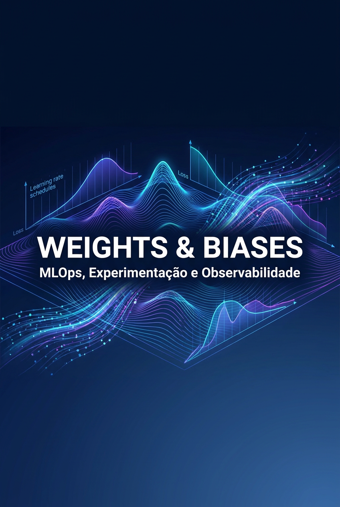

# Weights & Biases — MLOps, Experimentação e Observabilidade

## Sobre este ebook

Treinar um modelo uma vez é fácil. Treinar cem modelos, comparar, reproduzir o melhor, explicar para stakeholders, colocar em produção e monitorar — isso é engenharia de ML. Weights & Biases (W&B) é a plataforma que torna esse ciclo gerenciável.

Fundada em 2017, W&B virou o padrão de fato para tracking de experimentos, versionamento de modelos, hyperparameter sweeps, e observabilidade de modelos em produção. Times vão de FAANG a startups, todos usando o mesmo ferramental. Em 2026, "wandb" é verbo ("vou wandbear isso") e adjetivo ("esse experimento não foi wandbeado, não confio").

Este ebook cobre o stack completo: tracking básico, sweeps, artifacts, tables, reports, models, sweeps agents, integrations com todos os frameworks (PyTorch, TensorFlow, JAX, Hugging Face, etc), e como W&B se encaixa em pipelines de MLOps mais amplos.

## Sumário

| Nº | Capítulo |
|---|---|
| 1 | O que é W&B e Por Que Você Precisa |
| 2 | Setup, Login e Run Lifecycle |
| 3 | Tracking de Experimentos: A Fundação |
| 4 | Config, Logs, Metrics e o Poder da Observabilidade |
| 5 | Artifacts: Versionamento de Datasets e Modelos |
| 6 | Sweeps: Hyperparameter Tuning em Escala |
| 7 | Tables e Media: Visualização Rica |
| 8 | Reports: Comunicação de Resultados |
| 9 | Models: Registry e Deploy |
| 10 | Integrações, MLOps e Casos de Estudo |

---

# 1. O que é W&B e Por Que Você Precisa

Antes de W&B, engenheiros de ML tinham uma combinação caseira: TensorBoard para visualização, MLflow para tracking, Git para código, DVC para dados, e planilhas para registrar o que funcionou. Tudo desconectado. Tudo manual.

W&B unificou tudo isso em uma plataforma. Em 2026, oferece:

- **Experiments**: tracking de runs (hiperparâmetros, métricas, logs, código, ambiente).
- **Artifacts**: versionamento de datasets, modelos, e qualquer arquivo.
- **Sweeps**: hyperparameter tuning automatizado.
- **Tables**: exploração interativa de dados e predições.
- **Reports**: documentação colaborativa.
- **Models**: registry, lineage, deploy.
- **Launch**: execução de jobs em qualquer infraestrutura.
- **Weave**: tracing e observabilidade de aplicações LLM.

## Por que usar W&B

**Razão 1: Reprodutibilidade**. ML é ciência experimental. Sem tracking rigoroso, você não sabe o que funcionou.

**Razão 2: Velocidade**. Comparar 50 runs em uma única UI é 10× mais rápido que scripts Python.

**Razão 3: Colaboração**. Time inteiro vê, comenta, e aprende com experimentos dos outros.

**Razão 4: Debugging**. Loss spikes, gradientes explodindo, NaN — tudo registrado.

**Razão 5: Compliance**. Para empresas reguladas, audit trail é obrigatório.

## Pricing tiers

- **Free**: 100 GB de storage, 100 GB de artifacts, usuários ilimitados.
- **Pro ($50/mês/user)**: storage ilimitado, SSO, priority support.
- **Enterprise**: on-prem, dedicated support, SLAs, security compliance.

Para uso individual, free tier basta por muito tempo.

## W&B vs alternativas

| Feature | W&B | MLflow | TensorBoard | Neptune |
|---|---|---|---|---|
| Cloud-hosted | Sim | Não (self-host) | Não | Sim |
| Sweeps | Sim (excelente) | Limitado | Não | Sim |
| Artifacts | Sim | Sim (básico) | Não | Sim |
| Tables | Sim | Não | Não | Sim |
| Reports | Sim | Não | Não | Não |
| LLM tracing | Sim (Weave) | Limitado | Não | Sim |
| Multi-tenant | Sim | Sim | Não | Sim |

W&B ganha em UX, features, e comunidade. MLflow ganha em self-hosting e zero lock-in. TensorBoard é ótimo para visualização local.

> 💡 **INSIGHT**: W&B é mais que ferramenta de tracking. É a "memória institucional" do seu time de ML. Onde quer que esteja, no escritório, em casa, no Kaggle, em produção — todos veem a mesma coisa. Isso é invaluable em times distribuídos.

---

# 2. Setup, Login e Run Lifecycle

W&B funciona em qualquer máquina. Vamos do zero.

## Instalação

```bash
pip install wandb
```

## Login

```bash
wandb login
# Vai pedir API key, copie de https://wandb.ai/authorize
```

Ou via variável de ambiente:

```bash
export WANDB_API_KEY=...
```

## Conceito central: o Run

```python
import wandb

# Inicia um run
run = wandb.init(
    project="meu-projeto",
    name="experimento-1",
    config={
        "learning_rate": 3e-4,
        "batch_size": 32,
        "epochs": 10,
        "model": "resnet50",
    },
)

# Seu código
for epoch in range(10):
    loss = train_one_epoch()
    acc = evaluate()

    # Log de métricas
    wandb.log({"loss": loss, "acc": acc, "epoch": epoch})

# Finaliza
run.finish()
```

Cada `wandb.init()` cria um "run" — uma sessão isolada de treinamento. Tem ID único, URL pública, config, logs, artifacts, e tudo mais.

## Hierarquia: Project > Run > Artifact

```
workspace
  └── project
       ├── run-1
       │    ├── config
       │    ├── metrics
       │    ├── logs
       │    └── artifacts
       ├── run-2
       └── ...
```

Projeto agrupa runs relacionados. Cada run é um experimento individual.

## Modos de execução

```python
# Online (default): envia dados para servidor W&B
wandb.init(mode="online")

# Offline: salva local, sincroniza depois
wandb.init(mode="offline")
# wandb sync ./wandb/offline-run-*

# Disabled: desativa (para testes)
wandb.init(mode="disabled")
```

Offline mode é útil em ambientes sem internet (HPC, air-gapped). Disabled para CI/CD onde você não quer poluir.

## Resumable runs

```python
# Continua um run existente
run = wandb.init(
    project="meu-projeto",
    id="abc123",  # ID do run anterior
    resume="must",  # "must", "allow", "never"
)
```

Se o treinamento crashar (GPU OOM, node failure), você pode continuar.

## Config: a fonte da verdade

```python
# Opção 1: dict
config = {"lr": 0.001, "bs": 32}
wandb.init(config=config)

# Opção 2: argparse
import argparse
parser = argparse.ArgumentParser()
parser.add_argument("--lr", type=float, default=0.001)
args = parser.parse_args()
wandb.init(config=args)

# Opção 3: arquivo YAML
config = wandb.config  # Acessível em qualquer lugar
config.lr = 0.001  # Pode modificar em runtime
```

`wandb.config` é sincronizado automaticamente com a UI. Tudo que você colocar lá é pesquisável e filtrável.

> 🎯 **DICA PRO**: Use `wandb.init(config=config)` para passar todos os hiperparâmetros. Isso garante que a UI mostre exatamente o que rodou, sem ambiguidade. Nunca leia hiperparâmetros de variáveis de ambiente direto no código.

---

# 3. Tracking de Experimentos: A Fundação

O coração do W&B é tracking. Vamos cobrir os tipos de dados que você pode logar.

## Métricas escalares

```python
# Dentro do loop de treino
for step, batch in enumerate(loader):
    loss = train_step(batch)
    wandb.log({"train/loss": loss}, step=step)

for epoch in range(epochs):
    val_loss = validate()
    wandb.log({"val/loss": val_loss, "epoch": epoch})
```

`step` é a coordenada X. Default é auto-increment, mas você pode explicitar.

## Métricas agrupadas (nested)

```python
wandb.log({
    "train/loss": 0.1,
    "train/acc": 0.95,
    "val/loss": 0.2,
    "val/acc": 0.93,
    "lr": 1e-4,
    "grad_norm": 1.2,
})
```

Use `/` para criar hierarquia. W&B renderiza como seções na UI.

## Histograms

```python
for epoch in range(epochs):
    for batch in loader:
        wandb.log({"gradients": wandb.Histogram(model.linear.weight.grad)})
        wandb.log({"activations": wandb.Histogram(activations)})
```

Histograms são ótimos para detectar vanishing/exploding gradients, saturação, etc.

## Imagens

```python
# Lista de imagens (PIL, numpy, tensor)
wandb.log({
    "predictions": wandb.Image(image_array, caption="epoch 5"),
    "ground_truth": wandb.Image(gt_image, caption="GT"),
})

# Múltiplas
wandb.log({"samples": [wandb.Image(img) for img in images[:8]]})
```

Útil para classification, segmentation, generation. Vê o que o modelo está errando.

## Audio

```python
wandb.log({"sample": wandb.Audio(audio_array, sample_rate=16000, caption="...")})
```

Para TTS, ASR, music generation. Playback direto na UI.

## Video

```python
wandb.log({"rollout": wandb.Video(video_frames, fps=30)})
```

Para RL, video prediction, motion generation.

## 3D Point Clouds

```python
wandb.log({"scene": wandb.Object3D(point_cloud_array)})
```

Para LiDAR, depth, NeRF.

## Tabelas

```python
table = wandb.Table(columns=["text", "label", "prediction", "loss"])
for text, label, pred, loss in dataset:
    table.add_data(text, label, pred, loss)
wandb.log({"predictions": table})
```

Tabelas interativas. Filtre, ordene, agrupe, tudo na UI.

## Custom plots

```python
# Matplotlib
import matplotlib.pyplot as plt
fig, ax = plt.subplots()
ax.plot(x, y)
wandb.log({"custom_plot": wandb.Image(fig)})

# Plotly
import plotly.graph_objects as go
fig = go.Figure(data=go.Scatter(x=x, y=y))
wandb.log({"interactive": wandb.Plotly(fig)})
```

> ⚠️ **CUIDADO**: Logar muitas imagens/segundo polui o dashboard. Use `wandb.log(freq=10)` para logar a cada 10 steps. Ou use `wandb.Image(..., grouping="group")` para agrupar.


*Figura 3.1 — Tracking W&B: hyperparams → run → metrics, system, artifacts.*

---

# 4. Config, Logs, Metrics e o Poder da Observabilidade

A diferença entre um ML engineer mediano e um excelente está em observabilidade. W&B dá superpoderes.

## System metrics automáticos

```python
wandb.init()
# Automaticamente loga:
# - CPU usage
# - GPU usage, memory, temperature
# - Disk I/O
# - Network I/O
# - Memory usage
```

Você não precisa fazer nada. W&B spawn deamon que coleta em background. Vê exatamente onde o gargalo está.

## Code saving

```python
# Por padrão, W&B salva o script que iniciou o run
# Para salvar repo inteiro:
wandb.init(
    config=config,
    save_code=True,  # Salva o .py principal
)

# Ou manual
run.log_code(".", include_fn=lambda path: path.endswith(".py"))
```

Versionamento de código automático. Cada run tem o código exato que produziu.

## Environment

```python
# Salva requirements.txt, conda env, etc.
run = wandb.init()
run.log_artifact("requirements.txt", name="requirements", type="config")
```

Ou use `wandb.requirements.freeze()` para auto-detectar.

## Console logs

```python
# Tudo que você print() aparece na UI
print("Training started")
# Vê em "Logs" tab do run
```

W&B captura stdout/stderr. Não precisa redirecionar.

## Alertas

```python
# Alerta quando loss explode
wandb.alert(
    title="Loss divergiu",
    text="Train loss passou de 10.0 no step 5000",
    level=wandb.AlertLevel.ERROR,
)

# Slack integration
# W&B → Settings → Integrations → Slack
```

Recebe notificação em Slack/email/webhook. Ótimo para treinamentos longos.

## Resumindo a observação em prática

```python
import wandb

run = wandb.init(
    project="recomendador",
    config={
        "model": "transformer-6-layer",
        "optimizer": "adamw",
        "lr": 1e-3,
        "bs": 256,
    },
)
config = wandb.config

model = create_model(config)
opt = torch.optim.AdamW(model.parameters(), lr=config.lr)

for step, batch in enumerate(loader):
    loss = train_step(model, batch, opt)

    # A cada 100 steps, log rico
    if step % 100 == 0:
        metrics = {
            "train/loss": loss.item(),
            "train/lr": opt.param_groups[0]["lr"],
            "train/grad_norm": torch.nn.utils.clip_grad_norm_(model.parameters(), 1.0),
            "train/epoch": step // len(loader),
        }
        if step % 500 == 0:
            metrics["gradients/layer_0"] = wandb.Histogram(model.layers[0].weight)
            metrics["predictions"] = wandb.Image(batch["input"][0])
        wandb.log(metrics, step=step)

    # Validação a cada epoch
    if step % len(loader) == 0:
        val_loss, val_acc = validate(model)
        wandb.log({"val/loss": val_loss, "val/acc": val_acc}, step=step)

        # Alerta se degradar
        if val_loss > 5.0:
            wandb.alert(
                title="Val loss alto",
                text=f"Step {step}: val_loss = {val_loss:.2f}",
                level=wandb.AlertLevel.WARN,
            )

run.finish()
```

Esse padrão (log frequente, log rico periodicamente, alertas) é o que separa profissional de amador.

---

# 5. Artifacts: Versionamento de Datasets e Modelos

Modelos sem dados versionados são pesadelos. Artifacts resolvem.

## Conceito

Artifact é qualquer arquivo que você quer versionar: dataset, modelo, checkpoint, config, gráfico, relatório. Tem versão, lineage, e metadata.

## Salvando modelo

```python
run = wandb.init(project="...")

# Treina modelo
model = train()

# Salva como artifact
artifact = wandb.Artifact(
    name="meu-modelo",
    type="model",
    description="ResNet50 fine-tunado em CIFAR-10",
    metadata={"acc": 0.95, "dataset": "cifar10"},
)

# Adiciona arquivos
artifact.add_file("model.pth")
artifact.add_dir("checkpoints/")  # Pasta inteira

# Loga
run.log_artifact(artifact)
```

## Carregando modelo

```python
# Baixa artifact
artifact = run.use_artifact("meu-modelo:latest")
artifact_dir = artifact.download()

# Usa
model = load_model(f"{artifact_dir}/model.pth")
```

`latest` é alias para a versão mais recente. Você pode pedir versões específicas (`v3`) ou stages (`production`).

## Stages e aliases

```python
# Marca uma versão como "production"
run.link_artifact(
    artifact=artifact,
    target_path="wandb-registry-/Models/production",
)
```

Aliases úteis: `latest`, `production`, `staging`, `best`. Equipes definem convenções.

## Lineage: de dataset a modelo

```python
# Run 1: processa dataset
run1 = wandb.init()
dataset_artifact = wandb.Artifact("raw-data", type="dataset")
dataset_artifact.add_file("raw.csv")
run1.log_artifact(dataset_artifact)

# Run 2: usa dataset para treinar
run2 = wandb.init()
processed = wandb.Artifact("processed-data", type="dataset")
processed.add_file("processed.csv")
# Declara input
run2.use_artifact("raw-data:latest")
run2.log_artifact(processed)

# Run 3: treina modelo
run3 = wandb.init()
model_artifact = wandb.Artifact("model", type="model")
model_artifact.add_file("model.pth")
run3.use_artifact("processed-data:latest")
run3.log_artifact(model_artifact)
```

W&B constrói grafo de dependências. Você vê: este modelo usou este dataset, que veio deste CSV processado por este script.

## Tables como artifacts

```python
# Criar table gigante
table = wandb.Table(dataframe=df)
artifact = wandb.Artifact("dataset-v1", type="dataset")
artifact.add(table, "data")
run.log_artifact(artifact)

# Carregar e iterar
artifact = run.use_artifact("dataset-v1:latest")
table = artifact.get("data")
for row in table.iterrows():
    process(row)
```

Tables podem ser gigantes (milhões de linhas). W&B armazena de forma eficiente.

> 🎯 **DICA PRO**: Para datasets realmente grandes (terabytes), use W&B em conjunto com DVC ou LakeFS. W&B não foi feito para esse volume. Mas para modelos, configs, datasets médios, é perfeito.

---

# 6. Sweeps: Hyperparameter Tuning em Escala

Hyperparâmetros certos podem dobrar a performance do modelo. Sweeps automatizam a busca.

## Conceito

Você define:
- **Search space**: ranges ou valores para cada hiperparâmetro.
- **Search algorithm**: bayesian, grid, random.
- **Objective**: métrica a maximizar/minimizar.

W&B gera runs em paralelo, testa, e sugere próximas combinações.

## Definição via YAML

```yaml
# sweep.yaml
program: train.py
method: bayes
metric:
  name: val/acc
  goal: maximize
parameters:
  learning_rate:
    distribution: log_uniform_values
    min: 1e-5
    max: 1e-1
  batch_size:
    values: [16, 32, 64, 128]
  optimizer:
    values: ["adam", "adamw", "sgd"]
  num_layers:
    distribution: int_uniform
    min: 2
    max: 12
  dropout:
    distribution: uniform
    min: 0.0
    max: 0.5
early_terminate:
  type: hyperband
  min_iter: 3
  s: 2
```

## Iniciando sweep

```python
# Cria sweep
sweep_id = wandb.sweep(sweep_config, project="meu-projeto")

# Inicia agent (roda em qualquer máquina)
wandb.agent(sweep_id, function=train, count=50)
```

`count=50` = 50 runs. Sem limite, roda indefinidamente.

## train.py: função alvo

```python
def train():
    run = wandb.init()
    config = wandb.config  # W&B injeta hiperparâmetros aqui

    model = build_model(config)
    opt = torch.optim.AdamW(model.parameters(), lr=config.learning_rate)

    for epoch in range(config.epochs):
        # ... treino normal
        wandb.log({"val/acc": val_acc})

# Inicia agent
wandb.agent(sweep_id, train)
```

## Sweep agents distribuídos

```bash
# Máquina 1
wandb agent meu-usuario/meu-projeto/sweep-abc123

# Máquina 2 (concorrente)
wandb agent meu-usuario/meu-projeto/sweep-abc123
```

Ambos puxam runs do mesmo sweep. Escala horizontal nativa.

## Sweep strategies

```yaml
# Grid: testa todas combinações
method: grid

# Random: sampling aleatório
method: random

# Bayesian: usa Gaussian Process, inteligente
method: bayes

# Hyperband: early stopping agressivo
method: bayes
early_terminate:
  type: hyperband
```

Bayesian é o padrão: testa menos runs, converge mais rápido.

## Análise de resultados

W&B UI mostra:
- **Importance**: quais hiperparâmetros mais afetam a métrica.
- **Correlations**: correlações entre hiperparâmetros e performance.
- **Parallel coordinates**: visualização multidimensional.
- **Best run**: top N runs com config completo.

```python
# Acessar programaticamente
api = wandb.Api()
sweep = api.sweep("meu-usuario/meu-projeto/sweep-abc123")
best_run = sweep.best_run()
print(best_run.config)
print(best_run.summary["val/acc"])
```

> 💡 **INSIGHT**: Sweeps são subestimados. Um sweep bem configurado com 50-100 runs encontra hiperparâmetros que nenhum humano pensaria. Combine com early termination (Hyperband) para ser eficiente. Custo: ~10% do tempo de treinar cada combinação. ROI: desproporcional.


*Figura 6.1 — Sweep 3D: learning rate × batch size × layers, colorido por accuracy.*

---

# 7. Tables e Media: Visualização Rica

Às vezes, você precisa ver dados, não só métricas. Tables e Media tornam isso nativo.

## Tables interativas

```python
# Criar tabela com dados
table = wandb.Table(columns=["epoch", "input", "output", "ground_truth", "loss"])

for epoch in range(epochs):
    for batch in val_loader:
        pred = model(batch["input"])
        for i in range(len(batch["input"])):
            table.add_data(
                epoch,
                wandb.Image(batch["input"][i].cpu()),
                wandb.Image(pred[i].cpu()),
                wandb.Image(batch["target"][i].cpu()),
                loss_per_item[i].item(),
            )

    wandb.log({"val/predictions": table})
```

Na UI: filtrar por epoch, ordenar por loss, ver imagens inline. Validação visual em escala.

## Joining tables

```python
# Duas tabelas, join por chave
joined = wandb.JoinedTable(
    table1=predictions_table,
    table2=ground_truth_table,
    join_key="image_id",
)
wandb.log({"joined": joined})
```

Como SQL JOIN. Útil para comparar predições com gold standard.

## Media rica

```python
# HTML
wandb.log({"dashboard": wandb.Html(html_content)})

# JSON
wandb.log({"config_dump": wandb.Json(json_data)})

# Code
wandb.log({"important_function": wandb.Code("utils.py")})

# Molecule (química)
wandb.log({"molecule": wandb.Molecule(mol)})

# Bokeh
wandb.log({"interactive_plot": wandb.plot.bokeh(figure)})
```

W&B renderiza cada tipo nativamente. Custom types são possíveis via `wandb.Table.add_computed_columns`.

## Grouping para reduzir ruído

```python
# Log imagens agrupadas
wandb.log({
    "predictions": [
        wandb.Image(img, grouping=3)  # agrupa 3 imagens
        for img in images
    ]
})
```

Agrupamento reduz clutter visual. Útil em segmentation com máscaras + original.

## Tabelas em artifacts

```python
# Salvar tabela como artifact
artifact = wandb.Artifact("val-results", type="evaluation")
artifact.add(table, "predictions")
run.log_artifact(artifact)

# Carregar depois
artifact = run.use_artifact("val-results:latest")
table = artifact.get("predictions")
```

Tables versionadas com o run. Histórico completo de avaliações.

---

# 8. Reports: Comunicação de Resultados

Dados são inúteis se ninguém entende. Reports transformam runs em histórias.

## Criando report

```python
import wandb

# Cria report programaticamente
report = wandb.Report(
    project="meu-projeto",
    title="Resultados Experimento Q4 2026",
    description="Comparação de 3 arquiteturas em CIFAR-10",
)

# Adiciona seções
report.add_h1("Visão geral")
report.add_p("Treinamos 3 arquiteturas em CIFAR-10, cada uma com 5 seeds.")

# Adiciona gráficos
report.add_line_plot(
    xs=[0, 1, 2, 3, 4, 5],
    ys=[[0.6, 0.7, 0.75, 0.78, 0.80, 0.82],
        [0.7, 0.78, 0.82, 0.85, 0.86, 0.87],
        [0.5, 0.65, 0.72, 0.76, 0.78, 0.80]],
    keys=["ResNet", "ViT", "MLP"],
    title="Validation accuracy por epoch",
)

# Embed runs
report.add_run(run_id="abc123")
report.add_h1("Conclusão")
report.add_p("ViT é superior após 3 epochs de treino.")

# Publica
report.save()
```

## Compondo reports ricos

```python
# Múltiplos tipos
report.add_h2("Hyperparameters")
report.add_table(df_with_hp)

report.add_h2("Curvas de loss")
report.add_line_plot(...)

report.add_h2("Top 5 runs")
report.add_table(top_runs_df)

# Inline runs
report.add_run(run_id="best-run")

# Imagens
report.add_image("results/grad_cam.png")

# Vídeos
report.add_video("results/rollout.mp4")
```

## Colaboração

Reports são colaborativos como Google Docs:
- Múltiplos editores.
- Comentários inline.
- Versionamento automático.
- Permissões granulares.

## Quando usar

- **Síndrome semanal**: status update para liderança.
- **Publicação de paper**: figures e tables prontas.
- **Post-mortem**: o que deu errado em um run.
- **Onboarding**: mostrar experimentos históricos para novo membro.
- **Comparação pré-merge**: PR com modelo novo vs. baseline.

> 🎯 **DICA PRO**: Reports substituem 90% das apresentações de resultados. Invista tempo em um template padrão do time. Quando alguém perguntar "qual foi o melhor modelo?", você responde com uma URL.

---

# 9. Models: Registry e Deploy

Models em W&B é o "registry" — versionamento, lineage, governança. Integração nativa com deploy.

## Registry

```python
# Loga modelo
run = wandb.init(project="...")
model_artifact = wandb.Artifact(
    name="mnist-classifier",
    type="model",
    metadata={"acc": 0.98},
)
model_artifact.add_file("model.pth")
run.log_artifact(model_artifact)

# Linka para o registry
run.link_artifact(
    model_artifact,
    target_path="wandb-registry-/Models/Image-Classifier",
)
```

Aparece no Registry com versionamento, lineage, metadata.

## Stages de modelo

```python
# Marca versão como "staging"
api = wandb.Api()
artifact = api.artifact("wandb-registry-/Models/Image-Classifier:v3")
artifact.aliases = ["staging", "latest"]  # Adiciona tags
artifact.save()

# Depois promove para "production"
artifact.aliases = ["production", "latest"]
artifact.save()
```

Aliases: `latest`, `staging`, `production`, `candidate`, custom.

## Inferência de schema

```python
# Loga modelo com exemplo de input
model_artifact = wandb.Artifact("classifier", type="model")
model_artifact.add_file("model.pth")

# Adiciona exemplo para inferir schema
sample_input = torch.randn(1, 3, 224, 224)
model_artifact.add(wandb.Table(data=[[sample_input.numpy().tolist()]], columns=["input"]), "input_example")
```

W&B infere schema automaticamente. Na UI, você vê "este modelo espera input shape (1, 3, 224, 224)".

## Deploy via W&B

```python
# Auto-deploy to SageMaker, etc.
run.link_artifact(
    artifact=model_artifact,
    target_path="wandb-registry-/Models/Image-Classifier",
    aliases=["production"],
)
# W&B automaticamente deploya (configurado)
```

Integração com:
- **AWS SageMaker**
- **GCP Vertex AI**
- **Azure ML**
- **Kubernetes**
- **BentoML**

## Comparação de modelos

```python
# Query todos os modelos em production
api = wandb.Api()
production_models = api.artifact_versions(
    "wandb-registry-/Models/Image-Classifier",
    type="model",
)

for m in production_models:
    if "production" in m.aliases:
        print(f"Production: {m.version} - acc: {m.metadata.get('acc')}")
```

> ⚠️ **CUIDADO**: W&B Models é recente. Para produção séria, considere MLflow Models (mais maduro) ou BentoML (deploy-focused). W&B é excelente para tracking, mas ecosystem de deploy ainda está crescendo.

---

# 10. Integrações, MLOps e Casos de Estudo

W&B brilha quando integrado ao stack. Vamos ver como.

## Hugging Face Trainer

```python
from transformers import TrainingArguments, Trainer

training_args = TrainingArguments(
    output_dir="./results",
    report_to="wandb",  # ← mágica
    # ... outros args
)

trainer = Trainer(
    model=model,
    args=training_args,
    # ...
)
trainer.train()
```

Auto-magic: loss, learning rate, GPU usage, tudo logado. Sem código extra.

## PyTorch Lightning

```python
from pytorch_lightning import Trainer
from pytorch_lightning.loggers import WandbLogger

wandb_logger = WandbLogger(project="meu-projeto", config=config)

trainer = Trainer(
    logger=wandb_logger,
    accelerator="gpu",
    devices=4,
)
trainer.fit(model, datamodule=dm)
```

Lightning + W&B é a stack mais popular em pesquisa.

## Keras / TensorFlow

```python
import wandb
from wandb.keras import WandbCallback

wandb.init(project="keras-experiment", config=config)

model.fit(
    x_train, y_train,
    validation_data=(x_val, y_val),
    epochs=10,
    callbacks=[WandbCallback()],  # ← tudo automático
)
```

## XGBoost / LightGBM

```python
import wandb
from wandb.integration.xgboost import wandb_callback

wandb.init()

bst = xgb.train(
    params,
    dtrain,
    callbacks=[wandb_callback()],  # log de importance, métricas
)
```

## Fastai

```python
from fastai.callback.wandb import WandbCallback

learn = cnn_learner(dls, resnet50, metrics=accuracy, cbs=WandbCallback())
learn.fit_one_cycle(5)
```

## Weave: tracing para LLM apps

```python
import weave

weave.init("meu-projeto")

@weave.op
def query_llm(prompt: str) -> str:
    response = client.chat.completions.create(
        model="gpt-4o",
        messages=[{"role": "user", "content": prompt}],
    )
    return response.choices[0].message.content

# Cada chamada é traced, com input, output, latência, custo
result = query_llm("O que é RAG?")
```

Similar a LangSmith, mas integrado ao stack W&B.

## Pipeline de MLOps completo

```python
# Etapa 1: Processar dados
run1 = wandb.init()
data_artifact = process_data()
run1.log_artifact(data_artifact)
run1.finish()

# Etapa 2: Treinar modelos
for hp in hp_combinations:
    run2 = wandb.init(config=hp)
    run2.use_artifact(data_artifact)  # Linhagem
    model = train(hp)
    run2.log_artifact(model)
    run2.finish()

# Etapa 3: Avaliar
run3 = wandb.init()
candidates = run3.use_artifact("model", type="model")
best = evaluate(candidates)
run3.finish()

# Etapa 4: Deploy
deploy(best, alias="production")
```

Pipeline versionado, rastreável, reproduzível.

## Caso de estudo: time de pesquisa médica

**Contexto**: time treinando modelo de detecção de pneumonia em raios-X. 200+ experimentos por mês, 5 pesquisadores.

**Stack W&B**:
- Project: `pneumonia-detection`
- Tags: `exp-type`, `data-version`, `model-arch`
- Sweeps: 4 agentes em paralelo, 24/7
- Reports: weekly para o time + monthly para stakeholders
- Artifacts: dataset versionado por estudo clínico
- Models: registry com 12 modelos em produção

**Resultado**:
- 3× mais rápido para iterar em ideias.
- Reprodução de experimentos: 100%.
- Compliance: audit trail completo para FDA.
- Colaboração: novos membros produtivos em 1 semana.

## Checklist MLOps com W&B

- [ ] Todos os runs em W&B, não em planilha.
- [ ] Config completo (hiperparâmetros, git SHA, ambiente).
- [ ] Datasets versionados como Artifacts.
- [ ] Modelos versionados com aliases (`production`, `staging`).
- [ ] Sweeps rodando em paralelo.
- [ ] Alerts configurados (loss spike, NaN, etc).
- [ ] Reports semanais.
- [ ] Integração com CI/CD (W&B Launch).
- [ ] Integração com produção (Lineage).
- [ ] Linhagem completa: dataset → modelo → predição.

> 📌 **MENSAGEM FINAL**: W&B é a memória operacional do seu time de ML. Sem ele, você está adivinhando o que funcionou, confiando em anotações dispersas, perdendo conhecimento a cada experimento. Com ele, sua organização aprende, itera rápido, e produz ML robusto. O ROI é imediato.

---

*Por MMN AI-to-AI • Nexus Affil'IA'te MMN_IA • 2026*
